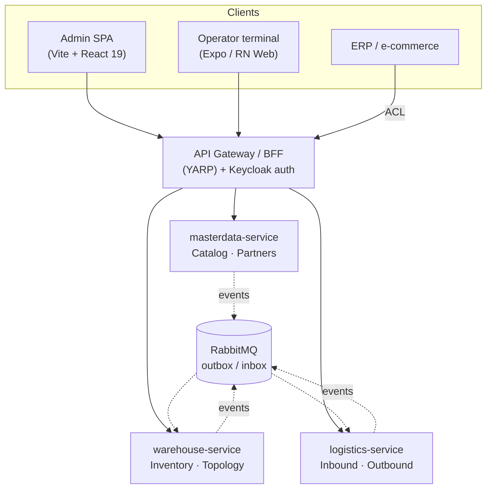

# Warehouse — a microservices WMS

[](https://github.com/mkasperczyk90/Warehouse/actions/workflows/backend.yml)
[](https://github.com/mkasperczyk90/Warehouse/actions/workflows/frontend.yml)
[](https://github.com/mkasperczyk90/Warehouse/actions/workflows/e2e.yml)
[](https://github.com/mkasperczyk90/Warehouse/actions/workflows/docker.yml)
[](https://github.com/mkasperczyk90/Warehouse/actions/workflows/codeql.yml)

A **warehouse-management system** for multiple sites with cold rooms and freezers — built the way real
distributed systems are built: domain-driven, event-driven, and microservices **from day one**. The
backend is .NET 10 / Aspire; the front is a data-dense admin SPA and a scanner-first operator terminal.

> This is a portfolio project. It is engineered end to end — domain model, ADRs, three deployable
> services, two front-ends, a full test pyramid, and CI/CD — to show how I think about and ship software,
> not just that it runs. The design is documented as it was decided: see [`docs/`](docs/).

---

## Why it's interesting

- **Microservices from day one, but only three of them.** Five bounded contexts, deliberately grouped
  into three services by *consistency needs and rate of change* — not one-service-per-context dogma
  ([ADR-0001](docs/adr/0001-microservices-from-day-one.md)).
- **Stock is an append-only ledger.** `StockMovement` is immutable; on-hand stock is a *projection*, and
  a correction is a reversing entry — never an `UPDATE` ([ADR-0002](docs/adr/0002-stock-as-append-only-ledger.md)).
- **Async-first with a transactional outbox/inbox from day one.** Events are written in the same
  transaction as the aggregate and relayed over RabbitMQ to idempotent consumers — no dual-write, no lost
  events.
- **No cross-service queries.** Each service owns its database; a service that needs another's data keeps
  a small **replica** kept fresh by events ([ADR-0003](docs/adr/0003-replicas-over-cross-service-queries.md)).
- **Two-stage allocation** — a *soft* SKU-level reservation at order time (protects available-to-promise),
  a *hard* FEFO batch+location allocation at pick release. The pallet isn't committed days before it ships.
- **A hard invariant that pays the rent:** temperature compatibility (and capacity) is validated on every
  put-away and move — a chilled item can never land in an ambient location.

---

## Architecture

Five bounded contexts (boundaries follow language + transactional consistency), three deployable
services, integrated through versioned events on a message bus behind an API gateway.



| Service | Bounded contexts | Why grouped this way |
|---|---|---|
| `warehouse-service` | **Inventory** (core) · Topology | share hard invariants (capacity, temperature) — must validate in one transaction |
| `logistics-service` | Inbound · Outbound | long-running sagas + external integrations — a different change profile |
| `masterdata-service` | Catalog · Partners | slow-changing, read-mostly reference data |

Inside each service the contexts stay **separate modules with separate schemas**, so the logical model is
still 5 contexts — only the deployment count is 3. If a boundary proves wrong, you move a module, not a
tangle of code. Full reasoning in [`docs/02-bounded-contexts.md`](docs/02-bounded-contexts.md).

---

## Tech stack

| Area | Choices |
|---|---|
| **Backend** | .NET 10 (LTS) · C# 14 · Minimal APIs · Clean Architecture per module with **vertical slices** inside `Application` ([ADR-0007](docs/adr/0007-vertical-slices-in-application-layer.md)) |
| **Persistence** | EF Core 10 · PostgreSQL (database per service) · owned types for value objects · strongly-typed IDs · `xmin` optimistic concurrency |
| **Messaging** | **Wolverine** (mediator + messaging + EF/Postgres outbox) · RabbitMQ · versioned past-tense contracts ([ADR & spike](docs/adr/README.md)) |
| **Platform** | **.NET Aspire** orchestration (one `dotnet run` for the whole stack) · YARP gateway/BFF · **Keycloak** (badge-scan auth) · OpenTelemetry |
| **Admin SPA** | Vite · React 19 · TypeScript (strict) · TanStack Router/Query/Table · React Hook Form + Zod · react-i18next (EN/PL) · MSW |
| **Operator terminal** | Expo / React Native Web — large touch targets, scanner-first flows · MSW |
| **Testing** | xUnit v3 · **Testcontainers** (real Postgres) · architecture tests · **playwright-bdd** e2e (admin + terminal) |
| **CI/CD** | GitHub Actions: build · test + coverage · Docker images + Trivy/SBOM · CodeQL · gitleaks · dependency review · AWS deploy |

The front-end talks to the gateway through a single API seam and is mocked at the network boundary with
MSW — going live is *turning the mock off*, never a rewrite ([ADR-0006](docs/adr/0006-mock-at-the-network-boundary.md)).

---

## Use cases

Fourteen use cases across the warehouse lifecycle (actors, flows, exceptions, and sequence/state diagrams
in [`docs/03-use-cases.md`](docs/03-use-cases.md)).

| Inbound | Inventory | Outbound | Master data |
|---|---|---|---|
| UC-01 Announce delivery (ASN) | UC-05 View stock | UC-09 Outbound order | UC-13 Manage products |
| UC-02 Receive delivery (GR) | UC-06 Move stock | UC-10 Picking (FEFO) | UC-14 Manage topology |
| UC-03 Quality inspection | UC-07 Stocktake | UC-11 Packing | |
| UC-04 Put away goods | UC-08 Stock adjustment | UC-12 Dispatch to carrier | |

---

## Status

Backend and both front-ends are built for the modeled use cases; the remaining work is integrations and
production hardening. The roadmap, reconciled against the codebase, lives in [`docs/PLAN.md`](docs/PLAN.md).

| Phase | Scope | State |
|---|---|---|
| 0 · Foundations | solution, SharedKernel, Aspire, outbox/inbox, EF, arch tests, CI/CD | ✅ largely complete |
| 1 · Master data | Catalog (UC-13), Topology (UC-14), admin panel | ✅ (Partners endpoints pending) |
| 2 · Inventory core | ledger, projections, moves, stocktake, adjustments | ✅ |
| 3 · Inbound | ASN, goods receipt, QC holds, put-away, terminal | ✅ |
| 4 · Outbound | orders + reservations, picking, packing, dispatch | ✅ |
| 5 · Integrations & hardening | ERP/e-commerce ACL, boundary review, SLOs/DLQs | ⬜ planned |

> Known simplifications, by design: the wave-planning *algorithm* (pick routing / FEFO ordering across
> many items) is modeled as a *lifecycle* but not optimized; serial-number tracking, slotting, and stock
> valuation are out of MVP scope.

---

## Repository layout

```
src/
  AppHost/            .NET Aspire orchestrator — runs the whole stack
  Gateway/            YARP API gateway / BFF + auth brokering
  Services/           warehouse · logistics · masterdata  (each: Domain/Application/Infrastructure modules)
  SharedKernel/       archetype value objects + base types (no business logic)
  Contracts/          versioned, additive-only integration events
  ServiceDefaults/    health checks, OpenTelemetry, resilience, messaging wiring
  Identity/           Keycloak realm + a custom badge Direct-Grant authenticator (Java SPI)
  web/admin/          desk SPA (Vite + React)
  web/terminal/       operator terminal (Expo / RN Web)
tests/                unit · architecture · integration (Testcontainers) · e2e (playwright-bdd)
infra/                Docker + AWS ephemeral-deploy infrastructure
docs/                 domain model, bounded contexts, use cases, ADRs, design system
```

---

## Quick start

```bash
# Whole system (Postgres + RabbitMQ + 3 APIs + gateway + SPAs), one command:
dotnet run --project src/AppHost/Warehouse.AppHost

# Or a front-end on its own against the MSW mock:
cd src/web/admin && npm ci && npm run mock:init && npm run dev
```

Prerequisites (.NET 10 SDK, Node 20, Docker), full build/test matrix, and the CI/CD details are in
[`CONTRIBUTING.md`](CONTRIBUTING.md).

---

## Documentation

The design is written down as it was decided — start here to see *how* the system was reasoned about:

| Doc | What's inside |
|---|---|
| [`docs/PLAN.md`](docs/PLAN.md) | The idea in three sentences, key decisions, and the live roadmap |
| [`docs/01-domain-overview.md`](docs/01-domain-overview.md) | Vision, subdomains, actors, ubiquitous language, invariants |
| [`docs/02-bounded-contexts.md`](docs/02-bounded-contexts.md) | The 5 contexts, context map, and the 3-service split |
| [`docs/03-use-cases.md`](docs/03-use-cases.md) | UC-01…UC-14 with sequence and state diagrams |
| [`docs/04-domain-model.md`](docs/04-domain-model.md) | Archetypes, class diagrams per context, events |
| [`docs/adr/`](docs/adr/README.md) | Architecture Decision Records (the *why* behind each call) |
| [`docs/models/`](docs/models/README.md) | As-built model reference — one file per module |
| [`docs/design/`](docs/design/README.md) | Design system, flows, actors, and the admin front-end plan |

---

## What this project demonstrates

DDD and strategic design (context mapping, archetypes, aggregate boundaries) · event-driven microservices
with the outbox/inbox pattern · Clean Architecture with vertical slices · EF Core domain modeling ·
a disciplined test pyramid up to Testcontainers and BDD e2e · two production-grade React front-ends ·
and a full CI/CD pipeline with security scanning — all decisions recorded as ADRs.
