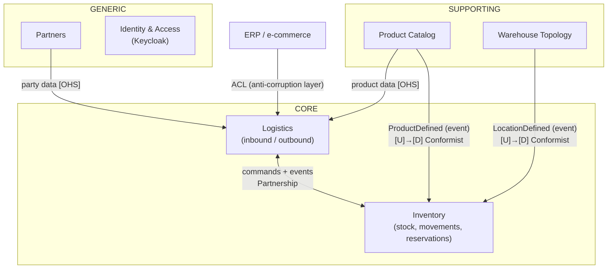
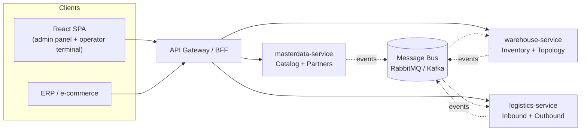

# Bounded Contexts and Service Architecture

## 1. Contexts

We carve out **5 bounded contexts** (boundaries follow language and transactional consistency):

### 1.1 Product Catalog
Product definitions — *what* we can store. **Knows nothing about stock or locations.**
- `ProductType` (SKU, name, EAN, dimensions, weight, category, unit of measure)
- `StorageRequirement` (temperature range, ADR/hazmat, fragility)
- Here "product" = a product card/definition (the **Description** archetype), not a physical unit.

### 1.2 Warehouse Topology
Physical structure — *where* goods can be stored.
- `Warehouse` → `Room` (type: standard / **cold room** / freezer / hazmat) → `Location`
- `Dock` (inbound/outbound ramps), room environmental parameters, location capacities.

### 1.3 Inventory *(core)*
Stock — *how much of what lies where*.
- `StockItem` (product + batch + location + quantity), `Batch`, `Reservation`
- `StockMovement` — an immutable, append-only ledger of all movements
- Reservations, transfers, adjustments, stocktakes, QC holds.
- **Enforces the invariants** (capacity, temperature compatibility, non-negative stock) — for that
  it keeps **local replicas** of the data it needs from Catalog and Topology (kept fresh via events).

### 1.4 Logistics
Flow of goods across the warehouse boundary — *inbound* and *outbound* processes.
- Inbound: `InboundDelivery` (ASN → arrival → goods receipt → put-away)
- Outbound: `OutboundOrder` (order → reservation → picking → packing → shipment)
- Sagas / process managers orchestrating work against Inventory (reserve / deduct / add).

### 1.5 Partners
Business parties: suppliers, customers, carriers (the **Party / PartyRole** archetype).
- One company can be both a supplier and a customer → roles, not separate entities.

## 2. Context Map

Relationships:
- **Catalog/Topology → Inventory:** Upstream/Downstream, integrated via **events** —
  Inventory maintains its own minimal copies (`ProductSnapshot`, `LocationSnapshot`).
- **Logistics ↔ Inventory:** Partnership — Logistics sends commands (`ReserveStock`,
  `ConfirmPutAway`), Inventory answers with events.
- **External systems → Logistics:** always through an **ACL**, so foreign models never leak into the domain.

## 3. How many microservices? — the decision

**Decision: microservices from day one — 3 services (not 5).**

A service per bounded context sounds clean, but 5 services would split contexts that share hard
invariants and deployment cadence. We group contexts by **consistency needs and rate of change**:

| Service | Contexts | Why combined |
|---|---|---|
| `warehouse-service` | Inventory + Topology | shared hard invariants (capacity, temperature) — they must validate in one transaction; splitting them would force distributed checks on every put-away |
| `logistics-service` | Logistics | different profile: long-running processes, sagas, external integrations (ERP, carriers) |
| `masterdata-service` | Catalog + Partners | slow-changing, read-mostly reference data |

Inside each service the contexts remain **separate modules with separate schemas** — `warehouse-service`
hosts `inventory` + `topology` schemas, `masterdata-service` hosts `catalog` + `partners`. So the
logical model stays 5 contexts; only the deployment unit count is 3. If a boundary proves wrong,
we move a module between services, not a tangle of code.

Rules that keep the boundaries honest (and the risk manageable):
- **Database per service** — three PostgreSQL databases; no service ever reads another service's tables.
- **Async-first integration**: events over a broker (RabbitMQ) with **transactional outbox + inbox
  (idempotent consumers) from day one**. Synchronous calls only where the use case truly needs an
  immediate answer (e.g. SKU validation on ASN entry), always with timeouts/retries/circuit breakers
  (`Microsoft.Extensions.Http.Resilience`).
- **Versioned contracts** in a shared, additive-only `Contracts` package — the only shared code
  besides a small `SharedKernel` (value objects, base types).
- Each service is independently deployable and testable; cross-service flows are covered by
  contract tests (e.g. PactNet) instead of end-to-end test webs.
- **Accepted trade-off:** boundary mistakes are more expensive to fix than in a monolith, and we
  take on eventual consistency between services from the start (e.g. Inventory's
  `ProductSnapshot`/`LocationSnapshot` replicas are updated by events, not joins).

## 4. Technology stack and engineering practices

### Platform
- **.NET 10 (LTS)** / **C# 14**, nullable reference types and analyzers on (`TreatWarningsAsErrors`)
- **Clean Architecture per module** (`Domain` / `Application` / `Infrastructure` / `Endpoints`),
  with **vertical-slice organization inside Application** (one folder per use case: command +
  handler + validator + endpoint live together) — layers protect the domain, slices keep features cohesive
- **Aspire** for local orchestration (Postgres, broker, dashboards) and service defaults
  (health checks, resilience, OpenTelemetry) — one `dotnet run` to get the whole environment
- **Central Package Management** (`Directory.Packages.props`) + `Directory.Build.props` for shared settings

### Persistence — EF Core 10 on PostgreSQL
- Schema per module; **separate `DbContext` per module**, migrations owned by the module
- DDD-friendly mapping: private constructors, backing fields, **owned types / complex types for
  value objects** (`Quantity`, `TemperatureRange`, `Dimensions`), **strongly-typed IDs** via value converters
- `StockMovement` ledger: append-only table — no `UPDATE`/`DELETE` (enforced by a Postgres rule/trigger),
  `Instant`-based timestamps (UTC everywhere)
- Optimistic concurrency on aggregates (`xmin` as the concurrency token on Postgres)
- Compiled models and `AsNoTracking` projections for read paths; pagination as keyset, not offset

### Messaging
- **Transactional outbox + inbox (idempotent consumers) from day one** — events are written in the
  same transaction as the aggregate, relayed asynchronously
- Library note: **MediatR and MassTransit moved to commercial licensing (2025)**. Preferred OSS path:
  **Wolverine** (mediator + messaging + outbox in one) or a thin hand-rolled dispatcher; MassTransit v8
  remains a viable OSS fallback. Decision deferred to Phase 0 spike.
- Integration events are **versioned, past-tense contracts** in a shared `Contracts` package

### API
- **Minimal APIs** with route groups per module, **endpoint filters** for validation
  (FluentValidation or .NET 10 built-in `IValidatableInfo` validation), `TypedResults` + `ProblemDetails`
- OpenAPI via the built-in `Microsoft.AspNetCore.OpenApi` generator
- CQRS: commands go through aggregates; queries are thin, handler-level SQL/LINQ projections

### Quality & operations
- **Testing pyramid:** domain unit tests (no mocks of domain objects) → application/slice tests →
  integration tests with **Testcontainers** (real Postgres) using **xUnit v3**; architecture tests
  (e.g. ArchUnitNET / NetArchTest) guard module boundaries
- **OpenTelemetry** (traces, metrics, logs) wired through Aspire service defaults
- CI: build + tests + EF migration check (`dotnet ef migrations has-pending-model-changes`)

### Frontend
- **React 19 + TypeScript + Vite**, TanStack Query for server state, TanStack Router or React Router v7
- Two surfaces: admin panel (master data, reports) and a simplified **operator terminal**
  (large touch targets, barcode-scanner-first flows)
