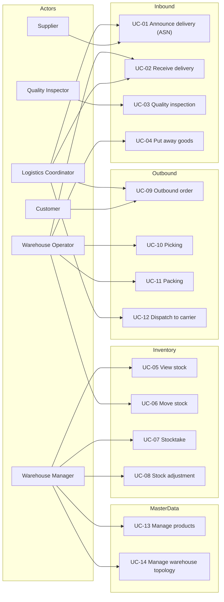
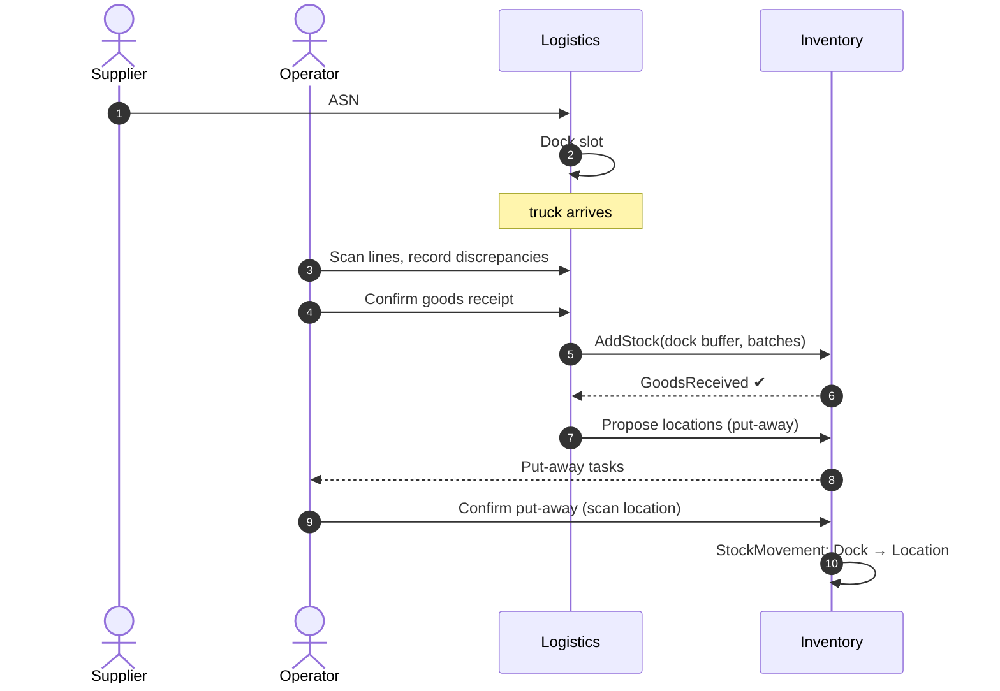
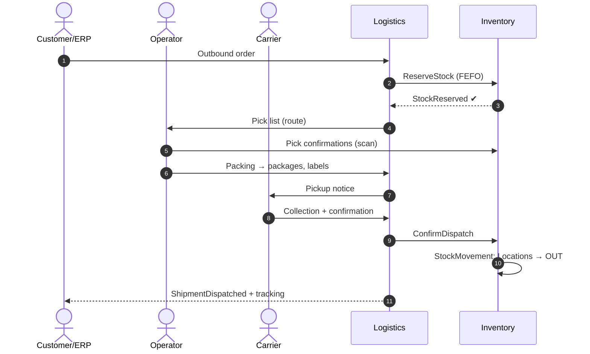
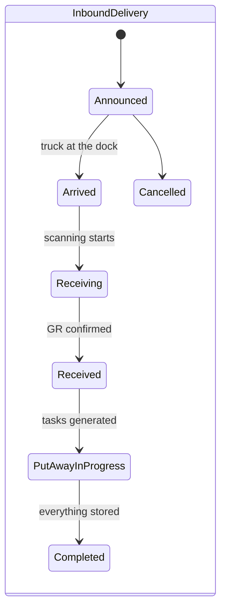
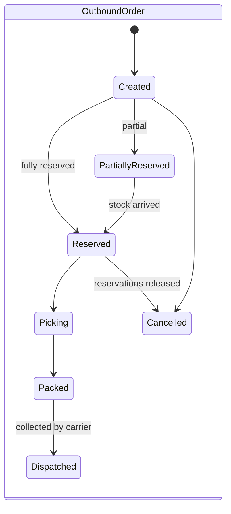

# Use Cases

## 1. Use case map

---

## 2. Inbound (receiving)

### UC-01: Announce delivery (ASN)
- **Actor:** Supplier or Logistics Coordinator
- **Goal:** the warehouse knows in advance what arrives and when
- **Flow:**
  1. Supplier/coordinator creates an ASN: supplier, planned date, target warehouse, lines (SKU + quantity + unit).
  2. System validates that the SKUs exist in the catalog.
  3. Coordinator assigns a dock slot (dock + time window).
  4. The ASN gets status `Announced`.
- **Exceptions:** unknown SKU → line flagged for clarification; no free slot → alternative window proposed.

### UC-02: Receive delivery (Goods Receipt)
- **Actor:** Warehouse Operator (at the dock)
- **Flow:**
  1. Truck checks in at the dock; operator opens the ASN.
  2. Scans/counts goods line by line; system compares against the ASN.
  3. Discrepancies (shortages, overages, damage) are recorded per line.
  4. For batch-tracked products the operator enters batch number and expiry date.
  5. Confirmation → a goods receipt document is created, goods go "on stock" in the dock buffer
     location, event `GoodsReceived`.
- **Rules:** only announced deliveries can be received (unannounced delivery → ad-hoc ASN first).

### UC-03: Quality inspection
- **Actor:** Quality Inspector
- **Flow:** selected batches from a receipt enter status `Quarantine`; QC releases (`Released`)
  or rejects (`Rejected` → return/disposal). A blocked batch is invisible to reservations.

### UC-04: Put away goods
- **Actor:** Warehouse Operator / forklift operator
- **Flow:**
  1. System generates put-away tasks: for each pallet it **proposes a target location**.
  2. The proposal respects: product temperature requirements ↔ room type, location capacity and
     load limit, strategy (e.g. consolidate with existing stock of the same SKU/batch).
  3. Operator scans the goods and the target location → confirmation → `PutAway` movement in the ledger.
- **Exceptions:** location full/occupied → operator scans another one; the system **always**
  validates environment compatibility (hard invariant).

---

## 3. Inventory (stock)

### UC-05: View stock
- **Actor:** Warehouse Manager / external systems
- Stock per product / batch / location / room / warehouse; distinguishing
  `OnHand` (physically present), `Allocated` (hard-pinned to orders), `Available-to-promise`
  (= OnHand − Allocated − outstanding soft reservations), `Blocked` (QC).

### UC-06: Move stock
- **Actor:** Warehouse Operator
- Move between locations (within a warehouse) or **inter-warehouse transfer**
  (issue from warehouse A → transport → receipt at warehouse B; goods in transit visible as `InTransit`).
- Same validations as put-away (environment, capacity).

### UC-07: Stocktake
- **Actor:** Warehouse Manager (orders it), operators (count)
- Blind count of selected locations (expected quantities hidden), comparison against the system,
  approval of differences → ledger adjustments with reason `StocktakeDifference`.

### UC-08: Stock adjustment
- **Actor:** Warehouse Manager
- Manual adjustment (damage, loss) — always with a reason and who/when audit trail; goes to the ledger.

---

## 4. Outbound (shipping)

### UC-09: Outbound order
- **Actor:** Customer / ERP / Logistics Coordinator
- **Flow:**
  1. An order is created: consignee, address, required date, lines (SKU + quantity).
  2. System makes a **soft reservation** against available-to-promise in the selected warehouse
     (SKU-level — no batch/location pinned yet).
  3. Insufficient availability → partial or waiting order (coordinator's decision).
- **Result:** a `StockReservation` per line, event `StockReserved`. Concrete batch+location are
  pinned later by **FEFO** hard allocation at wave/pick release (UC-10), not here — so a pallet
  isn't committed days before it's picked.

### UC-10: Picking
- **Actor:** Warehouse Operator
- On wave release, the soft reservation is turned into **hard allocations** (FEFO chooses the
  concrete batch+location, batch quality re-checked at this moment), then a pick list is
  generated with a route across locations (sequence minimizing travel).
  Operator scans location → product → quantity. Shortage at a location → replanning from
  another location/batch.

### UC-11: Packing
- **Actor:** Warehouse Operator (packing zone)
- Picked goods → parcels/pallets; system records contents, weight and dimensions of packages; prints labels.

### UC-12: Dispatch to carrier
- **Actor:** Logistics Coordinator / carrier
- Shipment assigned to a carrier and a pickup notice; on collection a signature/confirmation →
  stock deducted (`Dispatched` movement), event `ShipmentDispatched`, waybill issued.

---

## 5. Master data

### UC-13: Manage products
Create/edit `ProductType`: SKU, name, EAN, category, dimensions (L/W/H), weight, unit of measure,
storage requirements (temperature range, ADR), batch-tracked flag, expiry-date flag.
Changing storage requirements **does not move** existing stock — the system reports
incompatibilities for the manager to resolve.

### UC-14: Manage topology
Define a warehouse (address, docks), rooms (type: standard/cold room/freezer/hazmat, temperature
range) and locations (address `WH-ROOM-AISLE-RACK-SHELF`, capacity m³, load limit kg).
Rooms/locations holding stock cannot be deleted — stock must be moved first.

---

## 6. Process lifecycles

