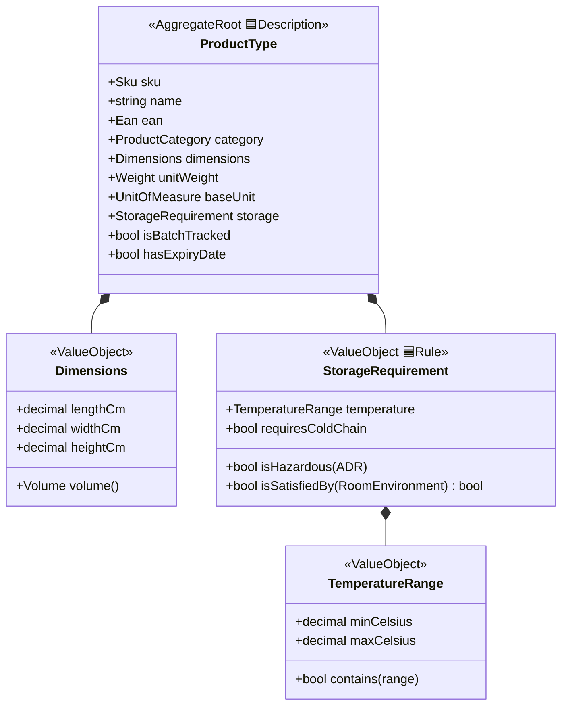
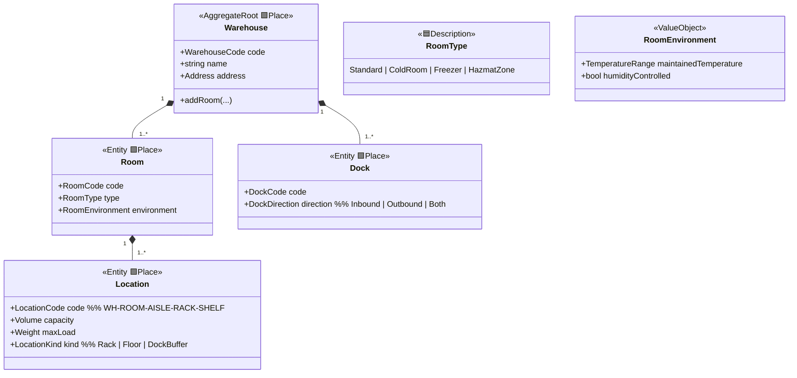
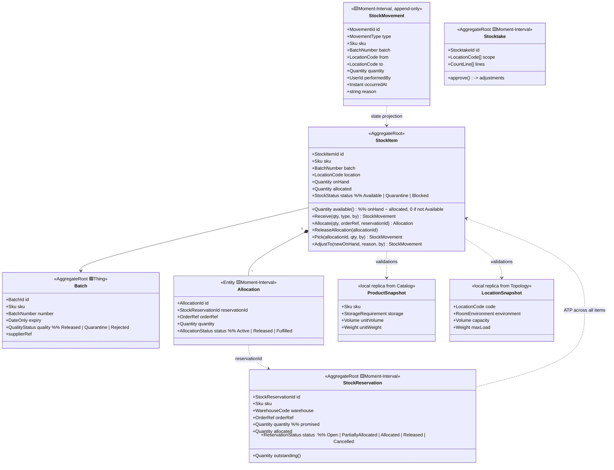
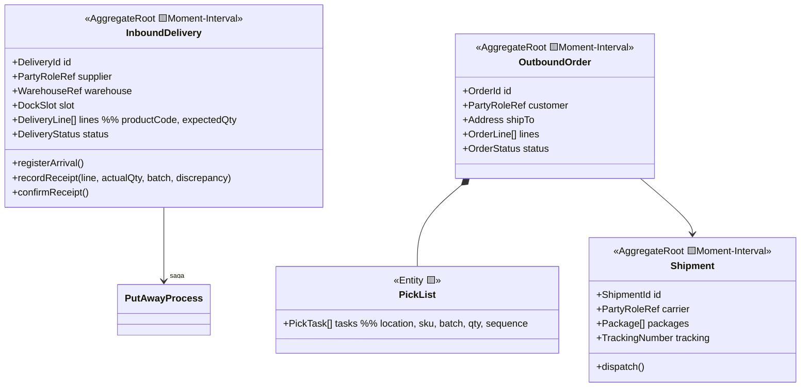
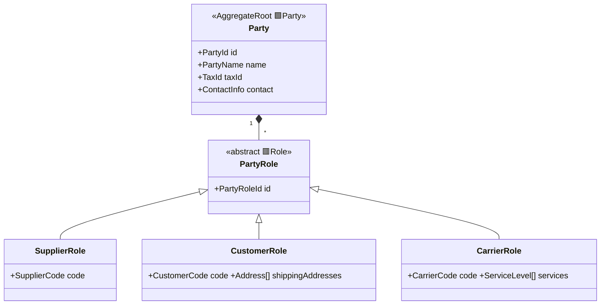

# Domain Model and Archetypes

> **Conceptual overview, reconciled with the as-built model.** This file is the high-level map;
> the detailed, per-module reference that tracks the code one-to-one is
> [models/](models/README.md), with [REVIEW-FIXES.md](REVIEW-FIXES.md) recording the key change:
> reservations are **two-stage** (soft `StockReservation` at order time → hard `Allocation` at
> wave/pick time), and `Sku` is not a shared type (Catalog owns a strict `Sku`, Inventory a lighter
> one, Logistics a loose `ProductCode`).

## 1. Archetypes — the foundation of the model

The model is grounded in **archetypes** from two sources:

**A. Archetype Patterns (Arlow & Neustadt — "Enterprise Patterns and MDA"):**

| Archetype | How we use it |
|---|---|
| **Party / PartyRole** | A business party (company) + roles: `SupplierRole`, `CustomerRole`, `CarrierRole` — one company can hold many roles |
| **Product** (ProductType vs ProductInstance) | `ProductType` = the catalog card; physical goods are represented as `Batch` + quantities (we do not track individual units beyond batches) |
| **Inventory / InventoryEntry** | `StockItem` = a stock entry (product + batch + location + quantity) |
| **Quantity / Unit** | `Quantity` = a number **always paired with a unit** (pcs, kg, m³) — no more bare `decimal`s |
| **Money** | value of goods for adjustments/stocktake reconciliation |
| **Rule** | `StorageRequirement` ↔ `RoomEnvironment` — compatibility rules as objects, not if-cascades |

**B. Color archetypes (Coad — "Modeling in Color with UML"):**

| Archetype (color) | Meaning | In our model |
|---|---|---|
| 🟨 **Moment-Interval** | a business-significant event/interval | `InboundDelivery`, `GoodsReceipt`, `StockMovement`, `StockReservation` (soft), `Allocation` (hard), `OutboundOrder`, `Shipment`, `Stocktake` |
| 🟩 **Party-Place-Thing** | participant, place, thing | `Party`, `Warehouse`, `Room`, `Location`, `Batch` |
| 🟦 **Description** | catalog-like description of a thing | `ProductType`, `RoomType`, `MovementType` |
| 🟥 **Role** | a role played by a PPT | `SupplierRole`, `CustomerRole`, `CarrierRole` |

> The practical payoff of the colors: **the yellow Moment-Intervals are the heart of the system** —
> they carry the history and the money. `StockMovement` as an immutable ledger is a direct
> consequence of this archetype: warehouse state = a projection of moments.

## 2. Product Catalog

- `ProductCategory`: `DryGoods | Refrigerated | Frozen | Hazardous | Fragile | BulkMaterial`
- Value objects `Sku`, `Ean`, `Weight`, `Volume`, `Quantity` — C# `record` types, validated in the
  constructor, immutable; mapped in EF Core 10 as complex/owned types with value converters.

## 3. Warehouse Topology

- The `Warehouse` aggregate guards structural consistency (code uniqueness; deleting a non-empty
  room is prevented by a policy that consults Inventory).
- A `Location` has a stable, human-readable address — printable as a scannable barcode.

## 4. Inventory *(core)*

**Key decisions:**
1. **`StockMovement` is append-only** (a ledger). Correcting a mistake = a reversing movement,
   never an edit. This gives auditability, easy stocktaking and natural integration events.
2. The aggregate is `StockItem` (small, transactional), **not** "the whole warehouse" — otherwise
   every scan would contend on a single row. Cross-stock invariants (location capacity across many
   SKUs) are enforced by a `PutAwayPolicy` domain service + a database constraint in Postgres.
   Concurrency: optimistic, with Postgres `xmin` as the EF Core concurrency token.
3. Environment compatibility check: `productSnapshot.storage.isSatisfiedBy(locationSnapshot.environment)` —
   the rule as a method on the **Rule** archetype, used on every put-away and move.
4. **Two-stage allocation.** An order takes a soft `StockReservation` at order time (SKU + warehouse,
   no pallet pinned) via `ReservationService`, which gates on available-to-promise. The concrete
   `Allocation` (batch + location, FEFO, batch quality re-checked) is pinned later at wave/pick time
   via `AllocationPolicy`. `StockItem.available()` = `onHand − allocated`; ATP spans all of a SKU's
   stock items and is computed by the application layer. See [models/inventory.md](models/inventory.md).

## 5. Logistics

Long-running processes are **sagas / process managers** (`InboundProcess`, `FulfillmentProcess`) —
they react to Inventory events and push the process forward. Saga state is persisted; every step
is idempotent (inbox pattern), so redeliveries are safe.

## 6. Partners

## 7. Domain events (contracts between contexts)

| Event | Producer | Consumers |
|---|---|---|
| `ProductDefined`, `ProductStorageChanged` | Catalog | Inventory (snapshot), Logistics |
| `LocationDefined`, `RoomEnvironmentChanged` | Topology | Inventory (snapshot) |
| `DeliveryAnnounced`, `DeliveryArrived` | Logistics | (UI, reports) |
| `GoodsReceiptConfirmed` | Logistics | Inventory (receipt into dock buffer) |
| `OutboundOrderCreated`, `OrderReserved` | Logistics | (UI, reports) |
| `StockReceived`, `StockPicked`, `StockAdjusted` | Inventory | Logistics, ERP |
| `StockReserved` (soft), `ReservationReleased` | Inventory | Logistics |
| `StockAllocated` (hard), `AllocationReleased` | Inventory | Logistics |
| `BatchQuarantined`, `BatchBlocked`, `BatchReleased` | Inventory (QC) | Logistics |
| `HandlingUnitMoved` | Inventory | (internal: triggers per-line transfer) |
| `ShipmentDispatched` | Logistics | Inventory (deducts stock), ERP, customer notifications |
| `StocktakeApproved` | Inventory | reports, accounting |

Conventions: events are named **in the past tense**, carry a minimal payload + identifiers, and are
**versioned** (`ProductDefinedV1`) in a shared `Contracts` package. Published via the transactional
outbox — never directly from a request handler.
