# #2 — Why we start with the domain, not with Docker

*Series: Building a real microservices application, brick by brick.
Previous: [#1 What is Event Storming](01-what-is-event-storming.md). The full domain docs are in [/docs](../PLAN.md).*

---

Most microservices tutorials start with infrastructure: a compose file, three services
named `OrderService`, `PaymentService`, `NotificationService`, and a to-do list to ship.
Then the hard questions arrive — *where exactly does an "order" end and a "shipment" begin?*
— and the answer gets duct-taped across HTTP calls.

This series goes the other way. We will build a complete, production-shaped microservices
system in .NET 10 — gateway, three services, Postgres-per-service, RabbitMQ, outbox, sagas,
React frontends, CI/CD — but **the first five posts contain no infrastructure at all**.
We start where real projects start: with the business.

## Why a warehouse?

I wanted a domain that is:

- **Real.** Warehouses exist; people who work in them will recognize every word we use
  (ASN, goods receipt, put-away, FEFO, blind stocktake). Nothing is invented for the demo.
- **Rich in invariants.** "Frozen goods can only sit in a freezer room" is a *hard* rule
  with physical consequences — far more interesting than "email must contain @".
- **Naturally distributed.** Product master data, physical stock, and logistics processes
  genuinely change at different speeds and for different reasons. The seams are real,
  not manufactured to justify microservices.
- **Not another e-shop.** You have seen enough cart services.

The business brief (after a few conversations with our product owner):

> We run **several warehouses**. Each has **rooms** — some are regular, some are **cold rooms**
> or freezers. Rooms have racks with addressable **locations**. Products have sizes, weights,
> types and storage requirements. Suppliers **announce deliveries**, trucks arrive at docks,
> goods are received, checked by QC and **put away**. Customers place orders; we **reserve**,
> **pick**, **pack** and hand over to carriers. And please — we must always know *exactly*
> what is where, because auditors visit twice a year.

That last sentence is the whole project. Everything we build serves one core capability:
**precise knowledge of what is stored where, and a trustworthy record of how it got there.**

## A day in the warehouse (developer glasses off)

Before any stickies, let's just watch the place work. No patterns, no services — people
and pallets.

**6:10.** A truck from a dairy supplier backs up to dock D02. It was *announced* — the
supplier sent an advance notice yesterday (Polish warehouse folk call it *awizacja*):
two pallets of yogurt, one of butter, arriving today between 6 and 7. Because the warehouse
knew, dock D02 was free, and Marek was scheduled to receive it. An unannounced truck would
be standing in the yard now, waiting for someone to improvise.

**6:25.** Marek scans pallet by pallet. The yogurt says batch `L2406-117`, best before
July 3rd. He types both in — for food, the batch number is the difference between
"recall 2 pallets" and "recall the entire warehouse". One pallet of butter is missing;
the driver shrugs. Marek records a shortage on that line and signs off. The goods are now
officially *on stock* — but physically they sit in the **dock buffer**, a marked square
of floor next to the ramp.

**6:40.** The system proposes where each pallet should go. Yogurt needs 2–6 °C, so it
proposes a rack location in cold room CHLD1 — never the ambient hall, *even if the hall
is emptier*. Forklift driver scans the pallet, drives, scans the rack label, done. That
double scan is the whole trick: the system believes scans, not memory.

**9:15.** The QC inspector doesn't like the look of the butter batch — temperature logger
in the truck showed a spike. She puts the **batch** on hold. Instantly, every pallet of
that batch, in every location, in every warehouse, is frozen for orders. Nobody emails
anybody; the hold *is* the fact.

**11:00.** A supermarket chain orders 300 yogurts for Thursday. The system makes a **soft
reservation** — it sets aside *300 of this SKU in this warehouse*, protecting the promise,
but it does **not** pin a specific pallet yet. That restraint is the whole point: Thursday is
two days away, and in two days a particular pallet can be QC-blocked, clipped by a forklift,
or moved. Committing concrete stock now would mean re-doing it every time reality shifts.
The concrete choice — *which* batch, *which* location — waits until the order is released to
the floor for picking. Only then does **FEFO** decide (*first-expired, first-out*): take the
batch dying soonest, re-checking *at that moment* that it's still QC-released and unexpired.
Fresh stock stays for later orders; the older batch leaves before it becomes waste.

**14:30.** Picker gets a route: three locations, shortest path. At the second one the
shelf says 11, the system says 12. She doesn't "fix" anything — she reports a **short
pick**, takes the 11, and the system replans the missing piece from another location.
And the twelfth yogurt? Here's the honest part: an unrecorded physical loss is precisely
what the ledger *cannot* contain — that's why stocktakes exist. What the ledger does give
you is every **recorded** touch of that location, so the search narrows to a window:
"correct at last count, three picks and one put-away since". The truth lands with the
next blind count, and its correction enters the ledger like everything else — with a
reason, a name and a timestamp.

**16:00.** Packed, labeled, carrier scans the handover, signs. Stock drops, a tracking
number goes to the customer. The day produced ~400 movements, and every single one is a
permanent line in the ledger: who, what, from where, to where, when, why.

If you understood this story, you understand 80% of the system we're about to build.
The remaining 20% is making it survive forklifts, concurrency and auditors.

## What the business taught us (and what we'd have gotten wrong)

The event-storming session was mostly *us being corrected*. The corrections are the
most valuable artifacts we own — each one killed a wrong model before it was coded:

- *"FIFO? No. **FEFO.** A delivery can arrive with shorter expiry than what's already
  on the shelf."* — We'd have modeled first-in-first-out and quietly rotated stock wrong.
  Expiry lives on the **batch**, and picking order follows expiry, not receipt date.
- *"When QC blocks goods, they block the **batch**, not a pallet."* — Our first sketch put
  the quality flag on stock-at-location. Wrong: a suspicious batch is suspicious
  *everywhere at once*. That single sentence moved the QC hold onto the `Batch` and gave
  reservations a gate that rejects quarantined, rejected **and expired** batches.
- *"During stocktake, counters must not see what the system expects."* — Blind counts.
  If the screen says 12, people count "12". Show nothing, and they count what's there.
- *"We never edit a stock number. Ever. We add a correction."* — The warehouse manager
  said this with the face of someone who once spent a week explaining a missing pallet
  to an auditor. The append-only ledger is not our idea; it's how the business already
  thinks.
- *"Temperature is not negotiable. Capacity is."* — If a location is full, the operator
  scans a neighboring one and life goes on. If a location is too warm for yogurt, there
  is no override button, *and there must not be one*. This split — hard rule vs soft
  preference — shaped the entire put-away design.
- *"Half our 'suppliers' also buy from us."* — One company, two roles. The `Suppliers`
  table died in that sentence (more in post #5).

This is what DDD actually is. Not the folder structure — the conversations. The folder
structure just preserves what the conversations taught us.

## The big picture — the event-storming board

Before any code, we ran an event-storming session — the technique from [post #1](01-what-is-event-storming.md):
orange stickies for **domain events** (facts, past tense), blue for **commands**, yellow for
**aggregates** that decide, purple for **policies** (whenever X then Y), green for **read
models**, red/pink for **actors and external systems**. Here is the cleaned-up board, left to
right in business time:

```mermaid
flowchart LR
    subgraph INBOUND["📦 Inbound"]
        direction LR
        SUP[/"Supplier"/]:::actor
        C1["Announce delivery (ASN)"]:::command
        A1["InboundDelivery"]:::aggregate
        E1["DeliveryAnnounced"]:::event
        E2["DeliveryArrived"]:::event
        C2["Confirm goods receipt"]:::command
        E3["GoodsReceiptConfirmed"]:::event
        P1["Policy: unannounced truck → ad-hoc ASN first"]:::policy
        SUP --> C1 --> A1 --> E1 --> E2
        E2 --> C2 --> A1
        A1 --> E3
        P1 -.-> C1
    end

    subgraph QUALITY["🔬 Quality"]
        direction LR
        QC[/"Quality inspector"/]:::actor
        C3["Quarantine / block batch"]:::command
        A2["Batch"]:::aggregate
        E4["BatchQuarantined / BatchBlocked"]:::event
        P2["Policy: blocked batch → quarantine its stock everywhere"]:::policy
        QC --> C3 --> A2 --> E4 --> P2
    end

    subgraph STORAGE["🏷️ Storage"]
        direction LR
        OP[/"Warehouse operator"/]:::actor
        E5["StockReceived (dock buffer)"]:::event
        P3["PutAwayPolicy: temperature ∧ capacity ∧ load"]:::policy
        C4["Confirm put-away (scan)"]:::command
        A3["StockItem"]:::aggregate
        E6["StockMoved (ledger entry)"]:::event
        R1[["Stock levels view"]]:::readmodel
        E3 --> E5 --> P3 --> C4
        OP --> C4 --> A3 --> E6 --> R1
    end

    subgraph OUTBOUND["🚚 Outbound"]
        direction LR
        CUS[/"Customer / ERP"/]:::actor
        C5["Place outbound order"]:::command
        A4["OutboundOrder"]:::aggregate
        E7["OutboundOrderCreated"]:::event
        P4["Policy: soft-reserve vs available-to-promise"]:::policy
        E8["StockReserved (soft)"]:::event
        C5b["Release wave to floor"]:::command
        P5["Policy: allocate FEFO + re-check batch quality"]:::policy
        E8b["StockAllocated (hard)"]:::event
        R2[["Pick list (routed)"]]:::readmodel
        C6["Confirm pick (scan)"]:::command
        E9["StockPicked"]:::event
        C7["Pack & confirm dispatch"]:::command
        A5["Shipment"]:::aggregate
        E10["ShipmentDispatched"]:::event
        CAR[/"Carrier"/]:::actor
        CUS --> C5 --> A4 --> E7 --> P4 --> E8
        E8 --> C5b --> P5 --> E8b --> R2
        R2 --> C6 --> A3 --> E9
        E9 --> C7 --> A5 --> E10 --> CAR
    end

    INBOUND --> QUALITY --> STORAGE --> OUTBOUND

    classDef event fill:#FFB347,stroke:#9C5700,color:#1a1a1a
    classDef command fill:#7EC8E3,stroke:#1864AB,color:#1a1a1a
    classDef aggregate fill:#FFF176,stroke:#B7950B,color:#1a1a1a
    classDef policy fill:#CE93D8,stroke:#6A1B9A,color:#1a1a1a
    classDef readmodel fill:#A5D6A7,stroke:#1B5E20,color:#1a1a1a
    classDef actor fill:#F8BBD0,stroke:#AD1457,color:#1a1a1a
```



Two things jumped off the board:

1. **Hot spots cluster around `StockItem` and the ledger.** Almost every process ends in
   "stock changed somewhere". That is our core domain.
2. **The pivotal events are few.** `GoodsReceiptConfirmed`, `StockReserved`,
   `ShipmentDispatched` — these are the natural integration points between future services.

## Classifying the subdomains

Not everything deserves the same investment. The classic core/supporting/generic split:

| Subdomain | Type | Why |
|---|---|---|
| **Inventory** (stock, movements, reservations) | **Core** | Accuracy of "what is where" *is* the business |
| **Logistics** (inbound/outbound processes) | **Core** | The flow of goods is the second pillar |
| Product Catalog | Supporting | Necessary, but nobody picks a warehouse for its product cards |
| Warehouse Topology | Supporting | Physical structure; changes rarely |
| Partners (suppliers, customers, carriers) | Generic | The textbook Party problem — solved patterns exist |
| Identity & Access | Generic | Buy, don't build |

> **Trade-off:** classifying Topology as "supporting" means we accept a simpler model there
> (one aggregate per warehouse) and spend our complexity budget on Inventory. If this were
> a slotting-optimization product, Topology would be core and modeled very differently.

## The strategic decisions — and what each one cost

### Decision 1: Microservices from day one (3 services, 5 contexts)

The honest default advice for a fresh domain is a **modular monolith** — boundaries are
cheapest to fix when they are just folders. We chose microservices from day one anyway,
deliberately: this series exists to show the real mechanics of a distributed system
(outbox, sagas, contract tests, independent deploys), and we wanted those constraints
present from the first commit, not retrofitted in post #15.

But we did **not** create five services for five contexts:

| Service | Contexts inside | Why together |
|---|---|---|
| `warehouse-service` | Inventory + Topology | They share *hard* invariants (capacity, temperature) that must validate in one transaction |
| `logistics-service` | Logistics | Long-running processes, sagas, external integrations |
| `masterdata-service` | Catalog + Partners | Slow-changing, read-mostly reference data |

Inside each service, contexts remain separate modules with separate database schemas — the
logical model stays five contexts; only the deployment count is three.

> **Trade-off:** we pay for this choice with eventual consistency between services and with
> boundary mistakes being expensive (moving a concept across a service boundary is a data
> migration, not a refactor). We mitigate by keeping contexts as modules — if a boundary is
> wrong, we move a module, not a tangle of code. And we accept the cost knowingly: it is
> the subject of the series.

### Decision 2: Stock is a projection of an append-only ledger

Every change of stock produces an immutable `StockMovement` (who, what, from, to, when, why).
Current quantities are a projection of movements. Corrections are *reversing movements*,
never edits.

> **Trade-off:** more rows, and the projection must never drift from the ledger (we made
> that structurally impossible — domain behaviors *return* the movement to persist, so you
> cannot change stock without producing a ledger entry). What we bought: a complete audit
> trail — remember the auditors? — trivially debuggable history, and natural integration events.

### Decision 3: The aggregate is `StockItem`, not `Warehouse`

A `StockItem` is the quantity of one SKU (and batch) at one location. Every scan-gun
confirmation is a short transaction on one small row.

> **Trade-off:** invariants that span stock items (location capacity across many SKUs)
> cannot live inside the aggregate — they move to a domain service (`PutAwayPolicy`) plus
> a database constraint as the last line of defense. That is the price of never having
> a hot row under 40 concurrent forklifts.

### Decision 4: Replicas instead of cross-service queries

Inventory needs product storage requirements (Catalog) and room environments (Topology)
to validate every put-away. It does **not** call anyone — it keeps local
`ProductSnapshot`/`LocationSnapshot` replicas, updated by events.

> **Trade-off:** the replica can be seconds stale. We accept it: product master data changes
> rarely, and a put-away validated against a 5-second-old temperature requirement is a
> non-problem. What we bought: put-away works when masterdata-service is down, and there is
> no temporal coupling between services.

## A one-page vocabulary: the building blocks of DDD

So far this post has been about the *conversations*. But Domain-Driven Design also gives a
precise **vocabulary** for the model those conversations produce — and from the next post on
we'll use it constantly (and, in post #5, write it as C# classes). Here it is in one place,
each term tied to something you already met in the story above. Two groups: the **strategic**
words draw the boundaries between parts of the system; the **tactical** words describe what
lives inside one part.

**Strategic — carving the system into parts:**

- **Ubiquitous Language** — one agreed word per concept, used by developers *and* the business,
  in conversation *and* in code. "Put-away", "FEFO", "dock buffer" aren't jargon we invented;
  they're the warehouse's own words, and the classes are named after them. When the manager
  says *"we never edit a stock number, we add a correction"*, the word *correction* ends up in
  the code. (The glossary below is exactly this language, written down.)
- **Subdomain** — a slice of the *business problem*, classified **core / supporting / generic**
  by how much it deserves our investment (we did this just above). Inventory is core; identity
  is generic — buy, don't build.
- **Bounded Context** — a boundary inside which one model and one language stay consistent.
  It's what lets the word "SKU" mean a strictly-validated catalog entry in one context and
  "whatever the scanner just read" in another — two precise, different meanings, no contradiction.
  Subdomains are the problem; bounded contexts are our answer to them (post #3 walks all five).
- **Context Map** — how contexts talk: which events flow where, what's shared and what's
  deliberately *not*. (Post #3 draws ours.)
- **Shared Kernel** — the small set of model fragments two or more contexts agree to share
  *and* coordinate every change on. Useful and dangerous in equal measure; post #6 is entirely
  about keeping ours tiny.

**Tactical — what lives inside one context:**

| Building block | What it is | In the warehouse |
|---|---|---|
| **Entity** | A thing with an identity that persists as its data changes | A `Batch` is the same batch even as its quantity drops — it has identity, not just values |
| **Value Object** | A thing defined *entirely by its values* — immutable, no identity | `Quantity(10, Piece)`, a `TemperatureRange`, an `Address` — equal when their values are equal; you replace them, never mutate them |
| **Aggregate** | A cluster of entities + value objects that must change together, under one rule | `StockItem` plus the allocations inside it — they stay consistent within a single transaction |
| **Aggregate Root** | The one entity that is the *only door* into an aggregate | You call `StockItem.Pick(...)`; you never reach in to edit an allocation directly |
| **Invariant** | A rule that must *always* hold | "available-to-promise is never negative"; "frozen goods never in an ambient room" |
| **Domain Event** | A fact that happened, named in the past tense | `GoodsReceiptConfirmed`, `BatchBlocked` — the orange stickies, now code |
| **Domain Service** | Behavior that spans aggregates and belongs to none of them | `PutAwayPolicy` checks a `StockItem` against a `Location` — neither aggregate can own the rule |
| **Repository** | The collection-like way to load and save *an aggregate*, hiding the database | "give me this `StockItem`, save this `Party`" — no SQL in the domain |

Two rules of thumb that recur through the series. **Value objects are cheap safety** — push
every concept you can down into an immutable, self-validating value, and whole classes of bug
stop being writable (a `Quantity` that refuses to add kilograms to pieces). And **the aggregate
is the consistency boundary** — choose it by asking *"what has to be true within one
transaction?"*, which is exactly why our aggregate is the tiny `StockItem` and not the whole
`Warehouse` (decision 3 above).

These are *patterns*, not law. We bend them on purpose and say when: the append-only ledger
borrows from event sourcing without paying its full price (post #5), and some rules live in
domain services because forcing them onto an aggregate would lie about the model. The glossary
that follows is the other half of the vocabulary — not the patterns, but the **domain words**
themselves.

# Ubiquitous Language Glossary (WMS)

This glossary defines the core language shared by the development team and warehouse experts, as established during domain discovery and event storming sessions [1], [2].

### 1. Inventory Management
*   **StockItem**: The smallest unit of physical stock tracking, identified by the combination of **SKU + Batch + Location** [3], [4].
*   **StockMovement (The Ledger)**: An immutable, append-only record of a physical change in stock (who, what, from, to, when, why) [5], [6]. Current quantities are a projection of these movements [5], [4].
*   **Batch**: A group of products with the same production series and expiry date [7], [3]. Quality holds (**QC Hold**) are applied at the batch level, blocking the stock across all locations simultaneously [8], [9].
*   **FEFO (First Expired, First Out)**: The primary rule for picking; the batch with the nearest expiry date must be shipped first, regardless of when it arrived at the warehouse [7], [8], [10].
*   **Blind Stocktake**: An inventory counting process where expected quantities are hidden from the operator to ensure an honest and accurate physical count [8], [10].
*   **On-Hand**: The total physical quantity of goods currently sitting on the shelf [11], [12].
*   **Allocated**: Quantity hard-pinned to specific customer orders at wave/pick time, awaiting pick [11], [12].
*   **Available-to-Promise (ATP)**: What can still be promised to new orders — **On-Hand minus Allocated minus outstanding soft reservations**. Zero for stock that is blocked or expired [11], [12].
*   **Soft Reservation** (`StockReservation`): A SKU-level promise made when an order arrives ("300 of this SKU in this warehouse"), protecting available-to-promise without pinning any physical pallet [11], [12].
*   **Hard Allocation** (`Allocation`): The concrete commitment made at wave/pick time — a specific batch + location chosen FEFO, with batch quality re-checked at that moment [11], [12].

### 2. Logistics & Processes
*   **ASN (Advance Shipping Notice)**: A notification sent by a supplier (often called *awizacja*) announcing an upcoming delivery, including what products are arriving and when [13], [14].
*   **Goods Receipt**: The process of unloading a truck and confirming that the physical goods match the ASN [13], [15].
*   **Dock Buffer**: A marked area on the warehouse floor near the loading ramp where received goods "legally" exist in the system after receipt but before they are moved to a final storage location [16], [17].
*   **Put-away**: The task of moving goods from the receipt buffer to a specific storage location based on hard rules like temperature and capacity [18], [16], [15].
*   **Pick**: The process of retrieving goods from storage locations to fulfill a customer order [18], [15].
*   **Short Pick**: A situation where a picker finds less stock on the shelf than the system expected. This is treated as an inventory problem, not a picking error [19], [20], [14].

### 3. Warehouse Topology
*   **WarehouseSite**: The highest level of physical structure (referred to as "Warehouse" in business language) [17], [21].
*   **Location**: A stable, addressable physical point (e.g., a specific shelf) identified by a scannable barcode (e.g., WAW1-CHLD1-A-03-2) [18], [17], [21].
*   **Handling Unit (LPN)**: A pallet, carton, or container with a unique **License Plate Number** code. Moving the LPN moves all its contents in a single transaction [3], [12].
*   **Cold Room / Freezer**: Temperature-controlled zones with hard storage requirements (e.g., yogurt requires 2–6 °C) [18], [16], [22].

### 4. Master Data & Archetypes
*   **SKU (Stock Keeping Unit)**: A unique identifier for a product type [23], [24]. Every context speaks in SKUs, but only the Catalog owns its full definition [24], [25].
*   **ProductType (Product Card)**: The definition of a product, including dimensions, weight, and specific **storage requirements** [18], [23], [26].
*   **Party / Role**: An architectural pattern where a single legal entity (**Party**) can play different roles, such as being both a **Supplier** and a **Customer** [27], [28].
*   **Quantity**: A value object that combines a non-negative numeric amount with a **Unit of Measure**, ensuring that units (like kilograms and pieces) are never incorrectly mixed [29], [30], [25].

## What's next

In [post #3](03-bounded-contexts-and-use-cases.md) we walk through each bounded context —
its aggregates, its use cases, and exactly how contexts talk to each other without ever
sharing a type.

```mermaid
graph LR
    %% Definicja stylów (kolory karteczek)
    classDef event fill:#ff9f1c,stroke:#333,stroke-width:2px;
    classDef command fill:#a2d2ff,stroke:#333,stroke-width:2px;
    classDef aggregate fill:#ffd60a,stroke:#333,stroke-width:2px;
    classDef policy fill:#c77dff,stroke:#333,stroke-width:2px;
    classDef actor fill:#ffafcc,stroke:#333,stroke-width:2px;

    subgraph Inbound_Process
        A1[Supplier]:::actor --> C1(Announce Delivery):::command
        C1 --> AG1[InboundDelivery]:::aggregate
        AG1 --> E1(DeliveryAnnounced):::event
        E1 --> P1{Dock Slot Booking}:::policy
        P1 --> C2(Register Arrival):::command
        C2 --> E2(DeliveryArrived):::event
        E2 --> C3(Confirm Receipt):::command
        C3 --> AG1
        AG1 --> E3(GoodsReceiptConfirmed):::event
        E3 --> P2{Move to Buffer}:::policy
        P2 --> C4(Receive Stock):::command
        C4 --> AG2[StockItem]:::aggregate
        AG2 --> E4(StockReceived):::event
    end

    subgraph Storage_and_Quality
        A2[Forklift Driver]:::actor --> C5(Put-away Pallet):::command
        C5 --> P3{PutAwayPolicy}:::policy
        P3 --> AG2
        AG2 --> E5(StockMoved):::event
        
        A3[QC Inspector]:::actor --> C6(Block Batch):::command
        C6 --> AG3[Batch]:::aggregate
        AG3 --> E6(BatchBlocked):::event
        E6 --> P4{Quarantine Convergence}:::policy
        P4 --> AG2
        AG2 --> E7(StockItemBlocked):::event
    end

    subgraph Outbound_Process
        A4[Customer]:::actor --> C7(Place Order):::command
        C7 --> AG5[OutboundOrder]:::aggregate
        AG5 --> E8(OutboundOrderCreated):::event
        E8 --> P5{Soft-reserve vs available-to-promise}:::policy
        P5 --> C8(Reserve Stock):::command
        C8 --> AG6[StockReservation]:::aggregate
        AG6 --> E9(StockReserved · soft):::event

        E9 --> C12(Release Wave to Floor):::command
        C12 --> P7{FEFO AllocationPolicy · re-check batch quality}:::policy
        P7 --> AG2
        AG2 --> E13(StockAllocated · hard):::event

        A5[Picker]:::actor --> C9(Confirm Pick):::command
        C9 --> AG2
        AG2 --> E10(StockPicked):::event
        C9 --> P6{Short Pick Handling}:::policy
        P6 --> E11(ShortPickReported):::event
    end

    subgraph Audit_Process
        A6[Auditor]:::actor --> C10(Start Stocktake):::command
        C10 --> AG4[Stocktake]:::aggregate
        AG4 --> E12(StocktakeStarted):::event
        A6 --> C11(Record Blind Count):::command
        C11 --> AG4
        AG4 --> E13(StockAdjusted):::event
        E13 --> AG2
    end
    ```