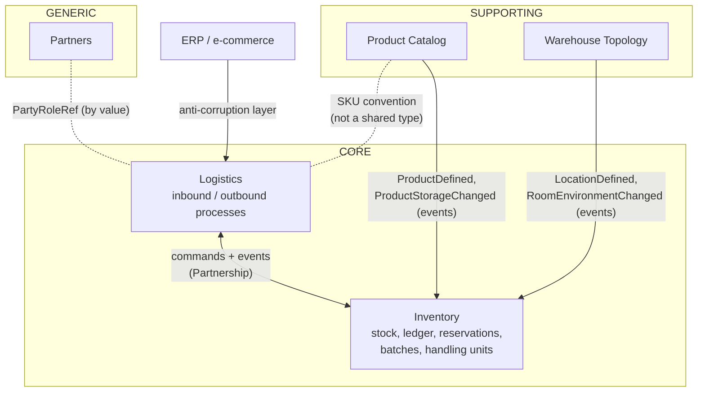
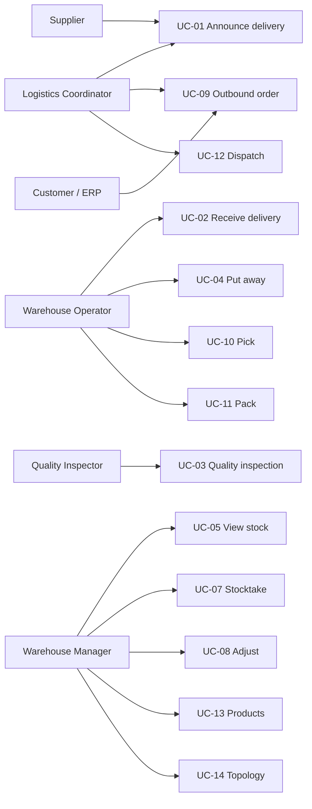
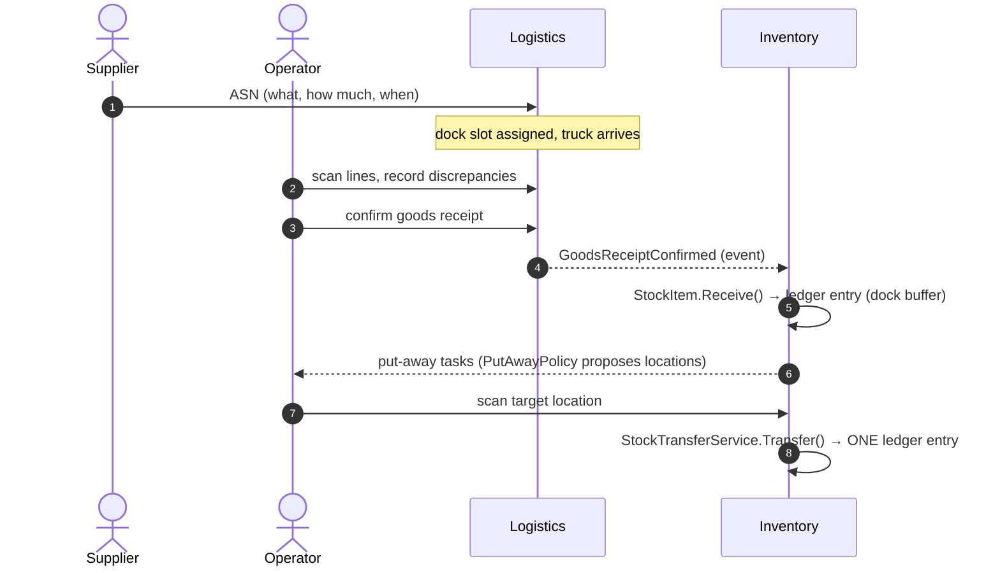

# #3 — Five contexts, three services: a tour of the warehouse domain

*Series: Building a real microservices application, brick by brick.
Previous: [#2 Why we start with the domain](02-why-we-start-with-the-domain.md).
Detailed model reference: [/docs/models](../models/README.md).*

---

In post #2 we carved the domain into five bounded contexts deployed as three services.
Today we walk through each context: what it owns, which use cases it serves, and — the
part most tutorials skip — **exactly how contexts talk to each other without sharing a
single type.**

One reading note: each context below has a **"Domain flavor"** box written with the
developer glasses off — the yogurt-and-forklift version of the same rules. If a box
surprises you, good: most of them record something the business corrected us on.
DDD is not the diagrams; it's the fact that we now know why milk is shipped by the date
on the lid, not the day it arrived.

## The context map

Solid arrows = event flow. Dotted = a shared *convention* (a code format, a reference by
value) — never a shared type. Catalog's strict `Sku`, Inventory's lighter `Sku` and
Logistics' loose `ProductCode` are three different types that agree on a format; more on why
in [post #6](06-the-shared-kernel.md).

## Catalog — *what* a SKU means

The product card: name, EAN, dimensions, weight, category, **storage requirements**
(temperature range, cold chain, hazmat), batch/expiry flags, and per-product **unit
conversions** (for *this* SKU, 1 pallet = 48 pieces; for another, 24).

- Aggregate: `ProductType` (identified by its natural key, the SKU)
- Use cases: UC-13 *Manage products*
- Knows **nothing** about stock or locations — by design. A product card saying
  "stored in WAW1" would be the first crack in the boundaries.

The interesting rule: changing storage requirements does **not** move existing stock.
The system reports incompatibilities; a human decides. Automating that decision would
mean the catalog silently triggering forklift work — a category error.

> 🧀 **Domain flavor:** when a producer reformulates a cheese and it suddenly needs 2–6 °C
> instead of ambient, three pallets of it are already sitting in the dry hall. The product
> manager edits the card; the warehouse manager gets a report saying "WAW1: 3 pallets now
> in the wrong room" and decides *when* a forklift deals with it — between trucks, not in
> the middle of the morning rush. The catalog states requirements; it never drives forklifts.
> Same with conversions: "a pallet" is not a unit of measure, it's a *per-product fact* —
> 48 crates of yogurt, 24 boxes of detergent. Ask a supplier how much fits on a pallet and
> the answer is always "of what?" — and sometimes even "depends on the truck". The same
> yogurt rides 48-to-a-pallet on an industrial pallet and 36 on a euro-pallet. So the catalog
> conversion is only the *default*; the authoritative count can belong to the specific
> delivery (the inbound line carries its own pack). Pinning that knowledge to master data
> alone would quietly miscount every receipt that arrived stacked differently.

## Topology — *where* goods can be stored

Physical structure: `WarehouseSite` → `Room` (standard / cold room / freezer / hazmat,
each with a maintained `RoomEnvironment`) → `Location` (addressable rack/shelf with
capacity and load limit) plus `Dock`s.

- Use cases: UC-14 *Manage topology*
- Location codes (`WAW1-CHLD1-A-03-2`) are **stable, scannable physical addresses** —
  they end up as barcodes on racks, which is why they are natural keys, not GUIDs.

> 🏷️ **Domain flavor:** read the code aloud and you can *walk there*: warehouse WAW1,
> cold room CHLD1, aisle A, rack 03, shelf 2 — a street address for goods. The label is
> printed once and glued to steel; if codes were database GUIDs, every re-labeling project
> would cost a weekend and a laminator. One special location kind is the **dock buffer**:
> the marked square of floor by the ramp where received goods legally exist ("on stock")
> before anyone decides where they'll live. Without it, you can't answer the auditor's
> favorite question: *"the truck left at 7:00, put-away finished at 9:00 — where was the
> butter at 8:00?"*

> **Trade-off:** one aggregate per warehouse keeps structural rules (unique codes,
> environment-per-room-type) trivially consistent, but a warehouse with 10k locations
> makes it a big aggregate. Fine for master data that changes rarely; we documented it
> as a known refactoring point rather than pre-optimizing.

## Inventory — the core: *how much of what lies where*

- `StockItem` — quantity of one SKU+batch at one location; hard allocations live inside it
- `StockReservation` — the *soft* promise made at order time (SKU-level, no pallet pinned)
- `StockMovement` — the append-only ledger (post #2, decision 2)
- `Batch` — expiry (FEFO) and the QC hold: blocking a batch hides it **everywhere** at once
- `HandlingUnit` — pallets/cartons with a scannable LPN; one scan moves the whole pallet
- `Stocktake` — blind counts, differences become ledger adjustments
- Domain services: `PutAwayPolicy` (the hard temperature/capacity rule),
  `StockTransferService` (one move = one ledger entry across two stock items),
  `ReservationService` (the soft-reserve gate) and `AllocationPolicy` (the hard-allocate gate — see below)
- Use cases: UC-05…UC-08 (stock view, moves, stocktake, adjustments)

**Two stages, not one — soft reservation then hard allocation.** This is the correction a
warehouse veteran insisted on, and it matters. When the order arrives, we take a **soft
reservation**: "300 of this SKU, in this warehouse, spoken for." It protects the promise
without pinning a pallet. The concrete pin — *which batch, which location* — is a separate
step, **hard allocation**, done at wave/pick time. Why split them? Because pinning a pallet
two days early means re-pinning it every time that pallet is blocked, damaged or moved; the
soft reservation lets the physical stock stay fluid until the last responsible moment.

**The numbers a manager actually reads.** For each SKU+warehouse the system distinguishes
`OnHand` (physically on shelves), `Allocated` (hard-pinned to orders, awaiting pick), and
**available-to-promise** = on hand − allocated − outstanding soft reservations. The shelf
holds 12 yogurts, 8 are already spoken for → a new order can take at most 4. Selling the same
yogurt twice is the unforgivable sin of warehousing, and this subtraction is the whole defense.

**The allocation gate.** Hard allocation runs at wave/pick time, and `AllocationPolicy` is the
bouncer: it refuses to commit a batch that is **in quarantine** (QC still deciding), **rejected**
(QC said no), or **expired**. The timing is the point — a batch can be fine when the order is
placed and blocked two days later, so the gate fires when stock is *committed*, not when it's
*promised*. And because a batch can be blocked *after* its stock is already sitting in five
locations, the `BatchBlocked` event sweeps through and quarantines those stock items too — the
rule holds at the gate *and* converges afterwards.

> 🥛 **Domain flavor — why FEFO and not FIFO:** Monday's delivery of milk can carry a
> *shorter* expiry than the milk already on the rack (different production line, different
> dairy). First-in-first-out would ship the older *delivery* — and let the sooner-expiring
> stock quietly rot in row B. First-**expired**-first-out ships what dies first. The
> warehouse manager's phrasing: "we don't sell milk, we sell *time until the date on the
> lid*".

## Logistics — the processes that cross the warehouse boundary

Four state machines: `InboundDelivery` (ASN → arrival → receipt → put-away),
`OutboundOrder` (created → reserved → picking → packed → dispatched), `PickList`
(routed tasks, short-pick handling), `Shipment` (packages, carrier, tracking).

- Use cases: UC-01…UC-04 (inbound), UC-09…UC-12 (outbound)
- Logistics holds **process state**; physical stock truth stays in Inventory. A pick
  list does not decrement anything — confirming a pick does, in Inventory, via a command.

> 🚚 **Domain flavor:** two rules here came straight from the receiving dock. First:
> **only announced deliveries get received** — an unannounced truck means an ad-hoc ASN is
> created first, *then* receiving starts. Sounds bureaucratic, until you learn that ramps
> are a scarce resource booked in time windows (a *dock slot*), and an unplanned 18-wheeler
> blocks four planned ones. Second: when the operator confirms a receipt, **lines nobody
> scanned become full shortages automatically** — the driver who "forgot" a pallet of
> butter doesn't get the benefit of an ambiguous paper trail. And on the way out: a picker
> who finds 11 where the system promised 12 reports a **short pick** — she never "fixes"
> the number herself. The missing yogurt is a *stocktake problem*, not a picking problem;
> mixing those two responsibilities is how warehouses lose track of what's true.

## Partners — the generic one

`Party` + roles (`SupplierRole`, `CustomerRole`, `CarrierRole`). One company can be both
our supplier and our customer — same party, two roles, never two duplicate roles.
Textbook archetype (more in post #5), and exactly the kind of subdomain where you want
*boring* code.

> 🤝 **Domain flavor:** the sentence that designed this context was the PO's offhand
> *"half our suppliers also buy from us"* — a dairy delivers yogurt on Monday and buys
> back near-expiry stock for its outlet store on Friday. Model that as two tables and you
> get two addresses, two tax IDs, and an accountant asking why "Mlekpol Sp. z o.o." owes
> itself money. One party, two roles — and the roles carry their own data: the customer
> role has shipping addresses, the carrier role has service levels (can they even haul
> refrigerated?).

## The use cases, mapped to actors

Notice the **two very different user experiences** hiding here: managers and coordinators
get a classic admin panel; operators get a scanner-first terminal with three giant buttons.
Same domain, two frontends — that distinction will drive the React work later in the series.

## How a delivery actually flows across contexts

And the outbound mirror image: order → soft `StockReservation` (protects available-to-promise)
→ at wave time `AllocationPolicy` pins concrete stock (FEFO, batch quality re-checked) →
routed pick list → scans decrement stock → packed → `ShipmentDispatched`.

## The rules of conversation between contexts

This table is the contract that keeps the system decoupled — worth printing:

| Mechanism | Used for | Examples |
|---|---|---|
| **Integration events** (async, via outbox) | Facts other contexts react to | `ProductDefined` → snapshot; `GoodsReceiptConfirmed` → stock enters dock buffer |
| **Shared conventions** (code formats, refs by value) | Pointing at things another context owns | a SKU code (Catalog `Sku` / Inventory `Sku` / Logistics `ProductCode`), `PartyRoleRef`, `WarehouseRef`, `OrderRef` on an allocation |
| **Local replicas** | Data needed to enforce *my* invariants | Inventory's `ProductSnapshot`, `LocationSnapshot` |
| **Never** | — | sharing entity types, querying another service's DB, synchronous calls inside invariant checks |

> **Trade-off:** duplication. `LocationCode` exists in Topology *and* (as its own type)
> in Inventory; storage requirements exist in Catalog and again in the snapshot; even a SKU
> is three types (Catalog's strict one, Inventory's lighter one, Logistics' loose
> `ProductCode`). That is deliberate: each context evolves its copy independently, and the
> only thing they truly share is the *language* (the code format). Sharing types would be
> less typing today and a distributed monolith tomorrow.

## What's next

[Post #4](04-the-aggregate-where-to-draw-the-lines.md): before the patterns, the single
most consequential tactical decision — **the aggregate boundary**. We listed our aggregates
casually above; the next post is about how you actually *draw* those lines, why `StockItem` is
tiny and `WarehouseSite` is big, and what it costs to get the boundary wrong.

Then [Post #5](05-archetypes-in-practice.md): the archetype patterns behind these models —
why `Party/Role` instead of a `Supplier` table, why quantities always carry units, and
why the yellow stickies (Moment-Intervals) ended up as our most important code.
