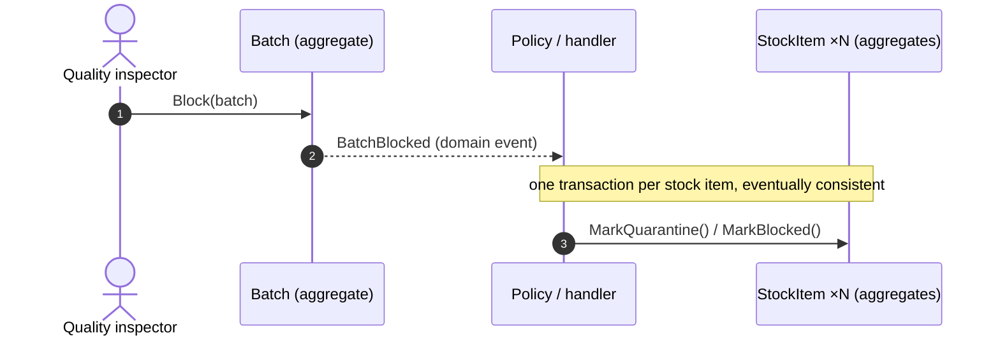
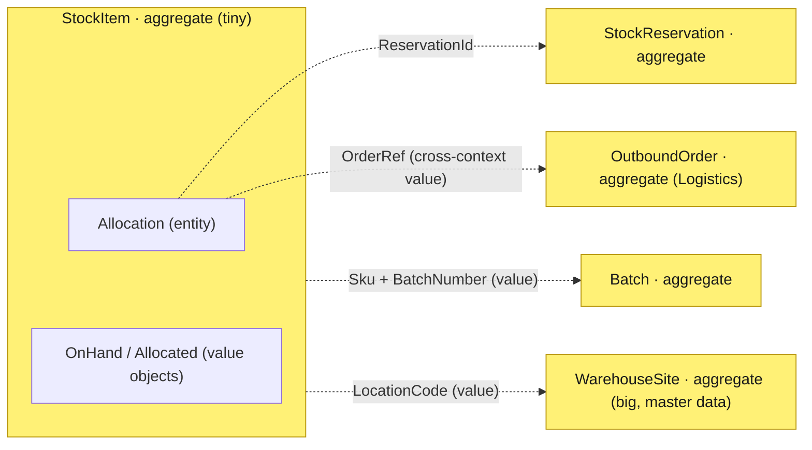

# #4 — The Aggregate: where you draw the lines (and what it costs to draw them wrong)

*Series: Building a real microservices application, brick by brick.
Previous: [#3 Five contexts, three services](03-bounded-contexts-and-use-cases.md).
Next: [#5 Archetypes in practice](05-archetypes-in-practice.md).
Code: [`src/.../Inventory/Domain/StockItem.cs`](../../src/Services/Warehousing/Modules/Warehouse.Warehousing.Inventory/Domain/StockItem.cs).*

---

Post #3 listed our aggregates almost casually — `StockItem`, `Batch`, `WarehouseSite`,
`OutboundOrder` — as if the hard part were naming them. It isn't. The hard part is the line
you draw *around* each one: what's inside, what's outside, and what is allowed to change in a
single breath. Get that line right and the model almost writes itself. Get it wrong and you
spend the next year fighting deadlocks, "why is this row always locked", and bugs where two
users overwrite each other and the auditor's numbers stop adding up.

This is the single most consequential tactical decision in DDD, and it deserves its own post.
The primer in [post #2](02-why-we-start-with-the-domain.md) gave you the one-line definition
("an aggregate is the consistency boundary"). Here we earn it: what the boundary really is,
the four rules for drawing it, how to *find* it in a real domain, and a tour of every line we
drew in the warehouse — including the one we deliberately drew small and the one we
deliberately drew big.

## What an aggregate actually is

Three definitions, from least to most useful:

- **Textbook:** a cluster of entities and value objects treated as a single unit, with one
  **aggregate root** as the only entry point.
- **Practical:** the **consistency boundary** — the set of objects that must obey their
  invariants *together*, in one transaction.
- **Operational:** the unit you **load and save as a whole**. One aggregate, one repository,
  one transaction, one lock.

The root is just the entity that owns the boundary. Everything outside reaches in *through*
the root and never touches the insides directly. In code, the root is the only thing that
carries domain events and the only thing a repository hands you:

```csharp
// SharedKernel — every root is exactly this much machinery, no more.
public abstract class AggregateRoot<TId> : Entity<TId>
    where TId : notnull
{
    private readonly List<IDomainEvent> _domainEvents = [];

    protected void Raise(IDomainEvent domainEvent) => _domainEvents.Add(domainEvent);

    // Infrastructure dequeues after a successful save and feeds the outbox.
    public IReadOnlyList<IDomainEvent> DequeueDomainEvents() { ... }
}
```

That's the whole base class. The aggregate's *value* isn't in the base type — it's in the
boundary you choose. So let's talk about choosing it.

## The four rules (and the warehouse evidence for each)

These are Vaughn Vernon's "Effective Aggregate Design" rules, distilled. Every one of them
left a fingerprint on this codebase.

### Rule 1 — Protect *true* invariants inside one boundary

An aggregate exists to keep an invariant true. If two pieces of data must always agree —
agree *at every instant*, with no window where they're inconsistent — they belong in the
same boundary. If they're allowed to be briefly out of step, they don't.

The `StockItem` boundary exists for one invariant: **you can never allocate more than you
have.** `Allocated ≤ OnHand`, always, no exceptions, no "fix it next batch job". That rule is
enforced by the root, in one transaction, before the change is allowed to exist:

```csharp
public Allocation Allocate(Quantity quantity, OrderRef orderRef, StockReservationId reservationId)
{
    if (Status != StockStatus.Available)
        throw new DomainException("stock_not_available", ...);

    if (!Available.IsGreaterThanOrEqualTo(quantity))   // Available = OnHand − Allocated
        throw new DomainException("stock_insufficient", ...);

    var allocation = new Allocation(AllocationId.New(), reservationId, orderRef, quantity);
    _allocations.Add(allocation);
    Allocated = Allocated.Add(quantity);
    Raise(new StockAllocated(...));
    return allocation;
}
```

Selling the same yogurt twice is the unforgivable sin of warehousing, and this subtraction is
the whole defense. It works *because* the allocations live inside the boundary — the root can
sum them and compare against on-hand atomically.

> 🥛 **Domain flavor:** "true invariant" has a test. Ask the warehouse manager: *"is it ever,
> even for a second, OK for allocated to exceed on-hand?"* The answer is a flat no — so it's a
> true invariant and goes inside the boundary. Ask *"is it OK if the stock-levels dashboard is
> three seconds behind reality?"* — "sure, it's a dashboard" — so that does **not** go inside;
> it's a read model fed by events.

### Rule 2 — Design *small* aggregates

The instinct of a beginner is the big aggregate: a `Warehouse` that owns its rooms, which own
their locations, which own the stock on them. It feels tidy — one object, the whole truth. It
is a trap. Every forklift confirmation would load and lock the entire warehouse; forty
operators would serialise behind one row; the object would be megabytes.

So our core aggregate is deliberately tiny — the quantity of **one SKU + batch at one
location** — and we said so in the class itself:

```csharp
/// The Inventory archetype entry and our core aggregate: quantity of one SKU (and batch)
/// at one location. Deliberately small — every scan gun confirmation is a transaction on
/// a single StockItem, so there are no hot rows.
public sealed class StockItem : AggregateRoot<StockItemId>
```

This is **decision 3 from [post #2](02-why-we-start-with-the-domain.md)**, and it's the
clearest example of the rule paying off: a scan is a short transaction on a single small row,
so 40 concurrent forklifts never contend.

> **Trade-off:** small aggregates can't enforce invariants that *span* them. "Total volume in
> this location across all SKUs must not exceed capacity" touches many `StockItem`s, so no
> single one can own it. We pay for small aggregates by pushing that rule into a domain
> service (`PutAwayPolicy`) backed by a database constraint as the last line of defense — the
> subject of [post #5](05-archetypes-in-practice.md). That's the deal: small aggregates buy
> concurrency, and the bill is "cross-aggregate rules move outside".

### Rule 3 — Reference other aggregates *by identity*, never by object

Inside a boundary you hold real objects. Across boundaries you hold only **IDs** (or a value
reference). An `Allocation` needs to know which order it serves and which soft reservation it
came from — but `OutboundOrder` and `StockReservation` are *other* aggregates, so it holds
references, not pointers:

```csharp
public sealed class Allocation : Entity<AllocationId>   // lives INSIDE StockItem
{
    public StockReservationId ReservationId { get; private set; }  // → another aggregate, by id
    public OrderRef OrderRef { get; private set; }                 // → an order in Logistics, by value
    public Quantity Quantity { get; private set; }
    public AllocationStatus Status { get; private set; }
}
```

Why so strict? Because an object reference is an invitation to load and *modify* the other
aggregate in the same transaction — and the moment you do, you've silently merged two
boundaries into one giant transaction and one giant lock. An ID can't be accidentally
mutated. It forces the question "do these really change together?" to be answered honestly,
in the open. (Note `OrderRef` is a reference to something a *different bounded context* owns;
it can only ever be a value — see post #3's rules of conversation.)

### Rule 4 — Change *other* aggregates with eventual consistency

If a single user action must change two aggregates, the default is **not** one transaction
that locks both. The default is: change one now, raise a domain event, let the other catch up.

The warehouse's sharpest example is the QC hold. A `Batch` and a `StockItem` are **separate
aggregates** (a batch is suspicious *everywhere at once*; stock is per-location). When QC
blocks a batch, every stock item of that batch — in every location, in every warehouse — must
become unavailable. You cannot do that in one transaction without locking the whole world.
So you don't:



Each stock item flips in its own little transaction. For a few milliseconds the batch is
blocked but a stock item hasn't caught up yet — and that's fine, because the allocation gate
re-checks batch quality *at the moment of allocation* anyway (`AllocationPolicy`, post #5).
The rule holds at the gate **and** converges afterwards. The window is acceptable; the
alternative (one transaction across thousands of rows) is not.

> **Trade-off:** eventual consistency between aggregates means you must answer "what happens
> in the gap?" for every cross-aggregate rule. We answer it twice — a converging sweep *plus*
> a gate that re-validates — which is more code than a single big transaction. We buy
> something worth far more: the system stays responsive, and no operation ever locks more
> than one small row.

## How to actually *find* the boundary

Rules are easy to recite and hard to apply. Here's the procedure we used, in order:

1. **List the invariants first, aggregates second.** Don't start from nouns ("there's
   clearly a `Warehouse` class"). Start from rules that must never be violated, then draw the
   smallest boundary that makes each rule enforceable in one transaction. `Allocated ≤ OnHand`
   gave us `StockItem`. Unique room/location codes gave us `WarehouseSite`. The invariant
   *is* the aggregate's reason to exist.
2. **Apply the "one transaction" test.** If completing a use case forces you to modify two
   candidate aggregates atomically, either they're really one aggregate, or your boundary is
   wrong, or (usually) the second change should be eventually consistent via an event. Three
   answers — pick deliberately, don't drift into a two-aggregate transaction by accident.
3. **Apply the "delete" test.** What gets deleted together? Delete a `Party` and its roles go
   with it — roles have no life of their own, so they're inside. Delete a `StockReservation`
   and the orders it referenced absolutely do **not** vanish — so orders are outside.
4. **Apply the "true vs convenient" test.** "Allocated never exceeds on-hand" is *true*
   consistency. "I'd like the dashboard to match instantly" is *convenient* consistency. Only
   true consistency justifies a boundary; convenient consistency is what read models and
   events are for.
5. **Default to smaller; merge only under proof.** Start with the smallest boundary the
   invariants allow. Only grow it when a concrete invariant *forces* two things into the same
   transaction. A boundary that's too small costs you an event; a boundary that's too big
   costs you concurrency, and concurrency is the more expensive bug.

A useful sanity check at the end: **one aggregate ↔ one repository ↔ one transaction.** If you
catch yourself wanting a repository that returns half an aggregate, or a transaction that
saves two, the line is in the wrong place.

## The lines we drew (a tour)



Solid containment = inside the boundary. Dotted = a reference by id/value to a *different*
aggregate. Read the diagram and you can see every one of the four rules at work.

- **`StockItem` — drawn small, on purpose.** Holds its `Allocation`s (entities) and its
  on-hand/allocated quantities (value objects) inside, because `Allocated ≤ OnHand` is a true
  invariant. Everything else it merely *references*. The whole class is a few hundred lines
  and every method is a short transaction.
- **`Allocation` — an entity, not an aggregate.** It has identity and lifecycle (Active →
  Fulfilled / Released) but **no independent existence**: an allocation without its stock item
  is nonsense. So it lives inside `StockItem`, mutated only through the root, with `internal`
  methods (`ReduceBy`, `MarkFulfilled`) the outside world can't call. That `internal` keyword
  is the boundary, enforced by the compiler.
- **`Batch` — a separate aggregate, referenced by value.** `StockItem` knows its batch as a
  `BatchNumber` value, not a `Batch` object, precisely because the QC hold must propagate by
  event (rule 4), not by reaching across and mutating in one transaction.
- **`WarehouseSite` — drawn big, also on purpose.** The counter-example that proves rules
  aren't dogma. A warehouse owns its rooms, docks and locations as a single aggregate, because
  structural invariants (unique codes, environment-per-room-type) are simple, must be
  consistent, and the data **changes rarely** — it's master data, edited by a manager between
  trucks, never under forklift concurrency:

  ```csharp
  public Location AddLocation(RoomCode roomCode, LocationCode code, ...)
  {
      if (_rooms.SelectMany(r => r.Locations).Any(l => l.Code == code))
          throw new DomainException("location_code_duplicate", ...);  // invariant across the whole site
      ...
  }
  ```

  > **Trade-off:** one aggregate per warehouse means a site with 10k locations is a big object
  > to load. We accept it *because the access pattern is rare reads and rarer writes* — the
  > exact opposite of `StockItem`. Same domain, opposite decisions, and the deciding factor in
  > both cases was the same question: *does this change under concurrency?* We documented the
  > large-aggregate risk in [post #7](07-the-price-tag.md) rather than pre-optimising. **The
  > size rule is "small *by default*", not "small *always*".**

## Smells that mean the line is wrong

A field guide to aggregate mistakes — every one of these we either avoided or caught in
review:

- **The God Aggregate.** `Warehouse` owns all stock. Symptom: one row everyone locks; "why is
  the warehouse always busy?". Fix: find the real per-operation invariant and shrink to it.
- **The Anemic Aggregate.** A root with public setters and no behavior; rules live in handlers
  outside. Symptom: the same validation copy-pasted across three services, one of which forgot
  it. Fix: push the invariant *into* the root (see `Allocate` above — you literally cannot
  over-allocate).
- **The Object-Reference Leak.** An aggregate holds a `Batch` instead of a `BatchNumber`.
  Symptom: a use case quietly saves two aggregates in one transaction. Fix: hold the id;
  let the change be eventually consistent.
- **The Multi-Aggregate Transaction.** "Place order" updates the order *and* decrements five
  stock items atomically. Symptom: deadlocks under load, distributed-transaction temptation.
  Fix: one aggregate per transaction; the rest follows by event.
- **The Convenience Boundary.** Two things share an aggregate only because it's handy to load
  them together. Symptom: a "true invariant" nobody can name. Fix: that's a read model, not an
  aggregate.

## The one paragraph to remember

An aggregate is not a data structure; it's a **decision about what must be true at the same
time**. Draw the boundary around the invariant, keep it as small as that invariant allows,
reference everything else by id, and let the rest of the world catch up through events. When
you're unsure, ask the domain expert the only question that matters — *"can these two facts
ever, even for a second, disagree?"* — and let the answer draw the line for you.

## What's next

[Post #5](05-archetypes-in-practice.md): the **archetype patterns** behind these aggregates —
why `Party/Role` instead of a `Supplier` table, why quantities always carry units, why the
ledger is a Moment-Interval, and the pre-paid price tag attached to each pattern.
