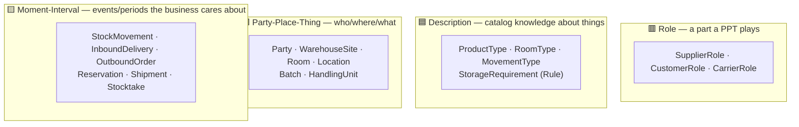

# #5 — Archetypes: pre-paid modeling decisions (and their price tags)

*Series: Building a real microservices application, brick by brick.
Previous: [#4 The aggregate: where to draw the lines](04-the-aggregate-where-to-draw-the-lines.md).*

---

When you model a new domain, you face hundreds of small decisions: is "supplier" an entity
or a role? Is a quantity a `decimal`? Is a goods receipt a row update or a fact? **Archetype
patterns** are those decisions made once, by people who modeled hundreds of enterprises,
and published with the trade-offs attached. Two sources shaped our model:

- **Arlow & Neustadt, *Enterprise Patterns and MDA*** — concrete archetypes: Party,
  Product, Inventory, Quantity, Money, Rule
- **Coad et al., *Modeling in Color*** — four color archetypes that classify *any* domain
  class: 🟨 Moment-Interval, 🟩 Party-Place-Thing, 🟦 Description, 🟥 Role

The colors first, because they organize everything else:



The practical insight of the colors: **the yellow classes are where the money is.** They
carry history, they trigger the next step, they are what auditors ask about. If your
yellow classes are anemic DTOs, your domain model is decoration.

## Archetype 1: Party / PartyRole — instead of a `Suppliers` table

The naive model has `Supplier` and `Customer` entities. Then your biggest supplier starts
buying surplus stock from you, and now the same company exists twice, with two addresses
to keep in sync and two tax IDs that had better match.

```csharp
public sealed class Party : AggregateRoot<PartyId>
{
    public SupplierRole BecomeSupplier(string code) => AddRole(new SupplierRole(PartyRoleId.New(), code));
    public CustomerRole BecomeCustomer(string code) => AddRole(new CustomerRole(PartyRoleId.New(), code));
    // AddRole throws party_role_duplicate for a second role of the same kind
}
```

Identity and legal data live on the `Party`; role-specific data (shipping addresses on
`CustomerRole`, service levels on `CarrierRole`) lives on the role. Other contexts point
at the **role**, not the party: an inbound delivery references a `PartyRoleRef` of a
supplier role.

> **Trade-off:** one level of indirection everywhere — you can't `JOIN suppliers` anymore,
> and every UI needs to understand "company with roles". For two roles it feels like
> over-engineering; the break-even is the *first* company that plays two roles, which in
> B2B logistics is roughly week two of production.

## Archetype 2: Description — `ProductType` is not a product

A product card (🟦) describes; physical goods (🟩) exist. Mixing them is the classic
catalog mistake: a `Product` table with a `quantity` column, which collapses the moment
you have two warehouses.

We split: `ProductType` (Catalog) holds SKU, dimensions, storage requirements; physical
existence lives in Inventory as `Batch` + quantities at locations.

> **Trade-off:** we track **batches, not serial numbers** — units of a batch are
> interchangeable. Pharma or electronics would need a `ProductInstance` per unit (heavier
> model, per-unit scans). For food logistics, batch + expiry is the industry standard;
> per-unit tracking would double the scanning work for zero business value. This is in the
> "deliberately deferred" list, *named*, so nobody mistakes it for an oversight.

## Archetype 3: Quantity — a number that refuses to lie

The most common warehouse bug is a bare `decimal`: pieces added to kilograms, pallets to
cartons, a negative stock that "fixes itself" next stocktake. The Quantity archetype makes
those bugs unrepresentable:

```csharp
var a = Quantity.Of(10, UnitOfMeasure.Piece);
var b = Quantity.Of(2, UnitOfMeasure.Kilogram);
a.Add(b);          // throws quantity_unit_mismatch
a.Subtract(Quantity.Of(11, UnitOfMeasure.Piece)); // throws quantity_insufficient
```

Movement *direction* is modeled by the movement type (`Pick`, `AdjustmentOut`), never by
signed amounts — so "negative quantity" is not a concept that exists.

Unit conversions deliberately do **not** live in `Quantity`: 1 pallet = 48 pieces *for this
SKU* and 24 for another. Conversion factors are product master data
(`ProductType.AddUnitConversion`, `ToBaseUnit`, `Convert`), not arithmetic — and even then
only the *default*: the same SKU can arrive stacked differently per delivery, so an inbound
line may carry its own `DeliveryPack` that overrides the catalog factor for that truck.

> **Trade-off:** ceremony. Every quantity needs a unit, EF needs complex-type mappings,
> and test data is wordier. We pay it gladly: in a domain whose entire value proposition is
> "the numbers are right", the type system guarding the numbers is the cheapest insurance
> available.

## Archetype 4: Moment-Interval — the ledger

The deepest consequence of the color archetypes in this codebase: **`StockMovement` is an
immutable fact, and stock is a projection of facts.**

```csharp
// You cannot change stock without producing the ledger entry:
public StockMovement Pick(AllocationId allocationId, Quantity quantity, string performedBy)
{
    // ...invariants...
    OnHand = OnHand.Subtract(quantity);
    return StockMovement.Record(MovementType.Pick, Sku, Batch,
        from: Location, to: null, quantity, performedBy, reason: $"Order {allocation.OrderRef}");
}
```

The behavior *returns* the movement; the application layer persists aggregate + movement in
one transaction. A correction is a reversing movement. The table will reject `UPDATE` and
`DELETE` at the database level.

> **Trade-off:** this is event-sourcing-flavored thinking without full event sourcing — and
> that is deliberate. Full ES would give us replay and temporal queries, at the cost of
> snapshotting, versioned event upcasting and a much steeper on-boarding. The ledger gives
> us the part the business actually asked for (auditability) at a fraction of the
> complexity. Knowing **how much of a pattern to buy** is the senior skill.

## Archetype 5: Rule — compatibility as an object, not an if-cascade

"Frozen goods only in freezer rooms" could be a stack of `if`s in a handler. Instead, the
requirement is data (`StorageRequirement` on the product card), the environment is data
(`RoomEnvironment` on the room), and the check is an explicit, testable policy:

```csharp
var check = PutAwayPolicy.CanStore(product, location, qty, usedVolume, usedWeight);
if (!check.IsAllowed) { /* check.RejectionReason explains exactly why */ }
```

Same pattern three more times: `ReservationService` (soft-reserve only within
available-to-promise), `AllocationPolicy` (a quarantined or expired batch is invisible to
hard allocation — a rule that *spans two aggregates*, `StockItem` and `Batch`, so neither can
own it alone), and `StockTransferService` (one physical move = one ledger entry across two
stock items).

> **Trade-off:** domain services are where DDD purists start arguing — "shouldn't this be
> on the aggregate?" Our rule of thumb: behavior touching **one** aggregate lives on it;
> behavior spanning aggregates or replicas lives in an explicitly named policy/service.
> The name in the ubiquitous language ("put-away policy" — the PO uses these words!)
> justifies the object.

## What's next

[Post #6](06-the-shared-kernel.md): the SharedKernel — the most dangerous package in any
microservices codebase, and how we kept it small enough to be safe.
