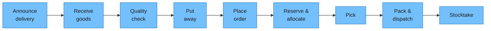
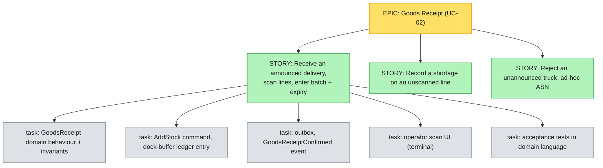

# #9 — Story Mapping: turning a domain into a plan (epics, stories, tasks)

*Series: Building a real microservices application, brick by brick.
Previous: [#8 Wrapping up Part I](08-wrapping-up-part-i.md).
Inputs: the [use cases](../03-use-cases.md) and the [event-storming boards](../diagrams/README.md).*

---

Part I ended with a domain we understand: a language, five contexts, a model guarded by
invariants. What it did **not** give us is a plan. And the default move here — dump every use
case into a flat backlog and start pulling from the top — is how good domain work quietly turns
into a year of shipping plumbing nobody can use yet.

A flat backlog has one fatal property: it's **one-dimensional**. You can see *order*, but not
*shape*. You can't see which tickets together form something a warehouse manager could actually
switch on, and which are just "more of the same". Sort it by priority and you get a tower of
"importance" with no narrative — you'll build all of receiving, then all of put-away, then all
of picking, and have nothing demoable until the last one lands.

So before we open an IDE (post #13), we spend an afternoon on **user story mapping** (Jeff
Patton). It's the bridge from "we understand the business" to "here's what we build first, and
why".

## What a story map is

A story map is the backlog made **two-dimensional**:

- **Horizontal — the backbone.** The user's journey, left to right, in the order things happen.
  These are *activities*, big-grained ("Receive a delivery", "Pick an order"). It reads like the
  day-in-the-warehouse narrative from [post #2](02-why-we-start-with-the-domain.md), because it
  *is* that narrative. The backbone is the spine of the event-storming Big Picture, re-told from
  the user's side.
- **Vertical — the detail and the options.** Under each activity hang the **stories**: the
  specific things a user does, the variations, the unhappy paths. The higher a sticky, the more
  essential; the lower, the more "nice to have / edge case".
- **Slices — the releases.** You draw horizontal lines across the whole map. Everything above the
  first line is **release 1**: the thinnest set of stories that still tells the *whole* story
  end-to-end. That's the difference between a plan and a pile.



The full map — backbone, the stories under each activity, and the release slices — is an
editable board: [`story-map.excalidraw`](../diagrams/story-map.excalidraw).

## Our map (abridged)

Under each backbone activity, the stories — and the line that carves out the first walkable
release. (Full version lives next to the [use cases](../03-use-cases.md); this is the shape.)

| Activity → | Receive goods | Put away | Place order | Reserve & allocate | Pick | Dispatch |
|---|---|---|---|---|---|---|
| **Release 1** (walking skeleton) | Receive an *announced* delivery, record batches | Put away with `PutAwayPolicy` (temperature hard-stop) | Create order, soft-reserve within ATP | Hard-allocate FEFO at wave | Confirm pick (scan) | Confirm dispatch, drop stock |
| **Release 2** | Discrepancies / shortages; ad-hoc ASN | Capacity reroute; consolidation strategy | Partial / backorder | Re-check batch quality at commit | Short-pick replan; routing | Carrier integration, tracking |
| **Later** | Inter-warehouse transfer | Handling units (LPN) moves | Customer-specific rules | Reservation expiry | Wave optimisation | Multi-parcel, labels, customs |

The **walking skeleton** is the top row read left to right: *one announced delivery comes in, gets
put away, an order reserves and allocates it FEFO, it's picked and dispatched, and stock is
correct the whole way.* It is deliberately shallow — no shortages, no short picks, no carrier
API — but it is **end-to-end**, and it crosses all three services. Building it first proves the
hard part (the seams, the outbox, the ledger) on the simplest possible happy path, and gives the
client something real to click in week N instead of month 3N.

> **Why a walking skeleton beats "finish receiving first":** a horizontal slice ("all of
> receiving") delivers nothing usable until the *last* horizontal slice is done — you can receive
> goods you can never ship. A vertical slice through every activity delivers a working, if
> minimal, warehouse. You learn whether your architecture is right while it's still cheap to be
> wrong.

## Epics, stories, tasks — what each one is here

Three sizes, and we're strict about which is which:



- **Epic** — a backbone activity, too big to build in one go. Roughly one use case (UC-02 *Receive
  delivery*). It's a *grouping*, not a work item; you never "do an epic".
- **Story** — a vertical, demoable slice of behaviour, written from the user's view and small
  enough to finish inside a sprint. *"As an operator I receive an announced delivery, scanning each
  line and entering batch + expiry, so that stock legally exists in the dock buffer."* It maps to
  one row of one column on the map.
- **Task** — the engineering steps a story decomposes into, and crucially they are a **vertical
  slice through Clean Architecture**: domain behaviour, application command, persistence, the
  integration event, the UI, the tests. Not "build the database layer" — that's a horizontal task
  and it's how stories stop being demoable.

We hold stories to **INVEST** (Independent, Negotiable, Valuable, Estimable, Small, Testable) and
write acceptance criteria in the **ubiquitous language** — Given/When/Then phrased in warehouse
words, so they read the same to the QC lead and the developer:

```gherkin
Scenario: A batch blocked after reservation cannot be allocated
  Given 300 units of SKU "MLK-2L" reserved (soft) for order ORD-42
  And the batch "L2406-117" is later put on QC hold
  When the wave for ORD-42 is released
  Then allocation skips batch "L2406-117" (quarantined)
  And FEFO picks the next-expiring released batch instead
```

That scenario is a hotspot from the [event-storming session](../meeting/event-storming-session-01.md),
now a test. The line from sticky → story → acceptance test is the whole point of doing Part I.

## How the map drives the rest of the series

The slices *are* the build order for Part III. Reading the walking skeleton left to right gives us,
near enough, the post sequence:

1. **Master data first** — there's no stock without a `ProductType` and a `Location` to put it in.
2. **First integration event** — `ProductDefined` → Inventory's `ProductSnapshot` (the smallest
   possible cross-service thread; proves the outbox before anything depends on it).
3. **Goods receipt** — the inbound saga; the first pivotal event.
4. **Put-away** — `PutAwayPolicy` under concurrency; the first hard invariant.
5. **Reserve → FEFO allocate → pick** — the outbound saga; the two-stage allocation.
6. **Dispatch, then the Release-2 depth** — shortages, short picks, carriers, stocktake.

Each brick adds exactly one architectural concept, because the *map* — not the framework — decided
the order.

> **Trade-off — a map is a snapshot, not a contract.** Story maps go stale the moment reality
> pushes back (Release 2 always gets re-cut after Release 1 ships). They're also a *workshop*: the
> map is only as good as having the same people who did the event storming in the room, and it
> costs their time. And estimates on the map are guesses — we use it to decide **order and shape**,
> not to promise dates. The map earns its keep as a shared picture of "what's in vs out for the
> next slice", and is meant to be redrawn, not defended.

## What's next

We have a domain, and now a plan with a clearly-cut first slice. Before we cut code, two short
design passes. First, [post #10](10-architectural-drivers.md) names the **architectural drivers** —
the handful of forces (the key use cases, the quality attributes, the constraints) that actually
shape an architecture, so the decisions that follow have something concrete to answer to. Then
[post #11](11-design-nfr-adr-and-design-system.md) writes the design **down** — the functional and
**non-functional** requirements, how we record decisions (ADRs), the architecture (Clean
Architecture per module, the three services and the diagrams worth maintaining), and a first cut of
the **design system** for our two very different frontends. It also ends with a list of questions
only you can answer.
