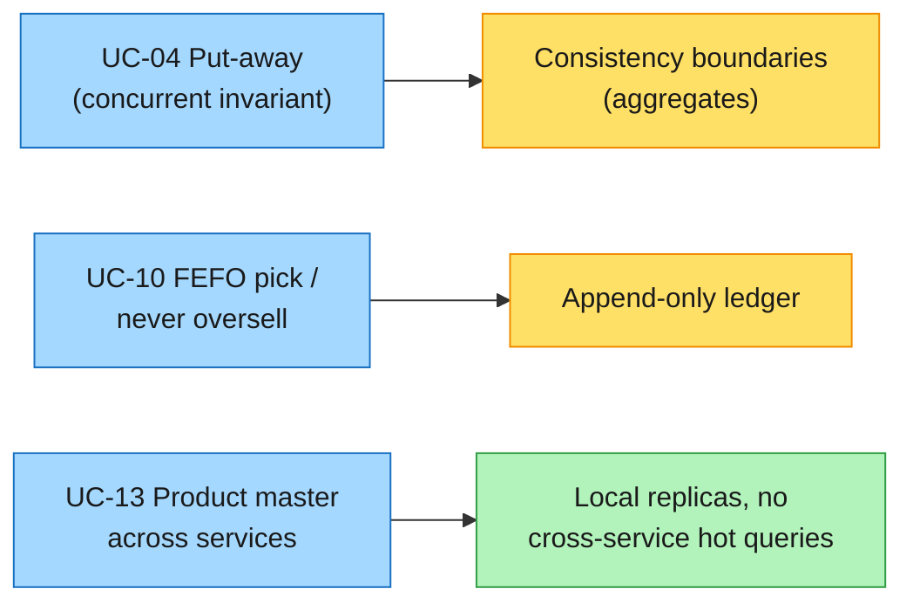
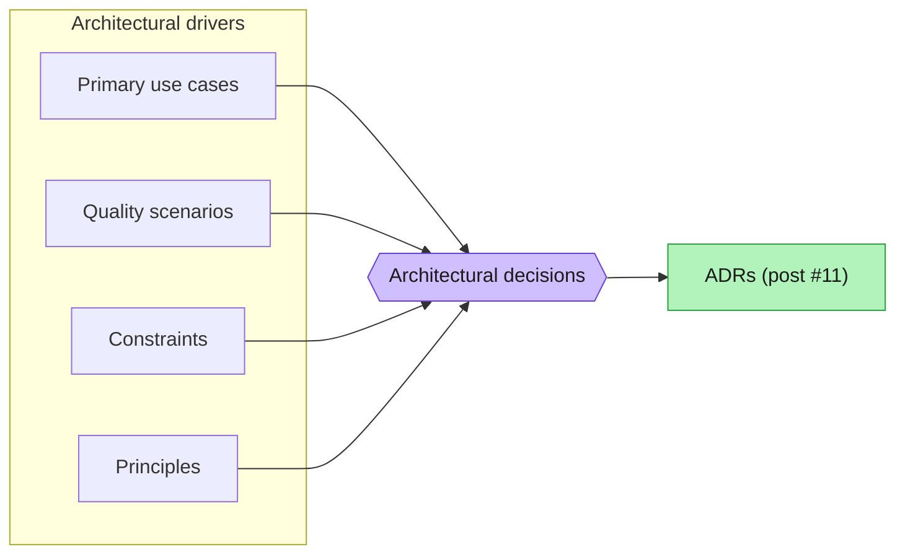

# #10 — Architectural drivers: the forces the architecture has to answer to

*Series: Building a real microservices application, brick by brick.
Previous: [#9 Story Mapping](09-story-mapping-epics-and-tasks.md).
Use cases: [/docs/03-use-cases.md](../03-use-cases.md). Decisions: [/docs/adr](../adr/README.md).*

---

We have a domain (Part I) and a plan (post #9). The next post writes the design **down** — NFRs,
ADRs, diagrams, a design system. But there's a question that sits *between* the plan and the design,
and most projects answer it by accident: **of everything we now know, what actually shapes the
architecture?**

Not everything does. "The system stores products" is true and necessary — and architecturally
boring; a CRUD table satisfies it. "We must never sell the same pallet twice, while 40 operators
scan in parallel, with the master-data service possibly down" is a different kind of sentence: it
*bends the structure of the system*. The first is a requirement. The second is a **driver**.

This short post names the drivers before we make a single decision — because a decision with no
driver behind it is a preference, and the ADRs in [post #11](11-design-nfr-adr-and-design-system.md)
should each be answerable to a force we can point at.

## What counts as a driver

An architectural driver is any input that the architecture has to *satisfy* or *trade against* —
and that would change the architecture if it changed. There are four kinds, and a useful design
keeps them apart because they behave differently:

| Kind | What it is | Warehouse example | Behaves like |
|---|---|---|---|
| **Primary functional reqs** | The handful of use cases that, by themselves, force structure | Concurrent put-away; FEFO picking; cross-service product master data | A *shape* — pick the few that bend things |
| **Quality attributes** | How well, under what load and failure — written as *scenarios*, not adjectives | Scan→confirm p95 < 300 ms; never oversell; degrade if a service is down | A *measure* — testable, falsifiable |
| **Constraints** | Givens you don't get to choose | Rugged Android in a freezer; OSS-only; Polish domain, English code | A *boundary* — non-negotiable |
| **Principles** | Self-imposed rules that keep decisions coherent | Dependencies point inward; the aggregate is the consistency boundary; believe scans, not memory | A *tiebreaker* — applied repeatedly |

> **Trade-off — a driver list is a *filter*, and filters can be wrong.** The whole point is to keep
> the set small: a dozen drivers, not fifty requirements. The risk is real — promote the wrong use
> case and you over-build a corner that never mattered; miss a real quality attribute and you find
> out in production. We accept that by writing drivers down *so they can be challenged*, and by
> revisiting them when the load tests (post #11's NFRs) tell us we guessed wrong.

## The architecturally significant use cases

We have fourteen [use cases](../03-use-cases.md). Most are satisfied by any competent layering —
they are not drivers. A few are, because they impose a constraint the rest of the system must bend
around:

- **UC-04 Put-away under concurrency** — two forklift drivers, the same location, the same second.
  The environment-compatibility and capacity invariants must hold *atomically*. This is what makes
  the `WarehouseSite`/`StockItem` consistency boundaries load-bearing, not cosmetic.
- **UC-10 FEFO picking** + **UC-09 outbound** — "never sell the same stock twice" is the one rule
  we never relax. It drives the two-stage reservation/allocation split and the append-only ledger.
- **UC-13 Manage products** consumed by Inventory — a fact owned by one context, needed hot by
  another. This single relationship is what forces a choice between cross-service queries and local
  replicas (and it picked the replica).

The other eleven use cases still get built — they're just not the ones we *design around*.

## Quality attributes — scenarios, not adjectives

"Fast", "reliable", "secure" are not drivers; they're wishes. A quality attribute becomes a driver
only when it's a **scenario** you could pass or fail: a *stimulus* on an *artifact* in an
*environment*, with a measurable *response*. The form forces the vagueness out.

| Source → stimulus | Artifact / environment | Measured response |
|---|---|---|
| Operator scans to confirm a pick | Operator terminal, €200 Android, freezer, 40 concurrent users | Round-trip p95 **< 300 ms** |
| Two operators allocate the last unit | Inventory, same SKU+batch+location | **Exactly one** succeeds; the other is rejected, never both committed |
| `masterdata-service` is down during a goods receipt | Warehousing service, normal floor traffic | Receipt **still completes** against the local product replica; no hard dependency |
| Auditor asks "who moved this pallet, when" | Stock ledger, months later | Every movement is attributable and immutable for the retention horizon |

Each row is a driver because flipping its measure would change the architecture: drop the 300 ms and
a chatty synchronous design becomes acceptable; drop "exactly one" and you don't need the ledger or
optimistic concurrency at all.

> **Trade-off — scenarios commit you to numbers you're guessing.** p95 < 300 ms and "40 concurrent
> operators" are hypotheses until a load test measures them against a real workload. We write them
> anyway, because a wrong-but-explicit number is a target the SLOs and load tests can check and
> revise — whereas "should be fast" can never be wrong, and so never teaches us anything.

## Constraints — the givens

Constraints are drivers we don't get a vote on. Keeping them separate matters: you satisfy a quality
attribute *as well as you can*, but you simply *obey* a constraint.

- **Business / environmental** — the floor is a cold room: gloves, glare, one free hand. The domain
  was discovered in Polish; code and UI are English. Stock is auditable for a regulated horizon.
- **Technical / organisational** — a portfolio/teaching project, so **OSS-only, no per-seat
  licences** (this is the constraint that later decides the [messaging library](17-choosing-a-messaging-library.md)).
  Local dev is one `dotnet run` via Aspire; the broker is RabbitMQ, the store is Postgres-per-service.

## Principles — the tiebreakers

When two designs both satisfy the drivers, principles break the tie the same way every time, so the
system stays coherent instead of becoming a museum of local opinions:

- **The domain depends on nothing.** Dependencies point inward (Clean Architecture); infrastructure
  is a plug.
- **The aggregate is the consistency boundary** — it decides what must be true in one transaction,
  and therefore the storage shape.
- **Believe scans, not memory** — every state change is an event a sensor actually produced.
- **Every decision shows its price** — no choice is presented as free (the rule of this whole series).

## From drivers to decisions

This is the payoff, and the reason the post exists *before* post #11: the ADRs aren't arbitrary —
each one traces back to a driver. Read the table right-to-left and every decision has a "because".

| Driver | Decision it forces | Recorded in |
|---|---|---|
| Cross-context invariants (UC-04) must commit together; independent deploy & scale | Microservices, but contexts that share an invariant share a service | [ADR-0001](../adr/0001-microservices-from-day-one.md) |
| Never oversell; full auditability | Stock is a projection of an append-only ledger | [ADR-0002](../adr/0002-stock-as-append-only-ledger.md) |
| Product master needed hot while its owner may be down (UC-13) | Local replicas, no cross-service queries on the hot path | [ADR-0003](../adr/0003-replicas-over-cross-service-queries.md) |

> **Trade-off — naming drivers is a step you can skip, and pay for later.** It costs an afternoon and
> produces no code. Skip it and the team still makes the same decisions — but nobody can say *why*,
> so six months on someone "simplifies" the replica back into a cross-service query and reintroduces
> the coupling we paid to avoid. The driver is the thing the ADR's *Context* section quotes; without
> it, the ADR is just an assertion.

## What's next

We've named the forces: the few use cases that bend the structure, the quality scenarios with
numbers attached, the constraints we obey, and the principles that break ties. They're the agenda for
the design. [**Post #11**](11-design-nfr-adr-and-design-system.md) works through that agenda on
paper — the full NFR catalogue, the ADRs each driver produced, the C4 and deployment diagrams worth
maintaining, and a first design system for the two frontends — the last cheap step before we open
the IDE.

**Post #11: From requirements to a design — NFRs, ADRs, diagrams and a design system →**
