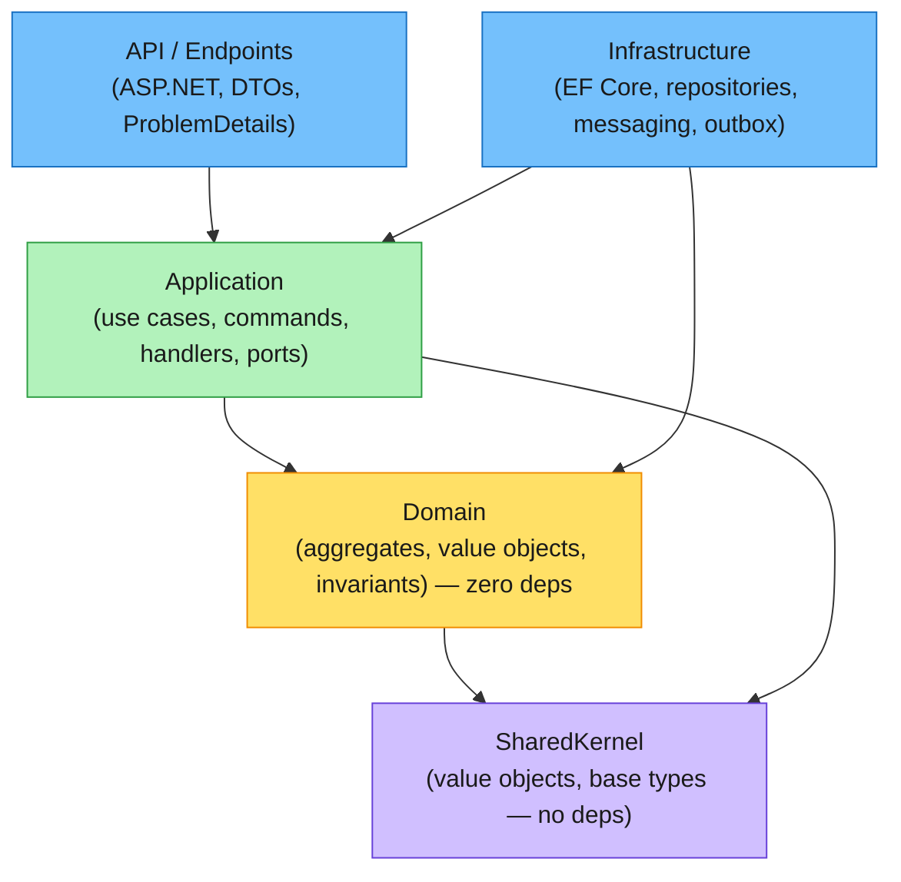
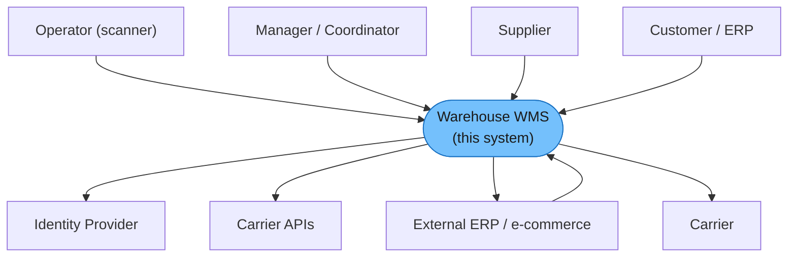
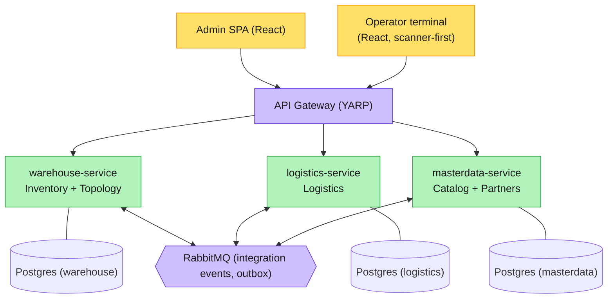
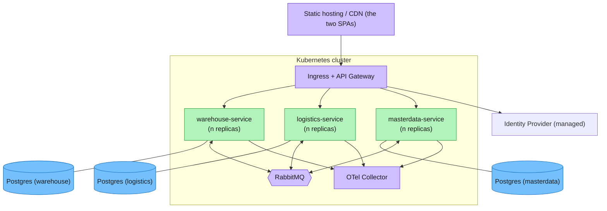
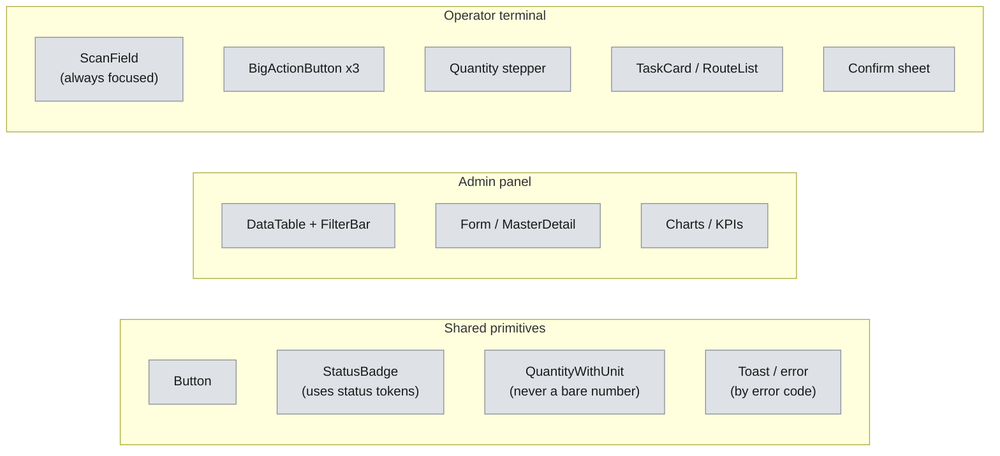

# #11 — From requirements to a design: NFRs, ADRs, the diagrams worth keeping, and a first design system

*Series: Building a real microservices application, brick by brick.
Previous: [#10 Architectural drivers](10-architectural-drivers.md).
Decisions: [/docs/adr](../adr/README.md). Diagrams: [/docs/diagrams](../diagrams/README.md).*

---

We have a domain (Part I) and a plan (post #9). The temptation now is to open the IDE — and we
nearly will. But there's a cheap, high-leverage step in between that most projects skip and
later pay for: **writing the design down.** Not a 60-page document nobody reads — a small,
durable set of artifacts that answer three questions a new team member (or a future you) will
ask: *what must this system do, how well must it do it, and why is it built this way?*

This post is that pass. Four parts: **functional vs non-functional** requirements, **how we
record decisions** (ADRs), **the architecture and the diagrams worth maintaining**, and a first
cut of the **design system** for our two frontends. It ends with a list of questions only *you*
(the product owner / sponsor) can answer — because half of a good design is knowing which
constraints are real.

## Functional vs non-functional — two different questions

**Functional requirements** answer *what the system does*. We already have these, and they cost us
Part I: they're the [use cases](../03-use-cases.md) (UC-01…UC-14) and the domain model behind
them. "Receive an announced delivery", "allocate FEFO", "blind stocktake". A functional
requirement is satisfied or not, and a domain expert can tell you which.

**Non-functional requirements (NFRs)** answer *how well, and under what constraints*. They're the
iceberg under the use cases — invisible on a feature list, fatal if ignored, and the thing that
actually decides your architecture. "Receive a delivery" is functional; "the scan-to-confirm
round trip is under 300 ms on a €200 rugged Android in a freezer, while 40 operators work in
parallel, and the put-away invariant holds even if `masterdata-service` is down" is the design.

Here's our starting NFR catalogue. Some are firm; many are **open** — flagged, because guessing
silently is worse than asking (see the questions at the end).

| Category | What we're committing to (or asking) |
|---|---|
| **Performance** | Scan→confirm p95 < 300 ms; stock/ATP queries p95 < 500 ms |
| **Throughput** | Design for ~X movements/day, ~Y concurrent operators per site — *open* |
| **Availability** | Operator-path services (warehouse) target higher uptime than master data; degrade gracefully — *target SLA open* |
| **Consistency** | **Strong** inside an aggregate / one DB transaction; **eventual** across services (replicas, outbox). Selling the same stock twice is the one thing we never tolerate |
| **Scalability** | Stateless services scale horizontally; Postgres-per-service; the ledger is append-heavy |
| **Security** | AuthN/Z on every call; full audit trail (the ledger helps); least-privilege; no secrets in logs — *identity provider open* |
| **Observability** | Structured logs, traces, metrics from day one (post #15); every integration event correlatable end-to-end |
| **Data & retention** | Ledger and audit are immutable and retained for the auditor's horizon — *retention period open* |
| **Internationalisation** | Domain discovered in Polish, code/UI in English; user-facing PL + EN? — *open* |
| **Accessibility / ergonomics** | Terminal usable one-handed, with gloves, in glare and cold; WCAG AA for the admin panel — *device targets open* |
| **Deployability** | Each service builds, tests and deploys independently; one `dotnet run` for local (Aspire, post #14) |

> **Trade-off — NFRs are hypotheses, not facts.** Every number above is a guess until it's
> measured against a real workload, and over-engineering for an availability target the business
> doesn't actually need is as expensive as under-engineering. We write them down *so we can be
> wrong on purpose* — they become the targets our load tests and SLOs check, and they get revised
> with data, not vibes.

## Recording decisions: ADRs

A design is a stream of decisions, and the decisions outlive the Slack threads that produced
them. Six months on, nobody remembers *why* `LocationCode` is duplicated across two services, and
someone "helpfully" DRYs it up — reintroducing the coupling we paid to avoid.

So we keep **Architecture Decision Records** — one short, immutable markdown file per significant
decision, in [Michael Nygard's format](https://cognitect.com/blog/2011/11/15/documenting-architecture-decisions):
**Context → Decision → Consequences**. The asset is the *Context and the "why"*, frozen at the
moment we had it. ADRs are never edited after `Accepted`; if we change our minds, a new ADR
**supersedes** the old one, and the trail of *why we changed* is itself valuable.

Part I's big calls are already captured in [`/docs/adr`](../adr/README.md):

- [ADR-0001](../adr/0001-microservices-from-day-one.md) — microservices from day one (3 services).
- [ADR-0002](../adr/0002-stock-as-append-only-ledger.md) — stock is a projection of the ledger.
- [ADR-0003](../adr/0003-replicas-over-cross-service-queries.md) — local replicas, no cross-service queries on the hot path.

> **Rule of thumb for "is this ADR-worthy?":** if it's expensive to reverse, or someone will
> later ask "*why on earth did they do it this way?*", it gets an ADR. Library bumps and naming do
> not. We had maybe a dozen across all of Part I — that's the right order of magnitude, not fifty.

## The architecture, and the diagrams worth maintaining

### Clean Architecture, per module

Inside every module (Inventory, Logistics, Catalog, …) the layers follow the **dependency rule**:
dependencies point *inward*, toward the domain, which depends on nothing.

*Editable board: [`clean-architecture.excalidraw`](../diagrams/clean-architecture.excalidraw).*

The payoff is exactly what Part I promised: the domain — and the ledger, and the invariants —
"will survive any future change of database, broker or framework, because none of it knows those
things exist." Infrastructure is a plug, not a foundation. (Enforced by architecture tests in
Part II, the same way the SharedKernel is kept pure.)

### Microservices — and the views you actually need

Three services, five modules. To reason about that without drowning, we keep a small set of
diagrams — and the discipline is *which* diagrams, for *whom*, updated *when*. The
[C4 model](https://c4model.com) (Context → Container → Component → Code) gives us the top three
zoom levels; we deliberately **don't** draw "Code" diagrams (that's what the code is for).

**Level 1 — System Context** (for everyone, incl. non-technical):

*Editable board: [`c4-context.excalidraw`](../diagrams/c4-context.excalidraw).*

**Level 2 — Containers** (for the dev team — the deployable/independently-runnable pieces):

*Editable board: [`c4-container.excalidraw`](../diagrams/c4-container.excalidraw).*

**Deployment diagram** (for ops — *where the containers run*; the one teams most often forget):

*Editable board: [`deployment.excalidraw`](../diagrams/deployment.excalidraw).*

The full diagram inventory we maintain (and why each one earns its keep):

| Diagram | Audience | Why | Cadence |
|---|---|---|---|
| Event-storming boards ([Big Picture / Process / Design](../diagrams/README.md)) | whole team | the domain & the flows | when the model changes |
| C4 Context | everyone, incl. sponsor | scope & external systems | rarely |
| C4 Container | dev team | the deployable pieces & their stores | per service added |
| **Deployment** | ops / SRE | where it runs, what scales, failure domains | per infra change |
| Sequence (e.g. inbound/outbound) | dev team | cross-service choreography ([in use-cases](../03-use-cases.md)) | per saga change |
| State machines (Inbound/Outbound) | dev + QA | the legal transitions ([in use-cases](../03-use-cases.md)) | per process change |
| ERD per module | dev | the persistence shape | per migration |

> **Trade-off — diagrams rot.** A wrong diagram is worse than none, because people trust it. We
> keep the set *small*, prefer ones generated/committed from the repo (like the event-storming
> boards), and treat "which level of C4" as a real choice — Context and Container pay for
> themselves; Component diagrams we draw only for the gnarly bits; Code diagrams never.

## A first design system

We have **two products, one domain, two wildly different users** — and pretending one UI serves
both is the classic enterprise mistake. The design starts from the personas:

- **The Manager / Coordinator** — at a desk, mouse + keyboard, big screen, data-dense, doing
  analysis and exceptions. Wants tables, filters, bulk actions, charts. Classic **admin panel**.
- **The Operator** — on the floor, a rugged handheld scanner, *one hand, gloves, cold room,
  glare, noise*, doing one task at a time as fast as possible. Wants **huge** touch targets, a
  scan field that's always focused, three big buttons, and zero prose. A **scanner-first
  terminal**.

Same ubiquitous language, two front ends. That split drives every token and component.

### Design tokens (preliminary)

The most important tokens are **semantic status colours**, because they must mean the same thing
as the domain — and as the event-storming legend the whole team already shares. Colour is never
decoration here; it's stock status.

| Token | Meaning (domain status) | Note |
|---|---|---|
| `status.available` | on-hand, sellable | green |
| `status.reserved` / `status.allocated` | spoken-for (soft / hard) | blue |
| `status.quarantined` / `status.blocked` | QC hold — **never shippable** | red/pink — must be unmissable |
| `status.expired` | past best-before | dark red |
| `status.in-transit` | inter-warehouse move | amber |

Plus the boring-but-load-bearing scales: a **spacing** scale (4 px base), **two type scales** (a
dense one for the admin panel, a deliberately *large* one for the terminal — minimum tap target
≥ 48 px), radius, elevation, and motion (minimal — a freezer is no place for a 400 ms ease).
Light + high-contrast themes from day one (glare).

### Component inventory (preliminary)

Note `QuantityWithUnit` and error display **by error code** — the UI is a direct echo of Part I's
domain decisions (unit-safe quantities; stable error codes on `DomainException`). The design
system isn't separate from the domain work; it's the same ubiquitous language wearing a UI.

> **Trade-off — a design system before a product can over-abstract.** Build a 60-component library
> for screens that don't exist yet and you've gold-plated a guess. So this is a *preliminary* set:
> tokens + a thin shared layer + the handful of persona-specific components the walking skeleton
> (post #9) actually needs. It grows per slice, not up front. React is the committed direction;
> the specific component-library/styling choice is **an open question**, below.

## Questions for you (please answer before we cut the first slice)

A design is only as good as its constraints, and these are yours to set. Your answers move the
"*open*" rows above from guesses to commitments — and may trigger new ADRs.

**Scale & load**
1. How many **warehouses / sites**, and how many **locations** per site (hundreds? 10k+)?
2. How many **SKUs**, and roughly how many **stock movements per day** at peak?
3. How many **concurrent operators** per site, and how many admin users?

**Availability & consistency**
4. What's the real **uptime target** for the operator path — and what's the cost of an hour down?
5. Is **eventual consistency** (seconds of staleness on product master data) acceptable, as
   [ADR-0003](../adr/0003-replicas-over-cross-service-queries.md) assumes?
6. Do operators need to **keep working offline** if the network/WiFi drops on the floor?

**Security & compliance**
7. Which **identity provider** — Keycloak, Entra ID, Auth0, something existing?
8. **Audit retention** horizon (how long must the ledger/audit be queryable)? Any **data
   residency** rules (where may data physically live)?
9. Is there any **PII** beyond partner contacts we must treat specially (GDPR)?

**Devices & environment**
10. Operator hardware: **rugged Android scanners? iOS? generic tablets? browser or native app?**
11. Real conditions to design for: **gloves, freezer temperatures, glare, noise?**

**UX, language & brand**
12. End-user **languages** — English only, or Polish + English (and others)?
13. Any **brand / visual identity** (logo, palette, font) we must adopt, or do we start neutral?

**Platform & ops**
14. **Hosting** — managed cloud (which?), on-prem, or Kubernetes you already run?
15. Managed **Postgres / RabbitMQ**, or self-hosted?

**Integrations & reporting**
16. Which **ERP / e-commerce** systems must we integrate with, and in which direction?
17. Which **carriers**, and do you need live tracking/labels in release 1 or later?
18. What **reports / BI** does the business need, and for whom?

## What's next

We have the requirements, the decisions, the architecture and a design system — but a design system
isn't screens yet. [**Post #12**](12-from-design-system-to-screens.md) turns this baseline into
concrete screens, organised by how each actor actually works (and pushed into Figma to share).
*Then* Part II keeps going and **opens the IDE**: post #13, the **Repository, Unit of Work and
Domain Events** — the seam that turns the Clean Architecture sketch above into a project structure
you can `dotnet run`, with the domain from Part I still untouched by infrastructure.
