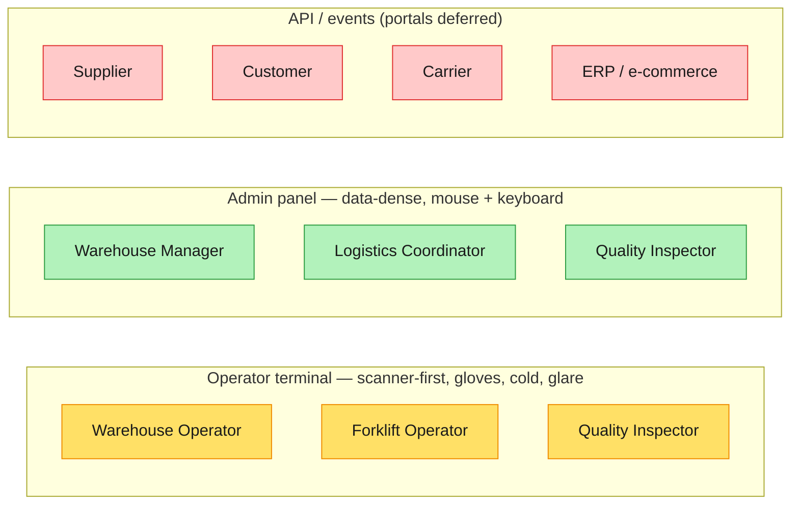

# #12 — From the design system to screens: designing for two very different users

*Series: Building a real microservices application, brick by brick.
Previous: [#11 NFRs, ADRs and a first design system](11-design-nfr-adr-and-design-system.md).
Screens & specs: [/docs/design](../design/README.md). Figma:
[Warehouse WMS — UX](https://www.figma.com/design/xAzdWqmAOd3b2ZKWlU0TgR).*

---

Post #11 gave us a design *system* — status colours, two type scales, a handful of components, and
the one decision that shapes everything: **two front ends, one domain.** A design system is a box
of paint swatches and rules, though. This post applies them to actual walls — it turns the
[use cases (UC-01…UC-14)](../03-use-cases.md) and the [personas](../01-domain-overview.md#3-actors-our-clients--users)
into concrete screens, organised the only way that matters to a warehouse: **by how each actor
actually works.**

The output lives in [`/docs/design`](../design/README.md): a runnable prototype per screen, a doc
per actor, and a [Figma file](https://www.figma.com/design/xAzdWqmAOd3b2ZKWlU0TgR) to share with
non-developers. Here's how it came about, and why it was worth doing *before* opening the IDE.

## Why design the screens now (and not after the code)

It's tempting to skip straight to React. We didn't, for the same reason we spent Part I at a
whiteboard: **moving pixels is cheap, moving code is expensive.** A screen is the cheapest place to
discover that a use case is missing a step, that two actors need the same data in opposite shapes,
or that an invariant has nowhere to *show* on the glass.

And there's a second payoff specific to a domain-driven project: **the UI is where the domain model
gets a fitting.** If our decisions from Part I are right, they should fall naturally onto screens.
If they don't, that's a cheap, early signal. Designing the screens turned out to be a *test of the
model* as much as a design exercise:

- `QuantityWithUnit` — the domain refuses bare decimals, so the UI does too. Every count on every
  screen carries a unit. The component exists because the model does.
- **FEFO** isn't hidden logic; on the picking screen it's a batch/expiry chip the operator can see
  and trust.
- **QC holds** must never be pickable — so `status.blocked` is styled to be the loudest badge in
  the system, impossible to miss on the stock view or receipt.
- The **environment-compatibility invariant** (dairy → cold room only) becomes a visible hard stop
  on the put-away screen, with the *reasons* the location was chosen shown as green check rows.

None of those are decoration. They're Part I's invariants, wearing a UI.

## The method: actor → journey → screen

We have **nine actors and two front ends** (post #11). The structure of the whole design follows
from collapsing the first onto the second:

For each actor we wrote down their use cases, walked the **journey** step by step, and only then
drew the **screens** that journey touches. The actor docs read like that on purpose — e.g. the
[Warehouse Operator](../design/actors/warehouse-operator.md) walks receive → put-away → pick →
pack, and each step links to the screen that serves it. It keeps the design honest: a screen with
no journey behind it doesn't get drawn.

The two front ends earn their split here. The **operator terminal** is one task at a time, a
scan field that's always focused, three big buttons, ≥48 px targets — because the user has one
free hand and a cold-room glove. The **admin panel** is the opposite: tables, filters, KPIs,
master/detail — because the manager triages many things and edits one. Same ubiquitous language,
two ergonomics.

> **Trade-off — two front ends double the design surface.** Two type scales, two interaction
> models, two sets of screens to keep in step with the domain. We pay that knowingly: one UI
> stretched across a desk analyst *and* a forklift driver in a freezer serves neither well. The
> shared token layer and the shared primitives (`StatusBadge`, `QuantityWithUnit`) are what keep
> the two from drifting into two different products.

## How it was built: code → design, not the usual way

Design usually flows design → code: someone draws in Figma, a developer rebuilds it. We went the
other direction, and it's worth explaining why.

Our design system from post #11 already exists **as code** — `status.available` isn't a sticky note,
it's a CSS custom property in [`tokens.css`](../design/prototypes/tokens.css), the single source of
truth. So each screen was built first as a small, self-contained **HTML prototype** that imports
those tokens. That makes the prototypes runnable (`python -m http.server` and click around) and
guarantees every screen uses the *real* status colours and type scales, not an approximation.

Then those prototypes were pushed **into Figma** — via the Figma MCP server's capture flow — so the
design is shareable with people who don't run a dev server: the product owner, a warehouse manager,
a future designer. The repo stays the source of truth (per the series' rules); Figma is the shared
canvas on top of it.

> **Trade-off — prototypes, not the product.** These are HTML mockups and Figma frames, not the
> React app. The risk is designing screens for code that doesn't exist yet and gold-plating a
> guess. We bound that risk the same way post #11 bounded the design system: a *thin* pass driven by
> the use cases, covering the real flows and nothing speculative. The actual React build comes in
> Part III (the admin panel around post #18); these screens are its spec, not a substitute.

## What got drawn

All 14 use cases now have at least one screen across the two front ends (15 screens plus the
operator's task hub):

| Use case | Screen | Use case | Screen |
|---|---|---|---|
| UC-01 Announce delivery (ASN) | Inbound (ASN) | UC-08 Stock adjustment | Adjustment |
| UC-02 Goods receipt | Goods receipt | UC-09 Outbound order | Outbound orders |
| UC-03 Quality inspection | QC worklist | UC-10 Picking | Picking |
| UC-04 Put-away | Put-away | UC-11 Packing | Packing |
| UC-05 View stock | Stock view | UC-12 Dispatch | Dispatch board |
| UC-06 Move / transfer | Move stock | UC-13 Manage products | Product master data |
| UC-07 Stocktake | Stocktake review | UC-14 Manage topology | Topology tree |

What's **not** here is as deliberate as what is: external-actor self-service portals (the API and
integration events are their interface for now), authentication (Identity is generic, off-the-shelf
— post #11), and BI dashboards. They grow per slice, not up front.

## See it

- **The walkthrough** — [`/docs/design`](../design/README.md): the actor docs, the design system,
  and the prototypes. Start with the [Warehouse Operator](../design/actors/warehouse-operator.md)
  for the terminal, or the [Warehouse Manager](../design/actors/warehouse-manager.md) for the
  admin panel.
- **Figma** — [Warehouse WMS — UX](https://www.figma.com/design/xAzdWqmAOd3b2ZKWlU0TgR). A few
  frames to start with: the operator
  [Task hub](https://www.figma.com/design/xAzdWqmAOd3b2ZKWlU0TgR?node-id=4-2),
  [Goods receipt](https://www.figma.com/design/xAzdWqmAOd3b2ZKWlU0TgR?node-id=5-2), and
  [Product master data](https://www.figma.com/design/xAzdWqmAOd3b2ZKWlU0TgR?node-id=6-2).

> **Trade-off — designs rot like diagrams do.** A screen that no longer matches the build is worse
> than none, because people trust it. The mitigation is the same as for our diagrams: keep the set
> small, generate the Figma frames from the committed prototypes rather than hand-maintaining two
> copies, and treat `/docs/design` as something that's updated with the slice, not frozen.

## What's next

We have the domain (Part I) and — still in **Part II, From understanding to delivery** — the plan and
the design: language, boundaries, requirements, and the screens that make them concrete. The
whiteboard is full; now we **open the IDE**. Part II keeps going, from design into the build, and it
starts at the seam between the domain and the database: post #13, the **Repository, the Unit of Work
and Domain Events** — what they're for, and how they let the Part I domain stay pure while
infrastructure does the work.

**Post #13: Repository, Unit of Work and Domain Events — opening the IDE →**
