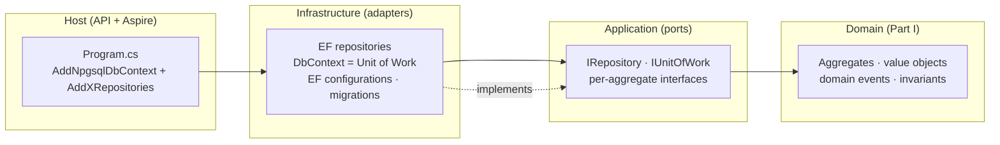
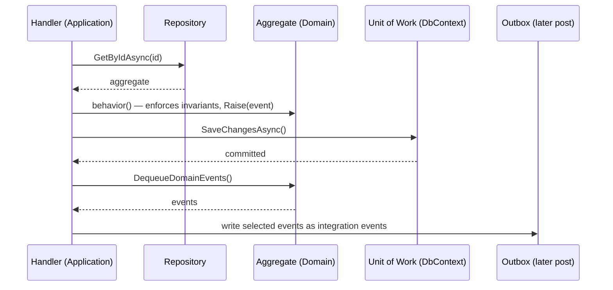

# #13 — Repository, Unit of Work and Domain Events: the seam where the domain meets the database

*Series: Building a real microservices application, brick by brick.
Previous: [#12 From the design system to screens](12-from-design-system-to-screens.md).
Code: [`src/SharedKernel`](../../src/SharedKernel/Warehouse.SharedKernel), the `Application` and
`Infrastructure` folders under each module in [`src/Services`](../../src/Services).*

---

Part I built a domain that knows nothing about databases — on purpose. `StockItem`, `WarehouseSite`,
`InboundDelivery` enforce their invariants and raise events, and not one of them references EF Core,
Postgres or RabbitMQ. That was rule #1 of this series: **earn the right to talk about infrastructure
by first understanding what a pallet is.**

Now we open the IDE for real. But before a single `DbContext`, three patterns define the *seam*
between that pure domain and the database that has to outlive it: the **Repository**, the **Unit of
Work**, and the **Domain Event** dispatch. Get these three right and the domain stays pure while the
infrastructure does the dirty work. Get them wrong and EF Core leaks into your aggregates within a
week.

This post is the **why**. The next two are the **how**, in our actual modules — a friendly one
([#14, Topology](14-persisting-an-aggregate-with-ef-core.md)) and the gnarly core
([#15, Inventory](15-the-hard-cases-ledger-and-owned-collections.md)).

## Where the three patterns live

Clean Architecture per module is just a rule about which way the arrows point: **dependencies point
inward, toward the domain.** The domain defines *ports* (interfaces); infrastructure provides
*adapters* (EF implementations). The domain never names EF; EF names the domain.



Two interfaces — `IRepository` and `IUnitOfWork` — live with the **application** abstractions, not
the domain. Loading and saving is an application concern; the domain only enforces rules and raises
events. The third pattern, **domain events**, lives in the domain itself (it's part of what an
aggregate *is*) but is *dispatched* by infrastructure after a save.

## Repository — load and save whole aggregates, nothing smaller

In Part I we were strict about one thing: the **aggregate is the consistency boundary.** `StockItem`
is one SKU+batch at one location; `WarehouseSite` owns its rooms, locations and docks. A repository
respects exactly that boundary — it deals in **whole aggregates, one row per consistency boundary,
never child entities directly.**

The base port is tiny on purpose:

```csharp
public interface IRepository<TAggregate, TId>
    where TAggregate : AggregateRoot<TId>
    where TId : notnull
{
    Task<TAggregate?> GetByIdAsync(TId id, CancellationToken cancellationToken = default);
    void Add(TAggregate aggregate);
    void Update(TAggregate aggregate);
}
```

Each module then extends it with the *domain* lookups its use cases actually need — named in the
ubiquitous language, not as raw queries:

```csharp
public interface IStockItemRepository : IRepository<StockItem, StockItemId>
{
    // The single stock item for a SKU/batch at a location, or null if none exists yet.
    Task<StockItem?> GetAtAsync(Sku sku, BatchNumber? batch, LocationCode location, CancellationToken ct = default);

    // Every stock item of a SKU in a warehouse — the app sums these into available-to-promise.
    Task<IReadOnlyCollection<StockItem>> ListBySkuAsync(Sku sku, WarehouseCode warehouse, CancellationToken ct = default);
}
```

> **Trade-off — no `IQueryable` out of the repository.** The fashionable shortcut is to expose
> `IQueryable<StockItem>` and let callers compose LINQ. We don't: it leaks EF's query model into the
> application, lets any handler reach past the aggregate boundary, and makes the data access
> untestable without a database. The price is more interface methods with intention-revealing names
> (`GetAtAsync`, `ListBookedSlotsAsync`). The win is that the *seam speaks the domain's language* —
> and you can read what the persistence layer is allowed to do without opening the implementation.

## Unit of Work — one business operation, one transaction

A single warehouse action rarely touches a single row. When an operator picks stock, the
`StockItem` changes **and** the append-only ledger gets a `StockMovement` (Part I, the
Moment-Interval archetype). Those two writes must commit together or not at all — a stock change
without a ledger entry is exactly the corruption the ledger exists to prevent.

That "all or nothing" is the **Unit of Work**:

```csharp
public interface IUnitOfWork
{
    // Persists all pending changes; returns the number of state entries written.
    Task<int> SaveChangesAsync(CancellationToken cancellationToken = default);
}
```

The port is in the application layer; the implementation *is* the EF `DbContext` (it already tracks
changes and wraps `SaveChanges` in a transaction). One operation loads aggregates through
repositories, calls their behaviors, and ends with a single `SaveChangesAsync`.

> **Trade-off — the Unit of Work is the DbContext.** Putting `IUnitOfWork` on the `DbContext` means
> a piece of infrastructure sits behind a domain-shaped port. A purist would wrap it. We accept the
> thin leak: re-implementing change-tracking and transactions to avoid *naming* EF buys nothing, and
> the port keeps the application code honest — it commits a **unit of work**, not "an EF context".

Crucially, this is also the one place where "publish events after save" can be made non-optional —
which brings us to the third pattern.

## Domain Events — facts the aggregate raises, dispatched after the save

Part I's behaviors already raise events: `Receive` raises `StockReceived`, `Announce` raises
`DeliveryAnnounced`, `Dispatch` raises `ShipmentDispatched`. They don't *send* anything — they
record that something happened. The base class collects them:

```csharp
public abstract class AggregateRoot<TId> : Entity<TId> where TId : notnull
{
    private readonly List<IDomainEvent> _domainEvents = [];

    protected void Raise(IDomainEvent domainEvent) => _domainEvents.Add(domainEvent);

    public IReadOnlyList<IDomainEvent> DequeueDomainEvents()
    {
        var events = _domainEvents.ToArray();
        _domainEvents.Clear();
        return events;
    }
}
```

`Raise` is **collect**, not **dispatch** — and that distinction is the whole point. Events are
drained by `DequeueDomainEvents()` *after* a successful `SaveChangesAsync`. If the transaction rolls
back, nothing was published, because publication hadn't happened yet.



Two kinds of event, kept apart deliberately: **domain events** stay inside the bounded context (a
`StockReceived` means something only to Inventory). When a fact needs to cross a service boundary, a
handler turns it into an **integration event** from the versioned `Warehouse.Contracts` package and
writes it to the transactional outbox — the subject of a later post. Domain events are compile-time,
in-process, free to change; integration events are wire-format, versioned, forever.

> **Trade-off — deferred dispatch over immediate.** Raising an event could call its handlers right
> away. We collect-then-drain instead, so an event can never fire for a transaction that later rolls
> back. The cost is one extra step (dequeue after save) and the discipline of never handling a
> domain event mid-transaction. The payoff is the property the whole system leans on: **no event
> describes something that didn't actually get committed.**

## Why bother — what these three buy us together

- **The domain stays pure.** Aggregates from Part I compile against zero infrastructure; the seam is
  three interfaces they don't even know are being implemented.
- **Consistency is structural, not hopeful.** The ledger and the stock projection commit in one
  Unit of Work; events publish only after that commit.
- **The persistence layer speaks the domain.** `IInboundDeliveryRepository.ListBookedSlotsAsync` is
  a sentence a domain expert would recognise — not a `Where` clause leaking out of a context.

None of this is EF-specific. Swap Postgres for anything and these three ports don't move — only the
adapters behind them do. That's the test of a good seam.

## What's next

Enough principle. [**Post #14 — From port to table**](14-persisting-an-aggregate-with-ef-core.md)
makes all three concrete for the **Topology** context: the EF repository, the `DbContext` as Unit of
Work, and the mapping that turns a `WarehouseSite` — value-object codes, owned rooms, locations and
docks, `xmin` concurrency — into tables, with one `dotnet run` standing it all up through Aspire.

**Post #14: From port to table — persisting an aggregate with EF Core →**
