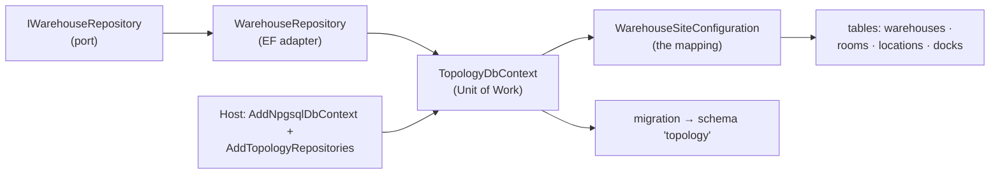

# #14 — From port to table: persisting an aggregate with EF Core

*Series: Building a real microservices application, brick by brick.
Previous: [#13 Repository, Unit of Work and Domain Events](13-repository-unit-of-work-and-events.md).
Code: [`Warehouse.Warehousing.Topology`](../../src/Services/Warehousing/Modules/Warehouse.Warehousing.Topology).*

---

[Post #13](13-repository-unit-of-work-and-events.md) drew the seam: a repository loads and saves
whole aggregates, the `DbContext` is the Unit of Work, and domain events drain after the save. Now
let's make it real for one module — and start with the **Topology** context, because its aggregate
is the deep end. A `WarehouseSite` owns **rooms**, each room owns **locations**, the site also owns
**docks**, and every identity is a value object. If EF Core can map that faithfully without the
domain bending to fit a table, the pattern holds for everything else.

The plan of this post is the journey of one aggregate from port to table:



## The repository: whole aggregates, children included for free

The port adds one domain lookup to the base `IRepository`; the adapter implements it with EF:

```csharp
internal sealed class WarehouseRepository(TopologyDbContext context) : IWarehouseRepository
{
    public Task<WarehouseSite?> GetByIdAsync(WarehouseCode id, CancellationToken ct = default) =>
        context.Warehouses.FirstOrDefaultAsync(w => w.Id == id, ct);

    public void Add(WarehouseSite aggregate) => context.Warehouses.Add(aggregate);

    public void Update(WarehouseSite aggregate) => context.Warehouses.Update(aggregate);

    public Task<bool> ExistsAsync(WarehouseCode code, CancellationToken ct = default) =>
        context.Warehouses.AnyAsync(w => w.Id == code, ct);
}
```

Notice what's **missing**: there is no `Include(w => w.Rooms).ThenInclude(...)`. Rooms, locations and
docks are *owned* by the aggregate (more on that below), and EF loads owned data with its owner
automatically. `GetByIdAsync` returns the entire warehouse tree, ready for its behaviors —
`AddRoom`, `AddLocation` — to run their invariants over the whole boundary.

`ExistsAsync` is the other half of the story from [#13](13-repository-unit-of-work-and-events.md):
warehouse-code uniqueness is a *set-level* rule no single aggregate can see, so the repository
exposes a named probe the application calls before `Establish` — not a stray query a handler invents.

## The DbContext is the Unit of Work

```csharp
public sealed class TopologyDbContext(DbContextOptions<TopologyDbContext> options)
    : DbContext(options), IUnitOfWork
{
    public const string Schema = "topology";

    public DbSet<WarehouseSite> Warehouses => Set<WarehouseSite>();

    protected override void OnModelCreating(ModelBuilder modelBuilder)
    {
        modelBuilder.HasDefaultSchema(Schema);
        modelBuilder.ApplyConfigurationsFromAssembly(typeof(TopologyDbContext).Assembly);
    }
}
```

Three things earn their place here. It implements `IUnitOfWork`, so the application commits "a unit
of work", never "an EF context". It owns a **schema** (`topology`) — important in [#15](15-the-hard-cases-ledger-and-owned-collections.md),
where this context shares a database with Inventory. And it pulls mappings in by assembly scan, so
adding a new aggregate is a new configuration file, not an edit here.

Only `WarehouseSite` is a `DbSet`. Rooms, locations and docks have no set of their own — you can't
load a room without its warehouse, which is exactly what "aggregate boundary" means.

## Mapping a rich domain without flattening it

The mapping is where a rich domain usually goes to die — squashed into anaemic columns. EF Core 10's
value converters and owned types let us keep the domain's types while the database sees plain
columns. The full file is [`WarehouseSiteConfiguration`](../../src/Services/Warehousing/Modules/Warehouse.Warehousing.Topology/Infrastructure/Persistence/Configurations/WarehouseSiteConfiguration.cs);
here are the three moves that matter.

**A value object as the key.** The warehouse's identity is a `WarehouseCode`, not a `string` or a
`Guid`. A converter stores its `.Value` and rebuilds it through the validating factory on read:

```csharp
builder.HasKey(w => w.Id);
builder.Property(w => w.Id)
    .HasConversion(code => code.Value, value => WarehouseCode.Of(value))
    .HasColumnName("code").HasMaxLength(10);
```

**Owned entities for the children.** Rooms, locations and docks are entities, but they live and die
with the warehouse — so they're owned collections, keyed by the parent's code plus their own:

```csharp
builder.OwnsMany(w => w.Rooms, room =>
{
    room.ToTable("rooms");
    room.WithOwner().HasForeignKey("warehouse_code");
    room.Property(r => r.Id)
        .HasConversion(code => code.Value, value => RoomCode.Of(value))
        .HasColumnName("code").HasMaxLength(10);
    room.HasKey("warehouse_code", "Id");
    room.Property(r => r.Type).HasConversion<string>().HasColumnName("type").HasMaxLength(16);

    room.OwnsOne(r => r.Environment, env =>
    {
        env.Property(e => e.HumidityControlled).HasColumnName("humidity_controlled");
        env.OwnsOne(e => e.MaintainedTemperature, t =>
        {
            t.Property(x => x.MinCelsius).HasColumnName("temp_min_c").HasPrecision(6, 2);
            t.Property(x => x.MaxCelsius).HasColumnName("temp_max_c").HasPrecision(6, 2);
        });
    });

    room.OwnsMany(r => r.Locations, loc =>
    {
        loc.ToTable("locations");
        loc.WithOwner().HasForeignKey("warehouse_code", "room_code");
        loc.HasKey("warehouse_code", "room_code", "Id");
        loc.Property(l => l.Capacity)
            .HasConversion(v => v.CubicMeters, d => Volume.FromCubicMeters(d))
            .HasColumnName("capacity_m3").HasPrecision(12, 4);
        loc.Property(l => l.MaxLoad)
            .HasConversion(w => w.Kilograms, d => Weight.FromKilograms(d))
            .HasColumnName("max_load_kg").HasPrecision(12, 3);
    });
});
```

That nesting — site → room → (environment → temperature) → locations — is the domain's shape,
preserved column-for-column. `RoomEnvironment` and `TemperatureRange` become owned columns on the
`rooms` table; `Volume` and `Weight` become plain numerics with their units known only to the domain.

> **Trade-off — owned collections vs separate aggregates.** Modelling rooms and locations as owned
> (one table each, but no `DbSet`, no repository) means you can't load a location on its own. That's
> deliberate: location-code uniqueness *across the whole warehouse* and capacity rules are warehouse
> invariants, and they can only be enforced in one transaction if the children load with the parent.
> The cost is that a very large warehouse loads as one object graph; if that ever bites, the seam
> (the repository) is the one place we'd add a narrower read path — without the domain noticing.

**Optimistic concurrency with Postgres `xmin`.** Two operators reconfiguring the same warehouse
shouldn't silently overwrite each other. Postgres' system column `xmin` changes on every row update,
so it makes a free concurrency token — no extra column, no app-managed version:

```csharp
builder.Property<uint>("xmin").HasColumnType("xid").ValueGeneratedOnAddOrUpdate().IsConcurrencyToken();
```

## From model to schema: migrations

A design-time factory lets `dotnet ef` build the model without running the app (the connection
string only has to be well-formed — it's never opened to scaffold a migration):

```csharp
internal sealed class TopologyDbContextFactory : IDesignTimeDbContextFactory<TopologyDbContext>
{
    public TopologyDbContext CreateDbContext(string[] args) =>
        new(new DbContextOptionsBuilder<TopologyDbContext>()
            .UseNpgsql("Host=localhost;Port=5432;Database=warehouse;Username=postgres;Password=postgres")
            .Options);
}
```

Then `dotnet ef migrations add Initial` produces a migration that `EnsureSchema("topology")` and
creates `warehouses`, `rooms`, `locations`, `docks` — each schema-qualified, with the composite keys
and foreign keys the owned mapping implies.

> **Trade-off — EF migrations are scaffolded code we don't hand-polish.** The generated migration
> trips analyzers (e.g. `new[] { ... }` for `CA1861`) under our warnings-as-errors build, so an
> `.editorconfig` rule marks `**/Migrations/*.cs` as generated and exempts it. We hold *our* code to
> the bar, not the tool's output — fighting the scaffolder would be churn for no safety.

## One `dotnet run`: wiring through Aspire

The host ties the port to the adapter and lets Aspire own the connection string, retries, health
checks and telemetry for the `DbContext`:

```csharp
builder.AddServiceDefaults();

// Both Warehousing contexts share the "warehouse" database, one schema each.
builder.AddNpgsqlDbContext<TopologyDbContext>("warehouse");
builder.Services.AddTopologyRepositories();   // IWarehouseRepository -> WarehouseRepository
```

`AddTopologyRepositories` is the module's one public seam into DI:

```csharp
public static IServiceCollection AddTopologyRepositories(this IServiceCollection services)
{
    services.AddScoped<IWarehouseRepository, WarehouseRepository>();
    return services;
}
```

From the Aspire AppHost, `dotnet run` now starts Postgres, applies the migration on first boot (dev
only), and stands the service up — the `WarehouseSite` aggregate from Part I, persisted, with not a
single line of its domain code aware that any of this happened.

## What's next

Topology was the friendly case: one aggregate, owned all the way down, read-and-write but not hot.
[**Post #15 — The hard cases**](15-the-hard-cases-ledger-and-owned-collections.md) takes on the core:
Inventory's **append-only ledger** committed in the same Unit of Work as the stock it changes,
**owned collections on a hot aggregate**, a **value-converted column you can't query with
`StartsWith`**, and **two bounded contexts sharing one database** — the seams from #13 under real
pressure.

**Post #15: The hard cases — the ledger, owned collections, and two contexts in one database →**
