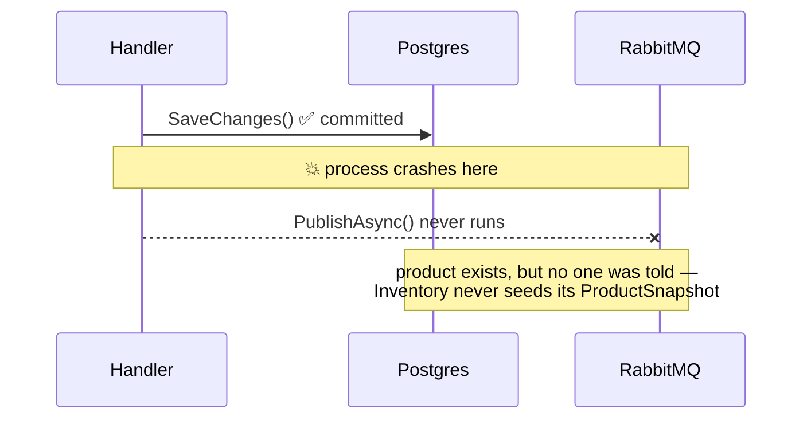
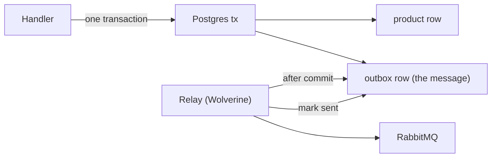

# #16 — The transactional outbox: making "publish after save" safe (with Wolverine)

*Series: Building a real microservices application, brick by brick.
Previous: [#15 The hard cases](15-the-hard-cases-ledger-and-owned-collections.md).
Code: [`Warehouse.Contracts`](../../src/Contracts/Warehouse.Contracts) and the Wolverine wiring in
[`Warehouse.MasterData.Api/Program.cs`](../../src/Services/MasterData/Warehouse.MasterData.Api/Program.cs).*

---

[Post #13](13-repository-unit-of-work-and-events.md) ended on a promise: an aggregate raises domain
events, the Unit of Work commits, and *then* the events that matter to other services are published.
[Post #15](15-the-hard-cases-ledger-and-owned-collections.md) built the write side but left the
publish as a seam — "the next post earns its own, because *publish after save* done naively is a
bug." This is that post. It's also the first time our system talks to **another service**, so it's
where a whole class of distributed-systems bugs would walk in if we let them.

## Why "publish after save" is a bug

The obvious code is two lines:

```csharp
await db.SaveChangesAsync();           // 1. commit the product
await bus.PublishAsync(productDefined); // 2. tell the world
```

It's wrong, and not rarely-wrong — wrong by design. There are two writes to two systems (the
database and the broker) with no shared transaction, so any crash *between* them leaves the system
inconsistent:



Swap the order and you get the mirror bug: publish first, and if the `SaveChanges` then fails, you've
announced a product that doesn't exist — a **phantom event** consumers act on. There is no ordering
of two independent writes that's safe. This is the **dual-write problem**, and "I'll just add a
`try/catch`" doesn't solve it — retries can crash too.

## The pattern: one transaction, then a relay

The transactional outbox makes the two writes **one** write. The outgoing message is stored in the
*same database, in the same transaction* as the state change. A separate relay reads the outbox table
and sends to the broker *after* the commit, marking each message sent:



Now the failure modes collapse into one safe shape: either the transaction commits (state **and**
message persisted together) or it doesn't (neither). The relay retries from the durable outbox until
the broker accepts the message — so delivery is **at-least-once**, never zero. (The price of
at-least-once is on the read side; we'll pay it below.)

## Why Wolverine

Our [PLAN](../PLAN.md) flagged this in Phase 0: the .NET messaging staples went commercial in 2025 —
**MediatR** and **MassTransit** both moved to paid licensing for new versions (MassTransit v8 is the
last OSS line). So the choice was a thin hand-rolled dispatcher, MassTransit v8 frozen, or
**[Wolverine](https://wolverinefx.net)** — still OSS, and unusually good at exactly this: it has a
built-in **EF Core + PostgreSQL transactional outbox**, so we don't hand-roll the relay, the polling,
or the sent-tracking.

> **Trade-off — a framework owns a core mechanism.** Leaning on Wolverine's outbox means a key
> correctness property lives in a dependency, not our code. We accept it because the outbox is a
> *solved* problem with sharp edges (relay ordering, crash recovery, dedupe) that a hand-rolled
> version gets subtly wrong, and because Wolverine is OSS with an escape hatch — the messages are
> plain `Warehouse.Contracts` records, so the wire format isn't tied to the library.

## Wiring it (MasterData service)

The outbox is configured once, in [`Program.cs`](../../src/Services/MasterData/Warehouse.MasterData.Api/Program.cs).
Aspire already provides the `masterdata` and `rabbitmq` connection strings (post #14); Wolverine
plugs into them:

```csharp
builder.UseWolverine(opts =>
{
    opts.PersistMessagesWithPostgresql(
        builder.Configuration.GetConnectionString("masterdata")!, schemaName: "wolverine");
    opts.UseEntityFrameworkCoreTransactions();

    opts.UseRabbitMq(new Uri(builder.Configuration.GetConnectionString("rabbitmq")!)).AutoProvision();
    opts.PublishMessage<ProductDefinedV1>().ToRabbitExchange("catalog");

    // Durable: the message lands in the outbox table first, so the relay survives a crash.
    opts.Policies.UseDurableOutboxOnAllSendingEndpoints();
});
```

`PersistMessagesWithPostgresql` puts Wolverine's envelope tables in their own `wolverine` schema in
the *same* database as Catalog — that co-location is the whole point, it's what lets the message and
the product share a transaction. `UseEntityFrameworkCoreTransactions` teaches Wolverine to enlist our
`DbContext`; the RabbitMQ lines say where `ProductDefinedV1` goes once committed.

## The write side: enqueue, then commit both

Here's the system's first cross-service event, the real endpoint that defines a product
([`Program.cs`](../../src/Services/MasterData/Warehouse.MasterData.Api/Program.cs)):

```csharp
app.MapPost("/catalog/products", async (
    DefineProductRequest request,
    IDbContextOutbox<CatalogDbContext> outbox,
    IProductTypeRepository products,
    CancellationToken cancellationToken) =>
{
    var sku = Sku.Of(request.Sku);
    if (await products.ExistsAsync(sku, cancellationToken))
        return Results.Conflict($"Product {sku} already exists.");

    var product = ProductType.Define(sku, request.Name, ean: null, ProductCategory.DryGoods,
        Dimensions.Of(10, 10, 10), Weight.FromKilograms(1), UnitOfMeasure.FromCode(request.BaseUnit),
        StorageRequirement.Ambient, request.IsBatchTracked, hasExpiryDate: false);

    products.Add(product);

    // Enqueue the integration event onto this DbContext's outbox...
    await outbox.PublishAsync(new ProductDefinedV1(
        product.Sku.Value, product.Name, product.BaseUnit.Code,
        product.Storage.RequiresColdChain, product.Storage.IsHazardous,
        product.IsBatchTracked, DateTimeOffset.UtcNow));

    // ...then commit the product row and the outbox row as ONE transaction; Wolverine relays after.
    await outbox.SaveChangesAndFlushMessagesAsync(cancellationToken);

    return Results.Created($"/catalog/products/{product.Sku.Value}", product.Sku.Value);
});
```

`IDbContextOutbox<CatalogDbContext>` is the hinge. It wraps the *same* scoped `CatalogDbContext` the
repository writes to, so `products.Add(product)` and `outbox.PublishAsync(...)` both land in one EF
change set. `SaveChangesAndFlushMessagesAsync` commits that change set — product row and outbox row
together — and only then hands the message to the relay. The two-line bug from the top of this post
is now structurally impossible: there is one transaction, and the message is inside it.

## Domain event ≠ integration event

Notice what we published: not the domain's `ProductDefined` (which carries a `Sku` value object and
means something only inside Catalog), but `ProductDefinedV1` from `Warehouse.Contracts` — primitives
only, **versioned**, additive-only:

```csharp
public sealed record ProductDefinedV1(
    string Sku, string Name, string BaseUnit,
    bool RequiresColdChain, bool IsHazardous, bool IsBatchTracked, DateTimeOffset OccurredAt);
```

This is the distinction from [#13](13-repository-unit-of-work-and-events.md) made concrete. The
domain event is in-process and free to change; the integration event is a wire contract other
deployments bind to, so the `V1` shape is frozen forever and a new field ships as `ProductDefinedV2`.
The handler is the **translation layer** between the two — it's where the domain's language becomes a
stable public fact.

## The read side: at-least-once means idempotent

The relay guarantees a message arrives *at least* once — a crash mid-relay means it re-sends. So the
consumer (Inventory, seeding its `ProductSnapshot` from `ProductDefinedV1`) must be **idempotent**:
processing the same event twice must equal processing it once. Wolverine's durable listener gives us
the **inbox** half for free — it records each handled envelope's id and dedupes redeliveries — but
the business handler still has to be written so "upsert the snapshot" is naturally repeatable (a
`ProductSnapshot` keyed by SKU, written with set-semantics, is). That consumer lands with the first
master-data slice in Part III; the contract and the producer exist now.

> **Trade-off — the outbox buys consistency with latency and infra.** We added a message table per
> service, a background relay, and **eventual** consistency: Inventory learns about a new product
> milliseconds-to-seconds later, not instantly (the "price tag" admitted back in
> [#7](07-the-price-tag.md)). And at-least-once delivery pushes idempotency onto every consumer. The
> alternative — a synchronous call from Catalog to Inventory — trades all that for temporal coupling:
> Catalog can't accept a product while Inventory is down. For master data that's a bad trade; we take
> the outbox and design consumers to expect duplicates.

## Where we are

The seam from posts #13–#15 now has its mechanism: a domain event raised inside an aggregate becomes
a versioned integration event, written to the outbox **in the same transaction** as the aggregate,
and relayed to RabbitMQ exactly when — and only when — that transaction commits. It's real code: the
solution builds, `POST /catalog/products` writes a product and a `ProductDefinedV1` atomically, and
Wolverine owns the durable relay.

## What's next

We reached for Wolverine in a single `builder.UseWolverine(...)` — but that one line sits on top of a
decision that, a year ago, .NET teams didn't have to make. The messaging field went through a
licensing earthquake in 2025, and "just use MassTransit" stopped being the free default.
[**Post #17 — Choosing a messaging library**](17-choosing-a-messaging-library.md) is the bake-off
behind the choice: MassTransit, Wolverine, NServiceBus, Rebus, CAP and the "no framework" option,
scored against what this warehouse actually needs — and a method you can run for your own project.

**Post #17: Choosing a messaging library — the bake-off behind one line of code →**
