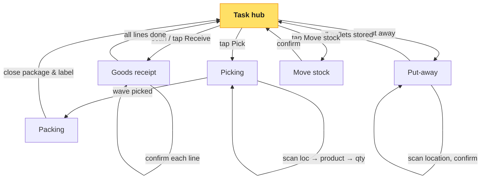
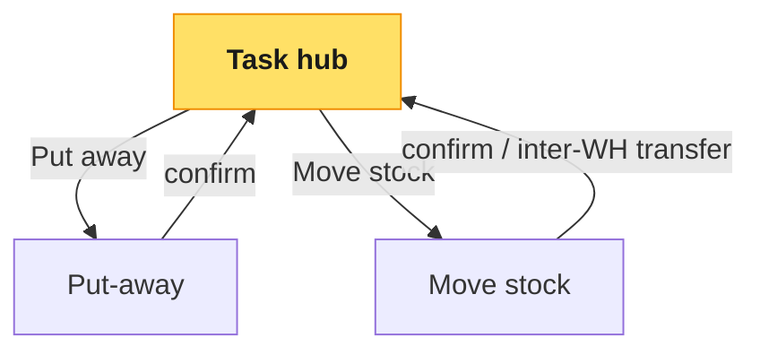
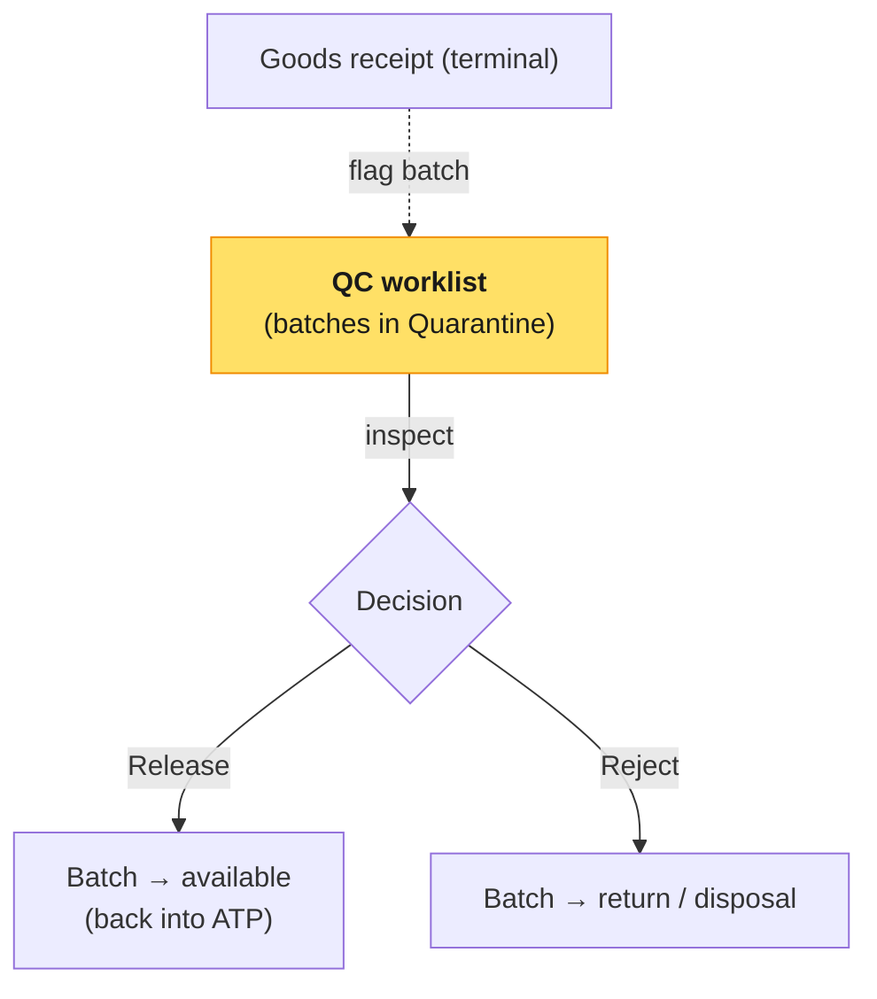
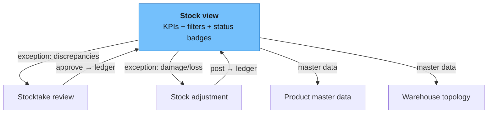
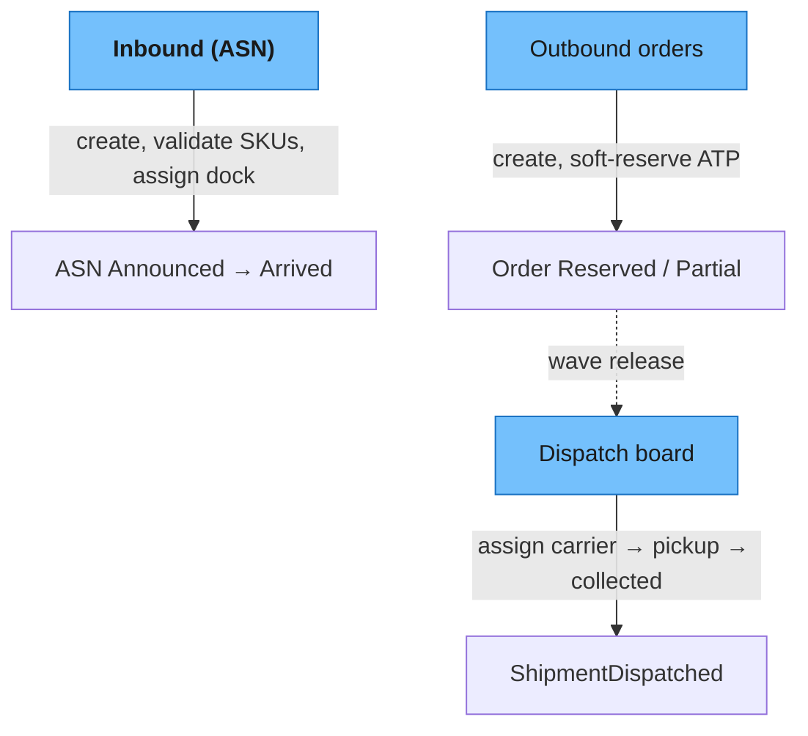
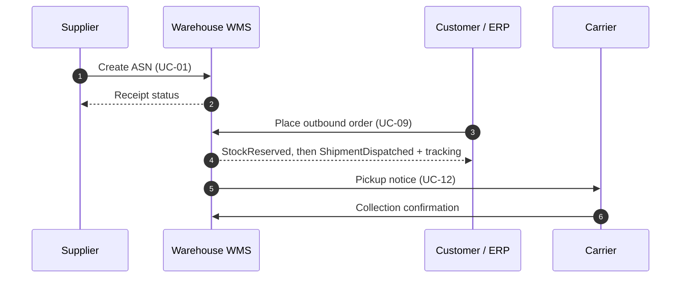

# Flows — how each actor uses the application

> Two ways to read the design. **By goods** — the lifecycle of a pallet as it crosses actors
> (below). **By actor** — the screen-by-screen clickpath each person walks. The per-actor
> [actor docs](README.md#actor--front-end--screens) carry the prose; this doc is the *map*.
> Screens live in [`prototypes/`](prototypes/index.html); use cases in
> [03-use-cases.md](../03-use-cases.md). These are the **happy paths** — exceptions, failures and
> the enforced invariants live in [02-exceptions.md](02-exceptions.md).

---

## 1. The goods lifecycle — where the actors meet

No actor owns the whole flow; they hand off to each other through domain events. This is the
spine of the system — read left to right, and note *who* acts and *on which screen*.

```mermaid
flowchart LR
    subgraph IN["① Inbound"]
      direction TB
      A1["ASN created & scheduled<br/><b>Coordinator</b> · Inbound (ASN)"]
      A2["Goods receipt<br/><b>Operator</b> · Goods receipt"]
      A3["Quality check<br/><b>Inspector</b> · QC worklist"]
      A4["Put-away<br/><b>Operator / Forklift</b> · Put-away"]
    end
    subgraph ST["② Stock"]
      direction TB
      S1["On stock / ATP<br/><b>Manager</b> · Stock view"]
      S2["Move & replenish<br/><b>Forklift</b> · Move stock"]
      S3["Stocktake & adjust<br/><b>Manager</b> · Stocktake / Adjustment"]
    end
    subgraph OUT["③ Outbound"]
      direction TB
      O1["Order + soft reservation<br/><b>Coordinator</b> · Outbound"]
      O2["Pick (FEFO hard alloc.)<br/><b>Operator</b> · Picking"]
      O3["Pack & label<br/><b>Operator</b> · Packing"]
      O4["Dispatch to carrier<br/><b>Coordinator</b> · Dispatch board"]
    end
    SUP["Supplier"] -.ASN via API.-> A1
    A1 -->|truck arrives| A2 -->|GoodsReceived| A3
    A3 -->|Released| A4 -->|PutAway| S1
    A3 -->|Rejected| RJ["Return / disposal"]
    CUS["Customer / ERP"] -.order via API.-> O1
    S1 --> O1 -->|StockReserved| O2 -->|picked| O3 -->|packed| O4
    O4 -->|ShipmentDispatched + tracking| CAR["Carrier / Customer"]
    S1 -.-> S2 -.-> S1
    S1 -.-> S3 -.-> S1
    classDef act fill:#b2f2bb,stroke:#2f9e44,color:#1a1a1a;
    classDef ext fill:#ffc9c9,stroke:#e03131,color:#1a1a1a;
    class A1,A2,A3,A4,S1,S2,S3,O1,O2,O3,O4 act;
    class SUP,CUS,CAR,RJ ext;
```

### Handoff table

| Step | Actor | Screen | Hands off via | To |
|---|---|---|---|---|
| Announce delivery | Logistics Coordinator | Inbound (ASN) | ASN `Announced` → `Arrived` | Operator |
| Receive goods | Warehouse Operator | Goods receipt | `GoodsReceived` | Inspector / Operator |
| Quality decision | Quality Inspector | QC worklist | `Released` / `Rejected` | Operator (put-away) |
| Put away | Operator / Forklift | Put-away | `PutAway` (ledger) | Manager (stock visible) |
| Hold stock for order | Logistics Coordinator | Outbound | `StockReserved` (soft) | Operator (at wave) |
| Pick | Warehouse Operator | Picking | hard allocation + picked | Operator (packing) |
| Pack | Warehouse Operator | Packing | package + label | Coordinator |
| Dispatch | Logistics Coordinator | Dispatch board | `ShipmentDispatched` | Carrier / Customer |

---

## 2. Per-actor clickpaths

Each diagram is the actual screen navigation in the [prototypes](prototypes/index.html) — the
**bold** node is the actor's landing screen.

### Warehouse Operator — [terminal](actors/warehouse-operator.md)

The most-used app in the building. Everything starts from the **Task hub**; each task is a loop
that returns to the hub when done.

1. **Receive** → opens the ASN, scans line by line (expected vs counted), records discrepancies,
   enters batch/BBE → `Confirm line`. ([flow detail](actors/warehouse-operator.md#journey-a--receive-an-announced-delivery-uc-02))
2. **Put-away** → accepts/overrides the proposed location, passes the environment + capacity check,
   scans the location to confirm.
3. **Pick** → walks the routed pick list (FEFO batch shown), scans location → product → quantity.
4. **Pack** → scans picked items into a package, records weight/dimensions, prints the label.
5. **Move** → from/to location with the same environment checks.

### Forklift Operator — [terminal](actors/forklift-operator.md)

A narrower slice of the operator app, working in whole pallets (LPNs).

The hard **temperature/capacity stop** is the point of these screens for this actor — the system
refuses an incompatible location. ([flow detail](actors/forklift-operator.md#journey-a--put-away-pallets-uc-04))

### Quality Inspector — [terminal + admin](actors/quality-inspector.md)

Blocked stock is invisible to reservation/picking until released — the loudest red badge in the
system. ([flow detail](actors/quality-inspector.md#journey--quarantine-then-release-or-reject-uc-03))

### Warehouse Manager — [admin](actors/warehouse-manager.md)

A desk app navigated through the sidebar; **Stock view** is home and the place exceptions surface.

Every write (stocktake, adjustment) is reason-bearing and lands in the immutable ledger.
([flow detail](actors/warehouse-manager.md#journey-a--view-stock-uc-05))

### Logistics Coordinator — [admin](actors/logistics-coordinator.md)

Owns the two ends of the flow — what comes in and what goes out.

([flow detail](actors/logistics-coordinator.md#journey-a--announce--schedule-a-delivery-uc-01))

### External actors — [API / events](actors/external-actors.md)

No screens in this pass; they interact system-to-system, behind an ACL.

---

## 3. Reading order for a new joiner

1. This page — the shape of the flows.
2. [00-design-system.md](00-design-system.md) — the tokens & components those screens are built from.
3. The [actor doc](README.md#actor--front-end--screens) for the role you're building for.
4. The [prototypes](prototypes/index.html) — click through the real screens.
