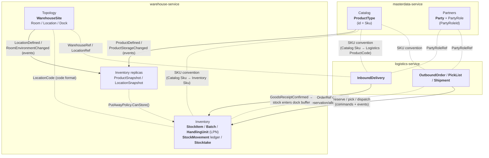

# Domain Models (as implemented)

Documentation of the domain models **as they exist in the code** (`src/`). The earlier
[04-domain-model.md](../04-domain-model.md) is the design sketch; this folder is the as-built
reference and should be updated together with the code.

| File | Module (project) |
|---|---|
| [shared-kernel.md](shared-kernel.md) | `Warehouse.SharedKernel` |
| [catalog.md](catalog.md) | `Warehouse.MasterData.Catalog` |
| [partners.md](partners.md) | `Warehouse.MasterData.Partners` |
| [topology.md](topology.md) | `Warehouse.Warehousing.Topology` |
| [inventory.md](inventory.md) | `Warehouse.Warehousing.Inventory` |
| [logistics.md](logistics.md) | `Warehouse.Logistics.Core` |

## How the contexts connect

Modules never reference each other's types. Every cross-context link is either a
**shared convention** (a code format both sides understand — a product code, a
location/warehouse code, ids carried as refs) or an **event** that feeds a local replica.
Note the nuance: the *format* is shared, the *type* is not. Catalog has a strict `Sku`,
Inventory a lighter `Sku`, Logistics a loose `ProductCode` — three types, one convention.

Reading the arrows:
- **solid** = event flow (asynchronous, via outbox → broker → inbox),
- **dotted** = shared convention only — a code format or a reference by value, no shared type.

## Conventions used across all models

- **Aggregates** extend `AggregateRoot<TId>`; behavior methods enforce invariants and `Raise(...)`
  domain events. State is only mutated through those methods (private setters, factory methods).
- **Strongly-typed ids** are `readonly record struct`s wrapping `Guid.CreateVersion7()`
  (time-ordered, index-friendly) — except natural keys (`Sku`, the topology codes).
- **Value objects** are `sealed record`s with private constructors and validating `Of(...)`
  factories; invalid values cannot exist.
- **Rule violations** throw `DomainException(errorCode, message)` — the error code is stable
  API surface, the message is for humans.
- Cross-context references are **refs by value** (`PartyRoleRef`, `WarehouseRef`, `OrderRef`),
  never object references.
