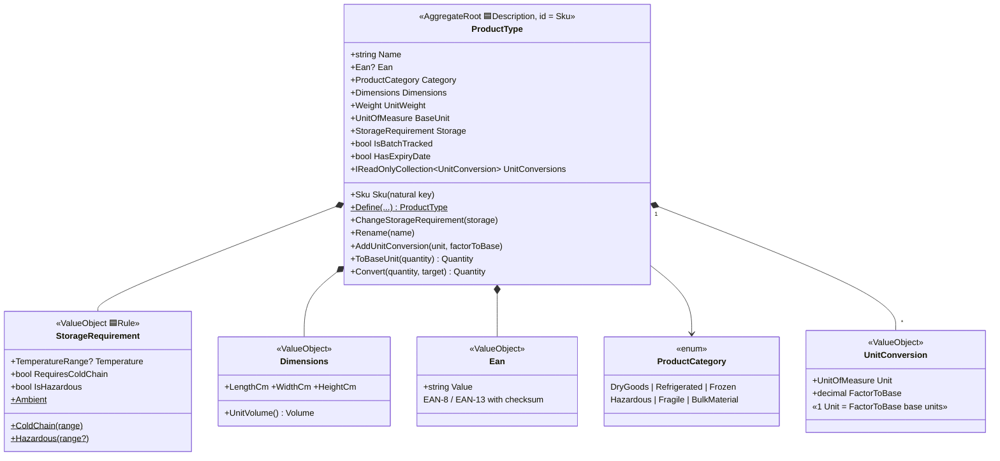

# Catalog (MasterData)

`src/Services/MasterData/Modules/Warehouse.MasterData.Catalog` — the product card:
*what* a SKU means. Knows nothing about stock or locations.

> **Catalog owns the canonical `Sku`.** It is a Catalog type (`...Catalog.Domain.Sku`),
> strict (regex + normalization, EAN-linked), because Catalog is where a SKU's *meaning*
> lives. Other contexts do **not** share it: Inventory keeps a lighter `Sku`, Logistics a
> loose `ProductCode`. The shared thing is the code convention, never the type
> (see [shared-kernel.md](shared-kernel.md)).

## Unit conversions — the catalog *default*

`Quantity` (SharedKernel) deliberately refuses to mix units — conversion factors are
**per-product master data**, not arithmetic. For one SKU `1 plt = 48 pcs`, for another
`1 plt = 24 pcs`. `ProductType.ToBaseUnit`/`Convert` translate via the base unit;
an unregistered unit throws `conversion_missing`. Used for outbound pack planning.

But the catalog factor is only the **standard/default** pack. The same SKU often arrives
palletized differently per delivery (industrial vs euro-pallet), so the authoritative
"how many on this pallet" can be a fact of the *Inbound Delivery*, not master data. Logistics
captures that with a delivery-specific `DeliveryPack` on the delivery line; receiving uses the
delivery pack if present, else falls back to this catalog default
(see [logistics.md](logistics.md)).

## Invariants (enforced in `Define` and `ChangeStorageRequirement`)

| Rule | Error code |
|---|---|
| `Refrigerated`/`Frozen` product must declare a cold-chain requirement | `storage_cold_chain_required` |
| `Frozen` product's max temperature ≤ −15 °C | `storage_frozen_range_invalid` |
| `Hazardous` product must declare hazardous storage | `storage_hazmat_required` |
| Expiry date requires batch tracking (FEFO needs batches) | `product_expiry_requires_batches` |
| Cold chain requires an explicit temperature range | `storage_requirement_invalid` |
| No conversion for the base unit itself; one conversion per unit; factor > 0 | `conversion_base_unit`, `conversion_duplicate`, `conversion_factor_invalid` |
| Converting an unregistered unit is rejected | `conversion_missing` |

## Domain events

| Event | Raised by | Downstream effect |
|---|---|---|
| `ProductDefined(Sku)` | `Define` | becomes integration event → Inventory creates `ProductSnapshot` |
| `ProductStorageChanged(Sku, Storage)` | `ChangeStorageRequirement` | Inventory updates the snapshot and **reports** (not moves) incompatible stock — UC-13 |
