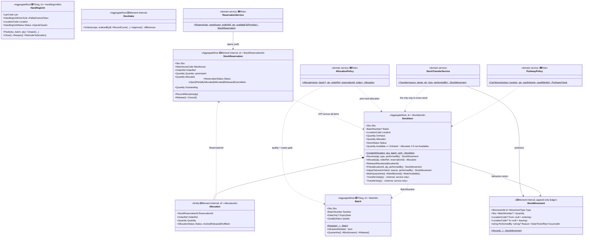

# Inventory (Warehousing) — core domain

`src/Services/Warehousing/Modules/Warehouse.Warehousing.Inventory` — *how much of what
lies where*. The aggregate is deliberately **small** (`StockItem` = SKU + batch + location),
so every scan-gun confirmation is a short transaction with no hot rows.

## Two-stage allocation: soft reservation → hard allocation

The single most important lifecycle in this context. Committing a concrete pallet the moment
an order arrives ("hard allocation at order time") deadlocks a busy warehouse: between order
(day 0) and pick (day +2) the pinned pallet can be QC-blocked, damaged or re-slotted, forcing
constant re-pinning. So allocation happens in **two stages**:

| Stage | When | What | API |
|---|---|---|---|
| **Soft reservation** | order arrives (day 0) | a promise of *quantity of a SKU in a warehouse* — no batch, no location | `ReservationService.Reserve(sku, warehouse, orderRef, qty, availableToPromise)` → `StockReservation` |
| **Hard allocation** | wave/pick release (day +2) | FEFO picks a concrete `StockItem` (batch+location); quality re-checked now | `AllocationPolicy.Allocate(stock, batch, qty, orderRef, reservationId, today)` → `Allocation` |
| **Pick** | operator scans | physical removal; ledger entry | `stockItem.Pick(allocationId, qty, by)` |

- **`StockReservation`** (soft) protects *available-to-promise* without pinning physical stock,
  so goods stay free to move and be inspected. `ReservationService` gates on ATP =
  `Σ OnHand − Σ Allocated − Σ outstanding reservations` (passed in by the app layer, the same
  pattern as `PutAwayPolicy`).
- **`Allocation`** (hard, inside `StockItem`) traces back to its `StockReservationId`. Because
  `AllocationPolicy` runs at wave time, a batch blocked or expired *after* the order was placed
  is caught here — exactly when it matters, not at order time.
- Wave-planning *optimization* (routing, FEFO ordering across many items) is the application
  layer's job and is deferred; the **lifecycle** above is the part the model nails down.

## Stock cannot change without a ledger entry

Every behavior that changes `OnHand` **returns the `StockMovement` to persist** — the
application layer saves the aggregate and the movement in one transaction:

| Operation | API | Movement produced |
|---|---|---|
| Goods receipt / transfer-in | `stockItem.Receive(qty, type, by)` | `GoodsReceipt` / `TransferIn` (from = null) |
| Put-away, internal move | `StockTransferService.Transfer(src, dst, qty, type, by)` | **one** `PutAway`/`Move` movement for two stock items |
| Pick | `stockItem.Pick(allocationId, qty, by)` | `Pick` (to = null) |
| Adjustment | `stockItem.AdjustTo(newQty, reason, by)` | `AdjustmentIn`/`AdjustmentOut` with the delta |
| Reserve / allocate / release | service / `StockItem` | none — neither reservation nor allocation moves stock |

`StockItem.TransferOut/TransferIn` are `internal`: a location-to-location move is one physical
fact touching two aggregates, so only `StockTransferService` may compose it (one movement,
checks: same SKU, same batch, different locations, only unallocated stock moves).

## Batch quality is a cross-aggregate rule — enforced twice

"A batch on QC hold is invisible to allocation" spans `Batch` and `StockItem`:

1. **At the gate:** allocations of batch-tracked stock go through
   `AllocationPolicy.Allocate(...)` — rejects quarantined, rejected and expired batches
   (`allocation_batch_*` error codes), at wave/pick time.
2. **By convergence:** `BatchQuarantined`/`BatchBlocked` events are handled by marking every
   `StockItem` of that batch `Quarantine`/`Blocked`, so already-stored stock catches up.

## Handling units (LPN)

`HandlingUnit` = pallet/carton/tote with a scannable `LpnCode`. **Stock truth stays in
`StockItem`** — the unit describes physical grouping. `RelocateTo` raises `HandlingUnitMoved`;
the application layer pairs it with `StockTransferService.Transfer` per content line in the
same transaction (one scan moves the whole pallet). Contents can only change while `Open`;
a `Closed` unit moves and ships as a whole.

## Invariants

| Rule | Where | Error code |
|---|---|---|
| On-hand never negative | `Quantity` itself | `quantity_insufficient` |
| Soft reservation ≤ available-to-promise | `ReservationService` | `stock_insufficient` |
| A reservation can't be over-allocated | `StockReservation.RecordAllocation` | `reservation_over_allocated` |
| Allocated ≤ on-hand; allocation only on `Available` stock | `StockItem.Allocate` | `stock_insufficient`, `stock_not_available` |
| Batch-tracked stock allocated only with a released, unexpired batch | `AllocationPolicy` | `allocation_batch_required/_mismatch/_not_released/_expired` |
| Pick ≤ active allocation; partial pick shrinks the allocation | `StockItem.Pick` | `pick_exceeds_allocation` |
| Only unallocated stock can be moved between locations | `StockItem.TransferOut` | `transfer_exceeds_unallocated` |
| Transfers: same SKU, same batch, different locations, PutAway/Move only | `StockTransferService` | `transfer_*`, `movement_type_invalid` |
| Adjustment cannot go below allocated; no-op adjustments rejected | `StockItem.AdjustTo` | `adjustment_below_allocated`, `adjustment_no_change` |
| No blocking stock with active allocations | `StockItem.MarkBlocked` | `block_with_active_allocations` |
| Movement needs positive qty and at least one location | `StockMovement.Record` | `movement_quantity_zero`, `movement_locations_missing` |
| HU contents change only while Open; non-empty to close/relocate | `HandlingUnit` | `handling_unit_*` |
| Environment compatibility + capacity + load (hard put-away rule) | `PutAwayPolicy.CanStore` | returns `PutAwayCheck.Rejected(reason)` |
| Stocktake counts are blind and limited to scope | `Stocktake.RecordCount` | `stocktake_location_out_of_scope` |

## Key design decisions

1. **Soft reservation vs hard allocation** — promise at order time, pin at wave time; the
   quality gate fires when stock is committed, not when the order is taken.
2. **`StockMovement` is append-only and inseparable from stock changes** — behaviors return
   the movement, so the ledger and the projection cannot diverge. A mistake is corrected with
   a reversing movement; the table will forbid `UPDATE`/`DELETE` at the database level.
3. **QC hold lives on `Batch`** — blocking a batch hides it everywhere at once; convergence to
   stock items happens via events (see above).
4. **Replicas, not queries.** `ProductSnapshot`/`LocationSnapshot` are updated by integration
   events from Catalog/Topology; policies work only on local data.
5. **Handling units don't own stock** — avoids dual bookkeeping; LPN is ergonomics (one scan),
   `StockItem` stays the single source of truth.

## Domain events

`StockReceived`, `StockReserved` (soft), `ReservationReleased`, `StockAllocated` (hard),
`AllocationReleased`, `StockPicked`, `StockAdjusted`, `BatchQuarantined`, `BatchBlocked`,
`BatchReleased`, `StocktakeApproved`, `HandlingUnitMoved` — raised by the behaviors above;
the infrastructure layer maps selected ones to integration events (Phase 0/2 work).
