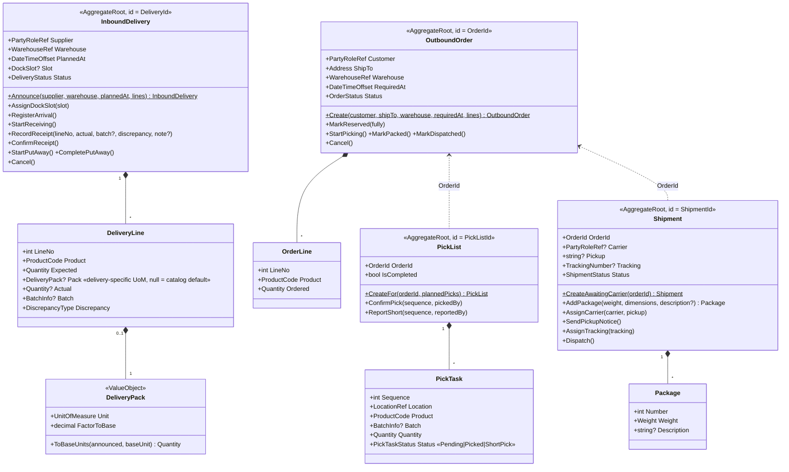
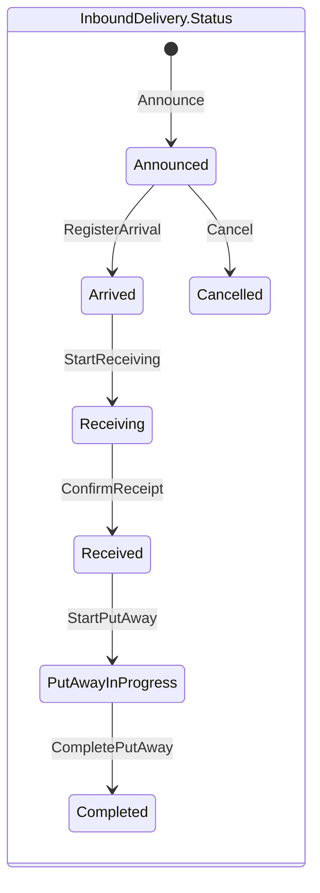
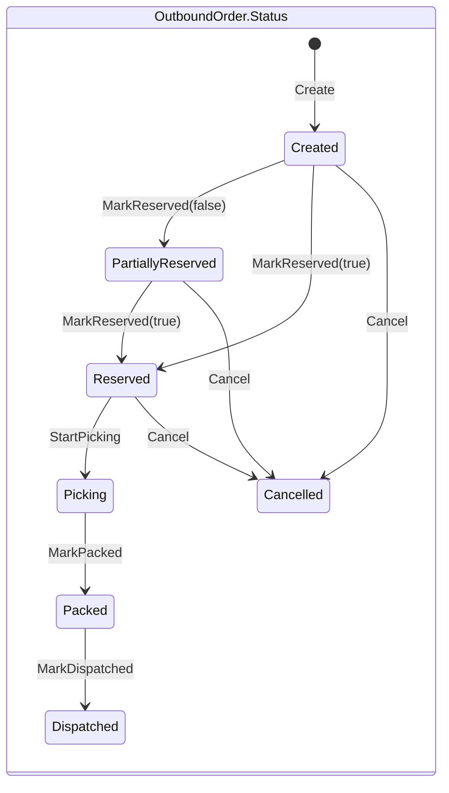
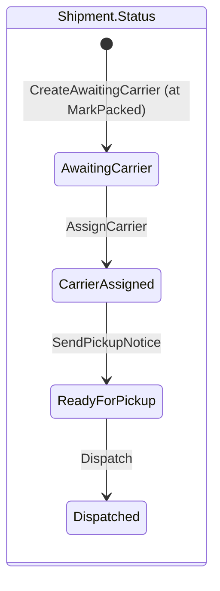

# Logistics

`src/Services/Logistics/Modules/Warehouse.Logistics.Core` — the flow of goods across the
warehouse boundary. All four aggregates are 🟨 Moment-Intervals: they carry process state;
physical stock truth stays in Inventory.

## State machines (as implemented)

The shipment opens when the order is packed (UC-11) and walks the dispatch board column by column
(UC-12): the admin advances it a step at a time, while the terminal's `ConfirmDispatch` fast-forwards the
same states to `Dispatched` in one call. Every transition guard throws `delivery_invalid_status` /
`order_invalid_status` / `shipment_invalid_status` when called out of order.

## Notable rules

| Rule | Where |
|---|---|
| ASN needs ≥ 1 line; only announced deliveries can be received (ad-hoc ASN otherwise) | `Announce`, status machine |
| On `ConfirmReceipt`, unrecorded lines become **implicit full shortages** | `ConfirmReceipt` |
| A line may carry a delivery-specific `DeliveryPack` (e.g. this truck: 1 plt = 36 pcs); else receiving uses the catalog default | `DeliveryLine.Pack`, `DeliveryPack.ToBaseUnits` |
| Dock slot window must be positive (`from < to`) | `DockSlot.Of` |
| Pick task short → status `ShortPick`, the saga replans from another location/batch | `ReportShort` |
| Shipment cannot be ready for pickup with zero packages | `MarkReadyForPickup` |
| Cancelling a reserved order → saga releases Inventory reservations | `Cancel` + event flow |

## Cross-context references (all by value)

| VO | Points at |
|---|---|
| `PartyRoleRef(Guid)` | a role in Partners (supplier/customer/carrier) |
| `WarehouseRef` / `LocationRef` | codes owned by Topology |
| `ProductCode` | a product in Catalog — **loose by design**: holds "what the scanner read", even an unknown code awaiting clarification (UC-01). Not Catalog's strict `Sku`. |
| `BatchInfo(number, expiry)` | becomes a `Batch` in Inventory at receipt |

## Domain events

`DeliveryAnnounced`, `DeliveryArrived`, `GoodsReceiptConfirmed` (→ Inventory receives stock
into the dock buffer), `OutboundOrderCreated`, `OrderReserved`, `ShipmentDispatched`
(→ Inventory deducts stock).
