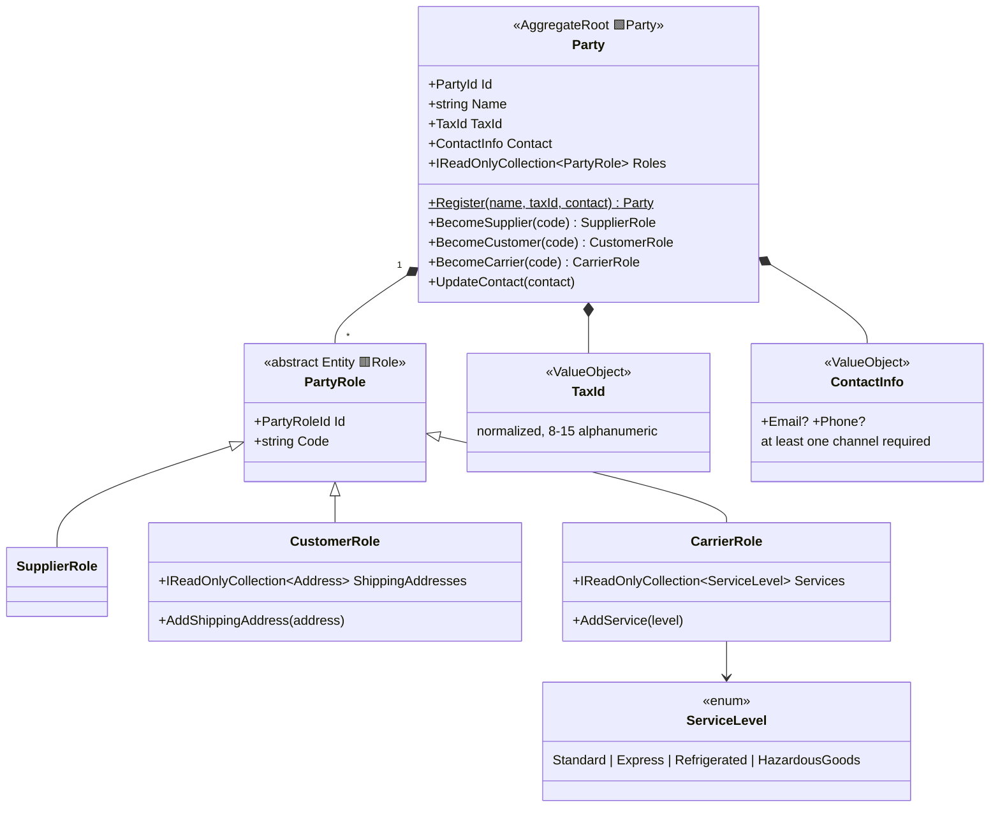

# Partners (MasterData)

`src/Services/MasterData/Modules/Warehouse.MasterData.Partners` — the Party/PartyRole
archetype: companies we do business with and the parts they play.

## Invariants

| Rule | Error code |
|---|---|
| A party never holds two roles of the same kind (it can be supplier **and** customer, never twice supplier) | `party_role_duplicate` |
| Contact requires at least e-mail or phone | `contact_info_required` |
| Tax id normalized to 8–15 alphanumeric chars | `tax_id_invalid` |

## How other contexts refer to parties

Logistics stores `PartyRoleRef(Guid)` — the **role** id, not the party id. An inbound delivery
points at a *supplier role*; if the same company also buys from us, its customer role is a
different ref. Role-specific data (shipping addresses, service levels) stays here.
