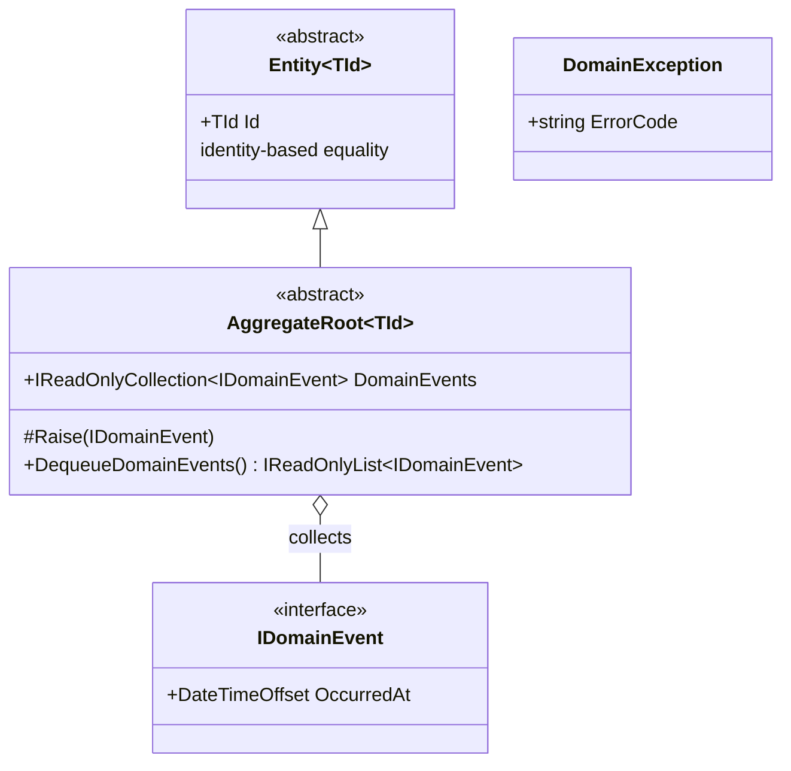
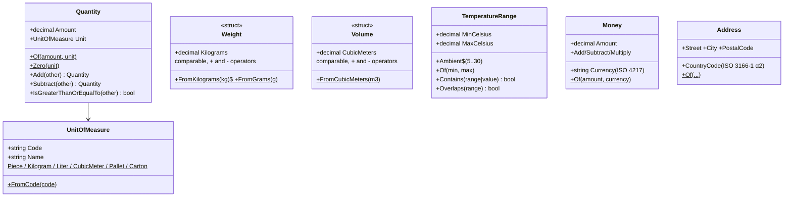

# SharedKernel

`src/SharedKernel/Warehouse.SharedKernel` — pure domain primitives shared by every module.
**No dependencies** (no EF, no messaging, no ASP.NET); guarded by architecture tests.

## Base types (`Domain/`)

- `AggregateRoot.DequeueDomainEvents()` is called by infrastructure after a successful save;
  selected events are translated into integration events and written to the outbox.
- `DomainException.ErrorCode` (e.g. `quantity_insufficient`) is the stable contract for API
  ProblemDetails mapping; messages are free text.

## Value objects (`ValueObjects/`)

Rules baked into the types:
- `Quantity` is **non-negative**; `Subtract` below zero throws `quantity_insufficient`;
  mixing units throws `quantity_unit_mismatch`. Movement direction is modeled by movement
  *type*, never by signed amounts.
- `UnitOfMeasure` is a **closed set** — unit conversions are a catalog concern (per-product factors), not arithmetic.
- `Money` forbids cross-currency arithmetic (`currency_mismatch`).
- `TemperatureRange.Contains(range)` is the primitive behind the cold-chain compatibility rule.

> **Not here: `Sku`.** It was tempting (every context speaks in SKUs), but "SKU" means
> different things per context — Catalog enforces syntax + EAN, Logistics holds whatever the
> scanner read. A shared strict type invites universal validation that pollutes the kernel.
> So identifiers belong to their owning context: Catalog owns the strict `Sku`, Inventory a
> lighter `Sku`, Logistics a loose `ProductCode`. The shared thing is the code *convention*,
> not a type. (More in [the SharedKernel blog post](../blog/05-the-shared-kernel.md).)
