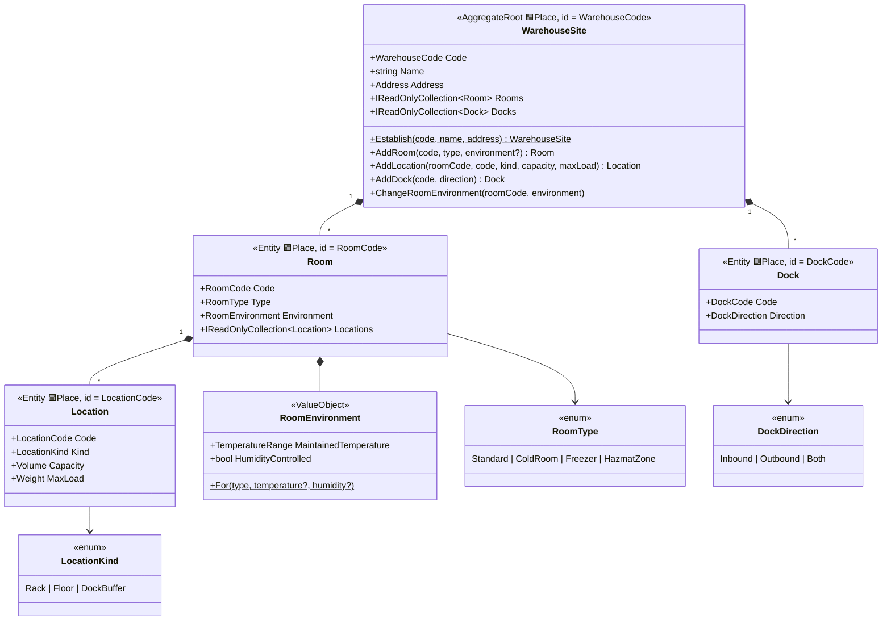

# Warehouse Topology (Warehousing)

`src/Services/Warehousing/Modules/Warehouse.Warehousing.Topology` — the physical structure:
*where* goods can be stored. The aggregate is named `WarehouseSite` in code only because
`Warehouse` would clash with the root namespace; in the ubiquitous language it is "Warehouse".

## Codes (value objects in `Codes.cs`)

| Code | Format | Example |
|---|---|---|
| `WarehouseCode` | 2–10 chars A-Z/0-9 | `WAW1` |
| `RoomCode` | 2–10 chars A-Z/0-9 | `CHLD1` |
| `DockCode` | 2–10 chars A-Z/0-9 | `D01` |
| `LocationCode` | 2–5 dash-joined segments; `Compose(warehouse, room, …)` | `WAW1-CHLD1-A-03-2` |

`LocationCode` is the **scannable physical address** printed on racks — stable by design.

## Invariants

| Rule | Error code |
|---|---|
| Room/dock codes unique within a warehouse | `room_code_duplicate`, `dock_code_duplicate` |
| Location codes unique across the **whole warehouse** (not just the room) | `location_code_duplicate` |
| Cold room maintains ≤ 8 °C; freezer ≤ −15 °C (defaults: 0..8 and −25..−18) | `room_environment_invalid` |
| A location must have positive capacity | `location_capacity_required` |
| Deleting a non-empty room/location — application-level policy consulting Inventory (not in the aggregate) | — |

## Application surface (vertical slices, ADR-0007)

One folder per use case under `Application/Warehouses/`; each handler is resolved directly by a thin
endpoint (`TopologyEndpoints` → `/topology/warehouses/…`, fronted by the gateway at `/api/topology`).

| Use case | Kind | Route |
|---|---|---|
| `EstablishWarehouse` | command | `POST /topology/warehouses` |
| `AddRoom` | command | `POST /topology/warehouses/{code}/rooms` |
| `AddLocation` | command | `POST /topology/warehouses/{code}/rooms/{room}/locations` |
| `AddDock` | command | `POST /topology/warehouses/{code}/docks` |
| `ChangeRoomEnvironment` | command | `POST /topology/warehouses/{code}/rooms/{room}/environment` |
| `ListWarehouses` / `GetWarehouse` | query | `GET /topology/warehouses[/{code}]` |

## Events

In-aggregate **domain events** (raised on `WarehouseSite`, in `Domain/Events`):

| Event | Raised by |
|---|---|
| `LocationDefined(warehouse, room, location, kind, capacity, maxLoad, environment)` | `AddLocation` |
| `RoomEnvironmentChanged(warehouse, room, environment)` | `ChangeRoomEnvironment` |

Published **integration events** (primitives-only `Contracts/Topology`, relayed through the transactional
outbox to the `topology` fanout exchange — Topology is a producer from here on):

| Event | Published by | Consumed by → effect |
|---|---|---|
| `LocationDefinedV1` | `AddLocation` (`IDbContextOutbox<TopologyDbContext>`) | Inventory `LocationProjectionConsumer` upserts a local `LocationSnapshot` |
| `RoomEnvironmentChangedV1` | `ChangeRoomEnvironment` | Inventory refreshes every `LocationSnapshot` in that room |

Inventory reads that replica — never a cross-service query (ADR-0003): `ConfirmPutAway` runs
`PutAwayPolicy` against the `LocationSnapshot` (+ Catalog `ProductSnapshot`), so the hard
temperature/hazmat invariant is enforced at put-away from topology data alone.
